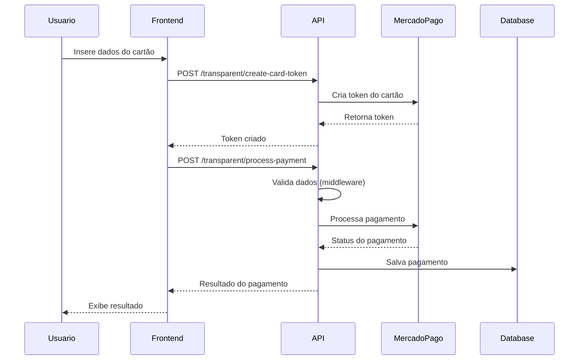
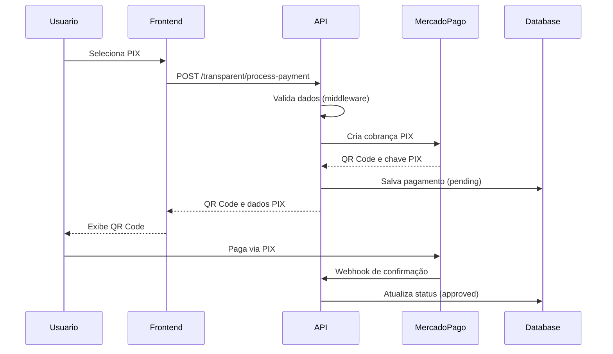
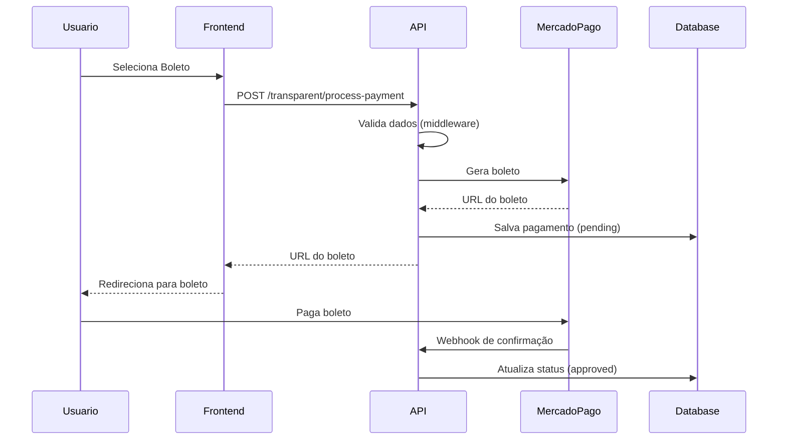

# MercadoPago Checkout Transparente - Documentação Técnica

## Visão Geral

Este documento descreve a implementação completa do MercadoPago Checkout Transparente na aplicação Mestres do Café Enterprise, incluindo todos os fluxos de pagamento, validações, segurança e tratamento de erros.

## Índice

1. [Arquitetura do Sistema](#arquitetura-do-sistema)
2. [Configuração e Credenciais](#configuração-e-credenciais)
3. [Endpoints da API](#endpoints-da-api)
4. [Fluxos de Pagamento](#fluxos-de-pagamento)
5. [Validações e Segurança](#validações-e-segurança)
6. [Componentes Frontend](#componentes-frontend)
7. [Tratamento de Erros](#tratamento-de-erros)
8. [Testes](#testes)
9. [Webhooks](#webhooks)
10. [Troubleshooting](#troubleshooting)

## Arquitetura do Sistema

### Estrutura de Arquivos

```
apps/
├── api/
│   ├── src/
│   │   ├── services/
│   │   │   └── mercado_pago_service.py
│   │   ├── controllers/
│   │   │   └── routes/
│   │   │       └── mercado_pago.py
│   │   └── middleware/
│   │       └── mercado_pago_validation.py
│   └── .env.example
└── web/
    └── src/
        └── components/
            ├── MercadoPagoCheckout.jsx
            └── MercadoPagoTransparentCheckout.jsx
```

### Componentes Principais

1. **MercadoPagoService**: Serviço principal de integração com a API do MercadoPago
2. **MercadoPagoValidator**: Classe de validação de dados de pagamento
3. **Rotas de API**: Endpoints para processamento de pagamentos
4. **Componentes React**: Interface do usuário para checkout

## Configuração e Credenciais

### Credenciais de Teste (Ambiente Sandbox)

```bash
# apps/api/.env
# Obtenha suas credenciais em: https://www.mercadopago.com.br/developers/panel/app
MP_ACCESS_TOKEN_TEST=TEST-YOUR_ACCESS_TOKEN_HERE
MP_PUBLIC_KEY_TEST=TEST-YOUR_PUBLIC_KEY_HERE
MP_CLIENT_ID=YOUR_CLIENT_ID_HERE
MP_CLIENT_SECRET=<será fornecido separadamente>
MP_WEBHOOK_SECRET=<configurar no painel do MercadoPago>
MP_ENVIRONMENT=sandbox
MP_MARKETPLACE_FEE=5.0
MP_ENABLE_3DS=true
MP_ENABLE_TOKENIZATION=true
```

### Informações da Aplicação

- **Application ID**: YOUR_APPLICATION_ID_HERE
- **Collector ID**: YOUR_COLLECTOR_ID_HERE
- **Modelo**: Marketplace
- **Ambiente**: Sandbox (para testes)

## Endpoints da API

### Checkout Transparente

#### POST `/api/payments/mercadopago/transparent/create-card-token`
Cria token de cartão para pagamento seguro.

**Request:**
```json
{
  "card_number": "4235647728025682",
  "expiry_month": 11,
  "expiry_year": 25,
  "cvv": "123",
  "cardholder_name": "APRO"
}
```

**Response:**
```json
{
  "success": true,
  "token": "card_token_here",
  "first_six_digits": "423564",
  "last_four_digits": "5682",
  "cardholder_name": "APRO"
}
```

#### POST `/api/payments/mercadopago/transparent/process-payment`
Processa pagamento através do checkout transparente.

**Request (Cartão):**
```json
{
  "order_id": "order_uuid_here",
  "payment_method_id": "visa",
  "token": "card_token_here",
  "installments": 1,
  "payer_email": "test@test.com",
  "payer_first_name": "Test",
  "payer_last_name": "User",
  "payer_doc_type": "CPF",
  "payer_doc_number": "19119119100",
  "enable_3ds": true
}
```

**Request (PIX):**
```json
{
  "order_id": "order_uuid_here",
  "payment_method_id": "pix",
  "payer_email": "test@test.com",
  "payer_first_name": "Test",
  "payer_last_name": "User",
  "payer_doc_type": "CPF",
  "payer_doc_number": "19119119100",
  "pix_expiration": 3600
}
```

**Response:**
```json
{
  "success": true,
  "payment_id": "payment_uuid",
  "mp_payment_id": 123456789,
  "status": "approved",
  "status_detail": "accredited",
  "amount": 100.00,
  "pix_data": {
    "qr_code": "00020126580014br.gov.bcb.pix...",
    "qr_code_base64": "iVBORw0KGgoAAAANSUhEUgAA...",
    "pix_key": "pix_key_here"
  }
}
```

#### GET `/api/payments/mercadopago/transparent/installments`
Obtém opções de parcelamento.

**Query Parameters:**
- `amount`: Valor do pagamento
- `payment_method_id`: ID do método de pagamento

#### GET `/api/payments/mercadopago/transparent/payment-methods`
Lista métodos de pagamento disponíveis para checkout transparente.

#### POST `/api/payments/mercadopago/transparent/validate-payment`
Valida dados de pagamento antes do processamento.

### Webhooks

#### POST `/api/payments/mercadopago/webhook`
Recebe notificações de mudança de status dos pagamentos.

## Fluxos de Pagamento

### 1. Pagamento com Cartão de Crédito/Débito



### 2. Pagamento com PIX



### 3. Pagamento com Boleto



## Validações e Segurança

### Middleware de Validação

A classe `MercadoPagoValidator` implementa validações robustas:

#### Validação de CPF
```python
def validate_cpf(cpf: str) -> bool:
    # Remove caracteres não numéricos
    cpf = re.sub(r'[^0-9]', '', cpf)
    
    # Verifica se tem 11 dígitos
    if len(cpf) != 11:
        return False
    
    # Algoritmo de validação de CPF
    # ... implementação completa
```

#### Validação de Cartão (Algoritmo de Luhn)
```python
def validate_card_number(card_number: str) -> Tuple[bool, Optional[str]]:
    # Remove espaços e hífens
    card_number = re.sub(r'[\s-]', '', card_number)
    
    # Algoritmo de Luhn
    def luhn_checksum(card_num):
        # ... implementação do algoritmo
    
    return luhn_checksum(card_number) == 0, error_message
```

### Tokenização de Cartões

Todos os dados sensíveis de cartão são tokenizados no frontend usando o SDK do MercadoPago:

```javascript
const createCardToken = async () => {
  const response = await fetch('/api/payments/mercadopago/transparent/create-card-token', {
    method: 'POST',
    headers: { 'Content-Type': 'application/json' },
    body: JSON.stringify({
      card_number: cardData.number.replace(/\s/g, ''),
      expiry_month: parseInt(cardData.expiry_month),
      expiry_year: parseInt(cardData.expiry_year),
      cvv: cardData.cvv,
      cardholder_name: cardData.cardholder_name
    })
  });
  
  const data = await response.json();
  return data.success ? data.token : null;
};
```

### 3D Secure (3DS)

Implementação de autenticação adicional para cartões:

```python
def process_transparent_payment(self, payment_data: Dict[str, Any]) -> Dict[str, Any]:
    # ... preparação dos dados
    
    if payment_data.get('enable_3ds', True):
        request_data['three_d_secure_mode'] = 'optional'
    
    # ... processamento
```

## Componentes Frontend

### MercadoPagoTransparentCheckout

Componente React principal para checkout transparente:

```jsx
const MercadoPagoTransparentCheckout = ({ 
  orderId, 
  amount, 
  customerData, 
  onSuccess, 
  onError, 
  onPending 
}) => {
  // Estados e lógica do componente
  // Interface responsiva com Tailwind CSS
  // Validação em tempo real
  // Integração com SDK do MercadoPago
};
```

#### Funcionalidades:
- ✅ Seleção de método de pagamento
- ✅ Formulários específicos por método
- ✅ Validação em tempo real
- ✅ Tokenização segura de cartões
- ✅ Interface responsiva
- ✅ Estados de loading e erro
- ✅ Integração com 3DS

## Tratamento de Erros

### Códigos de Erro Comuns

| Código | Descrição | Ação Recomendada |
|--------|-----------|------------------|
| `cc_rejected_insufficient_amount` | Valor insuficiente | Verificar saldo do cartão |
| `cc_rejected_bad_filled_security_code` | CVV inválido | Solicitar CVV correto |
| `cc_rejected_bad_filled_date` | Data de validade inválida | Verificar data do cartão |
| `cc_rejected_bad_filled_card_number` | Número de cartão inválido | Verificar número do cartão |
| `cc_rejected_high_risk` | Alto risco | Tentar método alternativo |

### Tratamento no Frontend

```javascript
const handleError = (error) => {
  const errorMessages = {
    'cc_rejected_insufficient_amount': 'Saldo insuficiente no cartão',
    'cc_rejected_bad_filled_security_code': 'Código de segurança inválido',
    'cc_rejected_bad_filled_date': 'Data de validade inválida',
    // ... mais mensagens
  };
  
  const message = errorMessages[error.code] || error.message || 'Erro desconhecido';
  setError(message);
};
```

## Testes

### Cartões de Teste

| Cartão | Número | Status |
|--------|--------|--------|
| Visa | 4235647728025682 | Aprovado |
| Visa | 4509953566233704 | Rejeitado |
| Mastercard | 5031433215406351 | Aprovado |
| American Express | 375365153556885 | Aprovado |

### CPFs de Teste

| CPF | Resultado |
|-----|-----------|
| 19119119100 | Aprovado |
| 24295738061 | Rejeitado |

### Emails de Teste

| Email | Resultado |
|-------|-----------|
| test_user_19119119100@testuser.com | Aprovado |
| test_user_24295738061@testuser.com | Rejeitado |

## Webhooks

### Configuração

1. Configure a URL do webhook no painel do MercadoPago:
   ```
   https://seu-dominio.com/api/payments/mercadopago/webhook
   ```

2. Configure o secret do webhook no `.env`:
   ```bash
   MP_WEBHOOK_SECRET=seu_webhook_secret_aqui
   ```

### Eventos Processados

- `payment.created`: Pagamento criado
- `payment.updated`: Status do pagamento atualizado
- `merchant_order.updated`: Ordem do comerciante atualizada

### Validação de Assinatura

```python
def verify_webhook_signature(self, payload: bytes, signature: str) -> bool:
    """Verifica assinatura do webhook"""
    secret = os.getenv('MP_WEBHOOK_SECRET')
    expected_signature = hmac.new(
        secret.encode(),
        payload,
        hashlib.sha256
    ).hexdigest()
    
    return hmac.compare_digest(signature, expected_signature)
```

## Troubleshooting

### Problemas Comuns

#### 1. Token de cartão inválido
**Sintoma**: Erro "Invalid card token"
**Solução**: Verificar se o SDK está carregado corretamente e se as credenciais estão corretas.

#### 2. Webhook não recebido
**Sintoma**: Status do pagamento não atualiza
**Solução**: Verificar configuração da URL e secret do webhook.

#### 3. Pagamento rejeitado
**Sintoma**: Status "rejected"
**Solução**: Verificar dados do cartão e usar cartões de teste válidos.

#### 4. Erro de validação 3DS
**Sintoma**: Redirecionamento 3DS falha
**Solução**: Verificar configuração do dominio no painel do MercadoPago.

### Logs Importantes

```python
logger.info(f"Payment processed for order {order_id}: {payment_id}")
logger.warning(f"Validation errors: {errors}")
logger.error(f"Error processing payment: {str(e)}")
```

### Monitoramento

1. **Status dos pagamentos**: Monitorar via dashboard interno
2. **Webhooks**: Verificar logs de recebimento
3. **Erros**: Acompanhar logs de erro da aplicação
4. **Performance**: Monitorar tempo de resposta da API

## Próximos Passos

### Para Produção

1. ✅ Implementar credenciais de produção
2. ✅ Configurar webhook em produção
3. ✅ Testar todos os fluxos em ambiente real
4. ✅ Implementar monitoramento avançado
5. ✅ Configurar alertas de erro

### Melhorias Futuras

1. **Pagamentos recorrentes**: Implementar assinaturas
2. **Split payments**: Melhorar divisão para marketplace
3. **Análise de fraude**: Implementar regras customizadas
4. **Relatórios avançados**: Dashboard de métricas
5. **A/B Testing**: Testar diferentes fluxos de checkout

## Contato e Suporte

Para dúvidas técnicas ou problemas:
1. Consultar documentação oficial do MercadoPago
2. Verificar logs da aplicação
3. Contatar suporte técnico do MercadoPago se necessário

---

**Última atualização**: 2024-01-XX  
**Versão da documentação**: 1.0  
**Responsável**: Equipe de Desenvolvimento Mestres do Café