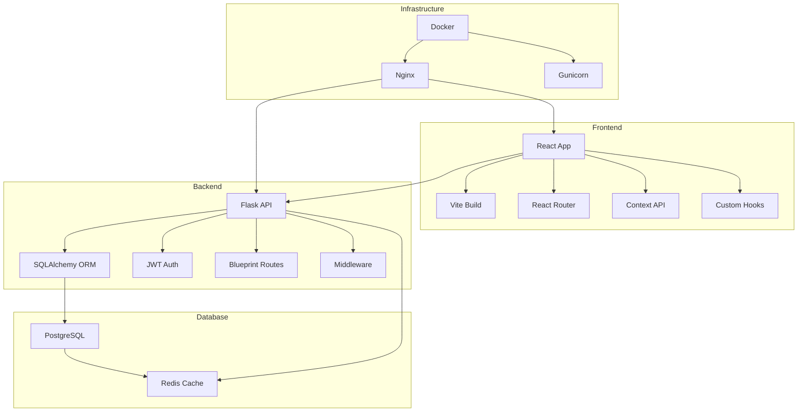
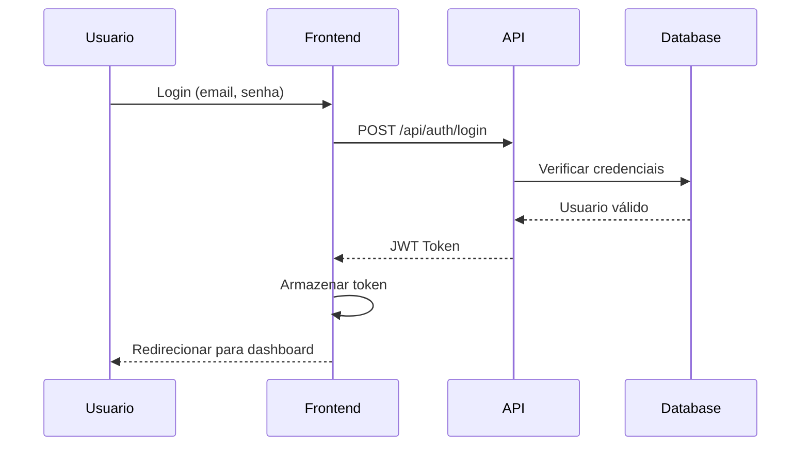
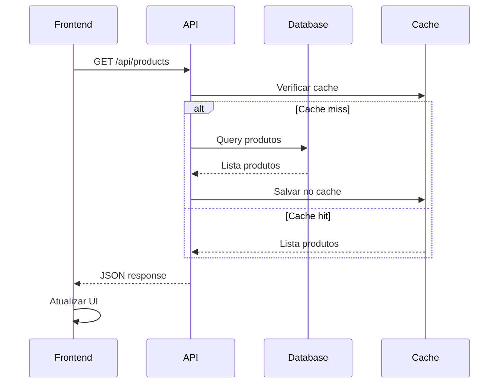

# 🏗️ Arquitetura do Sistema

Este documento descreve a arquitetura do Café Enterprise, um sistema completo de e-commerce e ERP.

## 📋 Visão Geral

O Café Enterprise é construído como um **monorepo** com arquitetura **full-stack**, utilizando padrões modernos de desenvolvimento e boas práticas de engenharia de software.

## 🏛️ Arquitetura Geral



## 🔧 Stack Tecnológica

### Frontend
- **React 18**: Biblioteca principal para UI
- **TypeScript**: Tipagem estática (parcial)
- **Vite**: Build tool moderna e rápida
- **React Router**: Roteamento client-side
- **Context API**: Gerenciamento de estado global
- **Tailwind CSS**: Framework CSS utility-first
- **Shadcn/UI**: Componentes UI reutilizáveis

### Backend
- **Flask 3.0**: Framework web Python
- **SQLAlchemy 2.0**: ORM para banco de dados
- **Flask-JWT-Extended**: Autenticação JWT
- **Flask-CORS**: Configuração de CORS
- **Werkzeug**: Utilitários WSGI
- **Marshmallow**: Serialização de dados

### Database
- **PostgreSQL 15**: Banco principal (produção)
- **SQLite**: Banco de desenvolvimento
- **Redis 7**: Cache e sessões
- **Alembic**: Migrações de banco

### DevOps
- **Docker**: Containerização
- **Docker Compose**: Orquestração local
- **Nginx**: Reverse proxy e servidor web
- **Gunicorn**: Servidor WSGI para Flask

## 📁 Estrutura de Pastas

```
cafe/
├── apps/
│   ├── web/                    # Frontend React
│   │   ├── src/
│   │   │   ├── components/     # Componentes React
│   │   │   ├── contexts/       # Contextos React
│   │   │   ├── hooks/          # Custom hooks
│   │   │   ├── lib/            # Bibliotecas e APIs
│   │   │   ├── pages/          # Páginas da aplicação
│   │   │   ├── services/       # Serviços externos
│   │   │   └── utils/          # Utilitários
│   │   ├── public/             # Assets estáticos
│   │   └── package.json
│   │
│   └── api/                    # Backend Flask
│       ├── src/
│       │   ├── controllers/    # Controladores
│       │   │   └── routes/     # Rotas organizadas
│       │   ├── models/         # Modelos de dados
│       │   ├── services/       # Lógica de negócio
│       │   ├── middleware/     # Middlewares
│       │   └── utils/          # Utilitários
│       └── requirements.txt
│
├── packages/                   # Pacotes compartilhados
│   ├── shared/                 # Tipos e constantes
│   ├── ui/                     # Componentes UI
│   └── database/               # Esquemas de banco
│
├── tools/                      # Ferramentas
│   ├── docker/                 # Configurações Docker
│   ├── scripts/                # Scripts de automação
│   └── monitoring/             # Monitoramento
│
├── docs/                       # Documentação
└── tests/                      # Testes
    ├── unit/                   # Testes unitários
    ├── integration/            # Testes de integração
    └── e2e/                    # Testes end-to-end
```

## 🔄 Fluxo de Dados

### 1. Autenticação


### 2. Operações CRUD


## 🧩 Componentes Principais

### Frontend Components

#### 1. Layout Components
- **Header**: Navegação principal e menu do usuário
- **Footer**: Links e informações da empresa
- **Sidebar**: Navegação lateral para dashboards

#### 2. Business Components
- **ProductCard**: Exibição de produtos
- **CartDropdown**: Carrinho de compras
- **OrderSummary**: Resumo de pedidos
- **CustomerTable**: Tabela de clientes

#### 3. UI Components
- **Button**: Botões reutilizáveis
- **Modal**: Diálogos e modais
- **Form**: Formulários padronizados
- **Loading**: Estados de carregamento

### Backend Modules

#### 1. Controllers
- **AuthController**: Autenticação e autorização
- **ProductController**: Gestão de produtos
- **OrderController**: Processamento de pedidos
- **UserController**: Gestão de usuários

#### 2. Models
- **User**: Modelo de usuário
- **Product**: Modelo de produto
- **Order**: Modelo de pedido
- **Category**: Modelo de categoria

#### 3. Services
- **EmailService**: Envio de emails
- **PaymentService**: Processamento de pagamentos
- **StorageService**: Armazenamento de arquivos
- **NotificationService**: Notificações

## 🔐 Segurança

### Autenticação
- JWT tokens com refresh tokens
- Hashing de senhas com bcrypt
- Rate limiting para APIs
- CORS configurado adequadamente

### Autorização
- Role-based access control (RBAC)
- Middleware de verificação de permissões
- Validação de entrada de dados
- Sanitização de dados

### Dados Sensíveis
- Variáveis de ambiente para secrets
- Criptografia de dados sensíveis
- Logs sem informações confidenciais
- Backup seguro do banco de dados

## 📊 Performance

### Frontend
- **Code Splitting**: Divisão automática de código
- **Lazy Loading**: Carregamento sob demanda
- **Memoization**: Cache de componentes
- **Tree Shaking**: Remoção de código não utilizado

### Backend
- **Connection Pooling**: Pool de conexões do banco
- **Query Optimization**: Otimização de consultas
- **Caching**: Redis para cache de dados
- **Compression**: Compressão de responses

### Database
- **Indexing**: Índices otimizados
- **Query Planning**: Análise de performance
- **Partitioning**: Particionamento de tabelas grandes
- **Backup Strategy**: Estratégia de backup

## 🔄 Padrões de Design

### Frontend
- **Component Composition**: Composição de componentes
- **Custom Hooks**: Lógica reutilizável
- **Context Pattern**: Compartilhamento de estado
- **Render Props**: Props de renderização

### Backend
- **Repository Pattern**: Abstração de acesso a dados
- **Service Layer**: Camada de serviços
- **Dependency Injection**: Injeção de dependências
- **Factory Pattern**: Criação de objetos

## 🚀 Escalabilidade

### Horizontal Scaling
- Containerização com Docker
- Load balancing com Nginx
- Database clustering
- Microservices ready

### Vertical Scaling
- Otimização de recursos
- Monitoring e alertas
- Auto-scaling capabilities
- Performance tuning

## 📈 Monitoramento

### Application Metrics
- Response times
- Error rates
- User activity
- Business metrics

### Infrastructure Metrics
- CPU e Memory usage
- Network I/O
- Database performance
- Cache hit rates

## 🔧 Configuração

### Ambientes
- **Development**: Local development
- **Staging**: Pre-production testing
- **Production**: Live environment

### Feature Flags
- A/B testing capabilities
- Gradual rollouts
- Quick rollbacks
- User segmentation

---

Esta arquitetura garante **escalabilidade**, **manutenibilidade** e **performance** para o crescimento do negócio.