# 🗄️ Arquitetura de Dados - Mestres Café Enterprise

> **Documentação completa do modelo de dados e estratégias de persistência**

---

## 📋 Visão Geral

O **Mestres Café Enterprise** possui uma arquitetura de dados robusta projetada para suportar operações complexas de **e-commerce**, **ERP** e **CRM**. O sistema utiliza **PostgreSQL** como banco principal com **Redis** para cache e sessões, totalizando **50+ tabelas** organizadas em domínios funcionais.

### 🎯 **Características da Arquitetura**

- **Modelo Relacional** - Integridade referencial garantida
- **Normalização 3NF** - Redução de redundância
- **Índices Otimizados** - Performance de consultas
- **Particionamento** - Escalabilidade horizontal
- **Auditoria Completa** - Rastreabilidade de mudanças

---

## 🏗️ Estrutura Geral do Banco

### 📊 **Estatísticas do Banco**

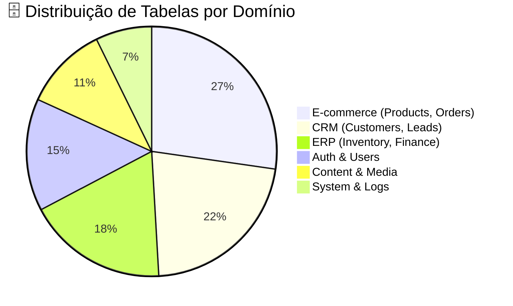
```mermaid
pie title 🗄️ Distribuição de Tabelas por Domínio
    "E-commerce (Products, Orders)" : 15
    "CRM (Customers, Leads)" : 12
    "ERP (Inventory, Finance)" : 10
    "Auth & Users" : 8
    "Content & Media" : 6
    "System & Logs" : 4
```

### 🔗 **Domínios Funcionais**

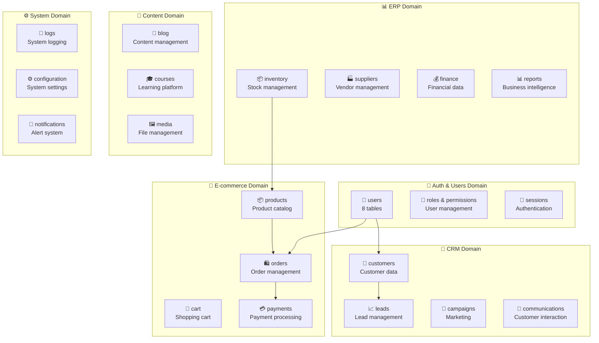
```mermaid
graph TB
    subgraph "👤 Auth & Users Domain"
        USERS[👥 users<br/>8 tables]
        ROLES[🔐 roles & permissions<br/>User management]
        SESSIONS[🎫 sessions<br/>Authentication]
    end

    subgraph "🛒 E-commerce Domain"
        PRODUCTS[📦 products<br/>Product catalog]
        ORDERS[🛍️ orders<br/>Order management]
        CART[🛒 cart<br/>Shopping cart]
        PAYMENTS[💳 payments<br/>Payment processing]
    end

    subgraph "👥 CRM Domain"
        CUSTOMERS[👤 customers<br/>Customer data]
        LEADS[📈 leads<br/>Lead management]
        CAMPAIGNS[📢 campaigns<br/>Marketing]
        COMMUNICATIONS[📧 communications<br/>Customer interaction]
    end

    subgraph "📊 ERP Domain"
        INVENTORY[📦 inventory<br/>Stock management]
        SUPPLIERS[🏭 suppliers<br/>Vendor management]
        FINANCE[💰 finance<br/>Financial data]
        REPORTS[📊 reports<br/>Business intelligence]
    end

    subgraph "📱 Content Domain"
        BLOG[📝 blog<br/>Content management]
        COURSES[🎓 courses<br/>Learning platform]
        MEDIA[🖼️ media<br/>File management]
    end

    subgraph "⚙️ System Domain"
        LOGS[📝 logs<br/>System logging]
        CONFIG[⚙️ configuration<br/>System settings]
        NOTIFICATIONS[🔔 notifications<br/>Alert system]
    end

    USERS --> ORDERS
    USERS --> CUSTOMERS
    PRODUCTS --> ORDERS
    CUSTOMERS --> LEADS
    INVENTORY --> PRODUCTS
    ORDERS --> PAYMENTS
```

---

## 🔐 Domínio de Autenticação

### 👤 **Modelo de Usuários**

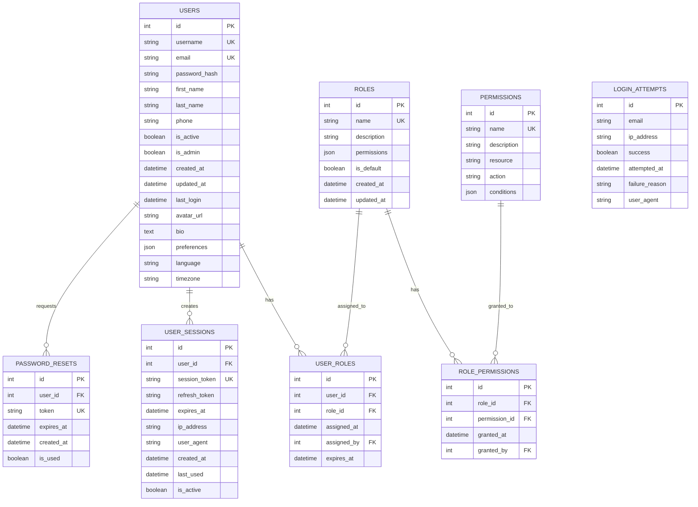
```mermaid
erDiagram
    USERS {
        int id PK
        string username UK
        string email UK
        string password_hash
        string first_name
        string last_name
        string phone
        boolean is_active
        boolean is_admin
        datetime created_at
        datetime updated_at
        datetime last_login
        string avatar_url
        text bio
        json preferences
        string language
        string timezone
    }

    ROLES {
        int id PK
        string name UK
        string description
        json permissions
        boolean is_default
        datetime created_at
        datetime updated_at
    }

    USER_ROLES {
        int id PK
        int user_id FK
        int role_id FK
        datetime assigned_at
        int assigned_by FK
        datetime expires_at
    }

    PERMISSIONS {
        int id PK
        string name UK
        string description
        string resource
        string action
        json conditions
    }

    ROLE_PERMISSIONS {
        int id PK
        int role_id FK
        int permission_id FK
        datetime granted_at
        int granted_by FK
    }

    USER_SESSIONS {
        int id PK
        int user_id FK
        string session_token UK
        string refresh_token
        datetime expires_at
        string ip_address
        string user_agent
        datetime created_at
        datetime last_used
        boolean is_active
    }

    PASSWORD_RESETS {
        int id PK
        int user_id FK
        string token UK
        datetime expires_at
        datetime created_at
        boolean is_used
    }

    LOGIN_ATTEMPTS {
        int id PK
        string email
        string ip_address
        boolean success
        datetime attempted_at
        string failure_reason
        string user_agent
    }

    USERS ||--o{ USER_ROLES : has
    ROLES ||--o{ USER_ROLES : assigned_to
    USERS ||--o{ USER_SESSIONS : creates
    USERS ||--o{ PASSWORD_RESETS : requests
    ROLES ||--o{ ROLE_PERMISSIONS : has
    PERMISSIONS ||--o{ ROLE_PERMISSIONS : granted_to
```

---

## 🛒 Domínio de E-commerce

### 📦 **Catálogo de Produtos**

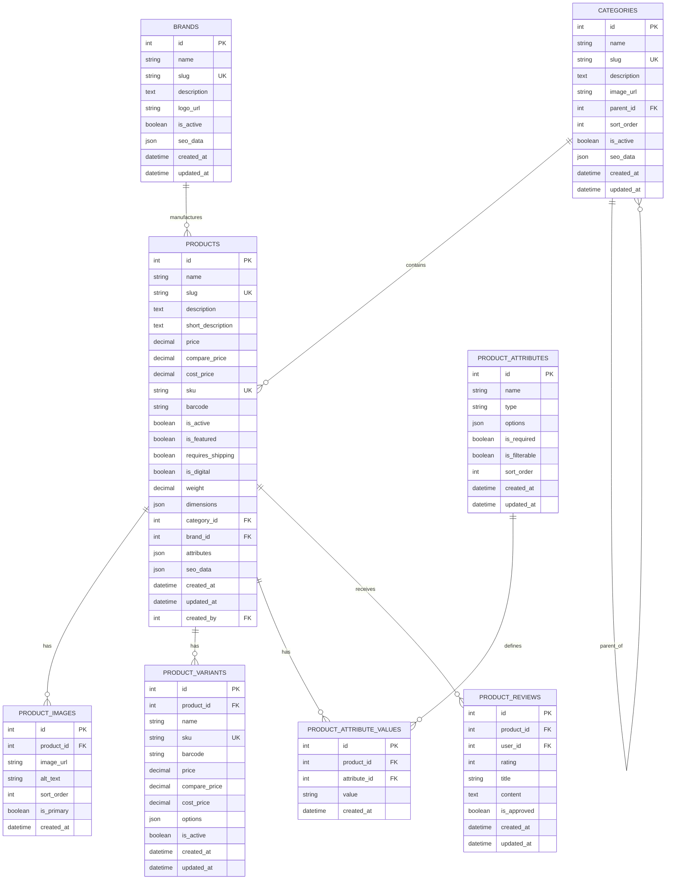
```mermaid
erDiagram
    PRODUCTS {
        int id PK
        string name
        string slug UK
        text description
        text short_description
        decimal price
        decimal compare_price
        decimal cost_price
        string sku UK
        string barcode
        boolean is_active
        boolean is_featured
        boolean requires_shipping
        boolean is_digital
        decimal weight
        json dimensions
        int category_id FK
        int brand_id FK
        json attributes
        json seo_data
        datetime created_at
        datetime updated_at
        int created_by FK
    }

    CATEGORIES {
        int id PK
        string name
        string slug UK
        text description
        string image_url
        int parent_id FK
        int sort_order
        boolean is_active
        json seo_data
        datetime created_at
        datetime updated_at
    }

    BRANDS {
        int id PK
        string name
        string slug UK
        text description
        string logo_url
        boolean is_active
        json seo_data
        datetime created_at
        datetime updated_at
    }

    PRODUCT_IMAGES {
        int id PK
        int product_id FK
        string image_url
        string alt_text
        int sort_order
        boolean is_primary
        datetime created_at
    }

    PRODUCT_VARIANTS {
        int id PK
        int product_id FK
        string name
        string sku UK
        string barcode
        decimal price
        decimal compare_price
        decimal cost_price
        json options
        boolean is_active
        datetime created_at
        datetime updated_at
    }

    PRODUCT_ATTRIBUTES {
        int id PK
        string name
        string type
        json options
        boolean is_required
        boolean is_filterable
        int sort_order
        datetime created_at
        datetime updated_at
    }

    PRODUCT_ATTRIBUTE_VALUES {
        int id PK
        int product_id FK
        int attribute_id FK
        string value
        datetime created_at
    }

    PRODUCT_REVIEWS {
        int id PK
        int product_id FK
        int user_id FK
        int rating
        string title
        text content
        boolean is_approved
        datetime created_at
        datetime updated_at
    }

    PRODUCTS ||--o{ PRODUCT_IMAGES : has
    PRODUCTS ||--o{ PRODUCT_VARIANTS : has
    PRODUCTS ||--o{ PRODUCT_ATTRIBUTE_VALUES : has
    PRODUCTS ||--o{ PRODUCT_REVIEWS : receives
    CATEGORIES ||--o{ PRODUCTS : contains
    CATEGORIES ||--o{ CATEGORIES : parent_of
    BRANDS ||--o{ PRODUCTS : manufactures
    PRODUCT_ATTRIBUTES ||--o{ PRODUCT_ATTRIBUTE_VALUES : defines
```

### 🛍️ **Gestão de Pedidos**

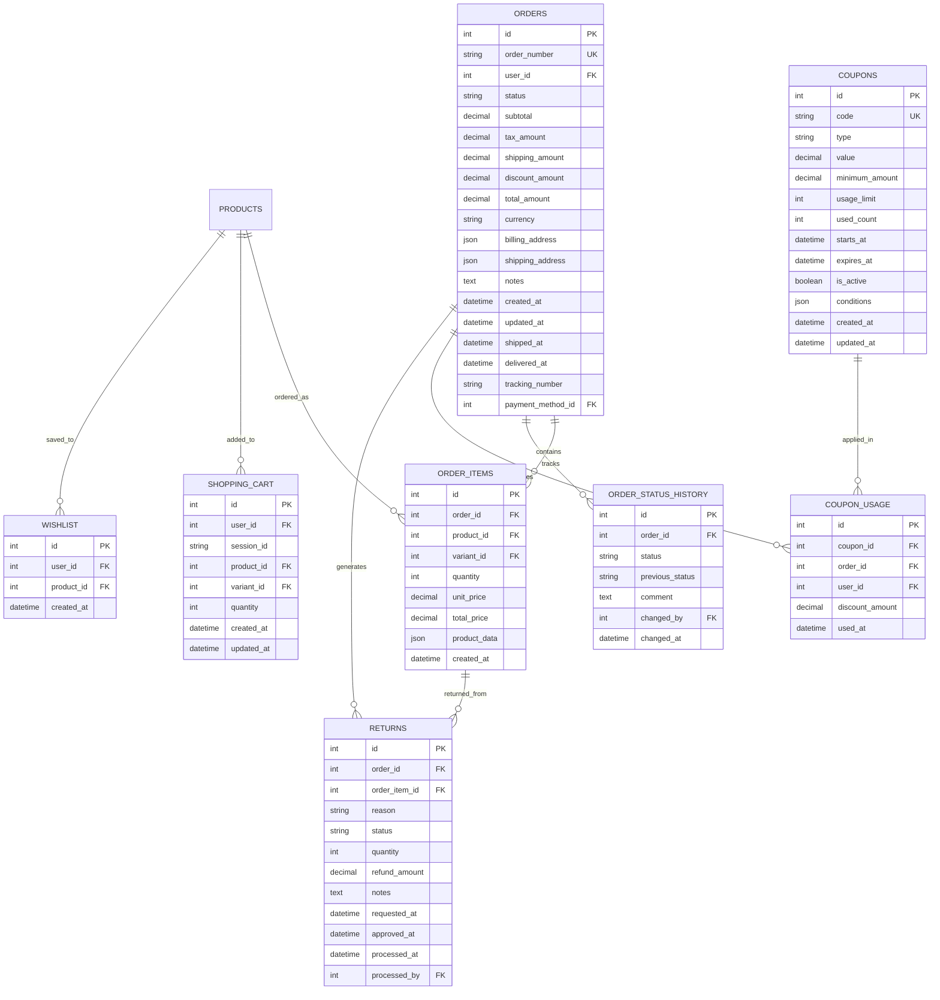
```mermaid
erDiagram
    ORDERS {
        int id PK
        string order_number UK
        int user_id FK
        string status
        decimal subtotal
        decimal tax_amount
        decimal shipping_amount
        decimal discount_amount
        decimal total_amount
        string currency
        json billing_address
        json shipping_address
        text notes
        datetime created_at
        datetime updated_at
        datetime shipped_at
        datetime delivered_at
        string tracking_number
        int payment_method_id FK
    }

    ORDER_ITEMS {
        int id PK
        int order_id FK
        int product_id FK
        int variant_id FK
        int quantity
        decimal unit_price
        decimal total_price
        json product_data
        datetime created_at
    }

    ORDER_STATUS_HISTORY {
        int id PK
        int order_id FK
        string status
        string previous_status
        text comment
        int changed_by FK
        datetime changed_at
    }

    SHOPPING_CART {
        int id PK
        int user_id FK
        string session_id
        int product_id FK
        int variant_id FK
        int quantity
        datetime created_at
        datetime updated_at
    }

    WISHLIST {
        int id PK
        int user_id FK
        int product_id FK
        datetime created_at
    }

    COUPONS {
        int id PK
        string code UK
        string type
        decimal value
        decimal minimum_amount
        int usage_limit
        int used_count
        datetime starts_at
        datetime expires_at
        boolean is_active
        json conditions
        datetime created_at
        datetime updated_at
    }

    COUPON_USAGE {
        int id PK
        int coupon_id FK
        int order_id FK
        int user_id FK
        decimal discount_amount
        datetime used_at
    }

    RETURNS {
        int id PK
        int order_id FK
        int order_item_id FK
        string reason
        string status
        int quantity
        decimal refund_amount
        text notes
        datetime requested_at
        datetime approved_at
        datetime processed_at
        int processed_by FK
    }

    ORDERS ||--o{ ORDER_ITEMS : contains
    ORDERS ||--o{ ORDER_STATUS_HISTORY : tracks
    ORDERS ||--o{ COUPON_USAGE : uses
    ORDERS ||--o{ RETURNS : generates
    PRODUCTS ||--o{ ORDER_ITEMS : ordered_as
    PRODUCTS ||--o{ SHOPPING_CART : added_to
    PRODUCTS ||--o{ WISHLIST : saved_to
    COUPONS ||--o{ COUPON_USAGE : applied_in
    ORDER_ITEMS ||--o{ RETURNS : returned_from
```

---

## 💳 Domínio de Pagamentos

### 💰 **Sistema de Pagamentos**

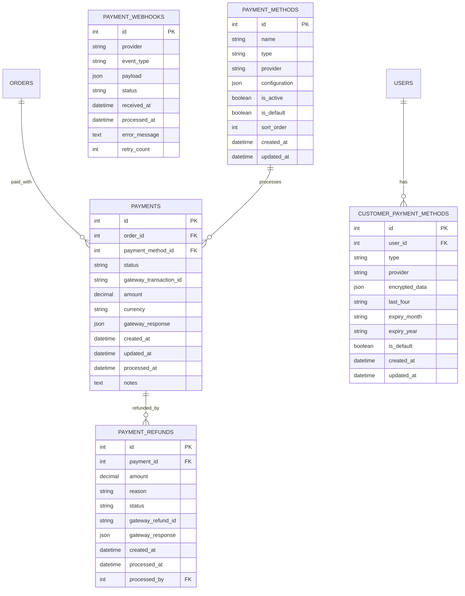
```mermaid
erDiagram
    PAYMENT_METHODS {
        int id PK
        string name
        string type
        string provider
        json configuration
        boolean is_active
        boolean is_default
        int sort_order
        datetime created_at
        datetime updated_at
    }

    PAYMENTS {
        int id PK
        int order_id FK
        int payment_method_id FK
        string status
        string gateway_transaction_id
        decimal amount
        string currency
        json gateway_response
        datetime created_at
        datetime updated_at
        datetime processed_at
        text notes
    }

    PAYMENT_REFUNDS {
        int id PK
        int payment_id FK
        decimal amount
        string reason
        string status
        string gateway_refund_id
        json gateway_response
        datetime created_at
        datetime processed_at
        int processed_by FK
    }

    CUSTOMER_PAYMENT_METHODS {
        int id PK
        int user_id FK
        string type
        string provider
        json encrypted_data
        string last_four
        string expiry_month
        string expiry_year
        boolean is_default
        datetime created_at
        datetime updated_at
    }

    PAYMENT_WEBHOOKS {
        int id PK
        string provider
        string event_type
        json payload
        string status
        datetime received_at
        datetime processed_at
        text error_message
        int retry_count
    }

    ORDERS ||--o{ PAYMENTS : paid_with
    PAYMENT_METHODS ||--o{ PAYMENTS : processes
    PAYMENTS ||--o{ PAYMENT_REFUNDS : refunded_by
    USERS ||--o{ CUSTOMER_PAYMENT_METHODS : has
```

---

## 📊 Domínio de Inventário

### 📦 **Gestão de Estoque**

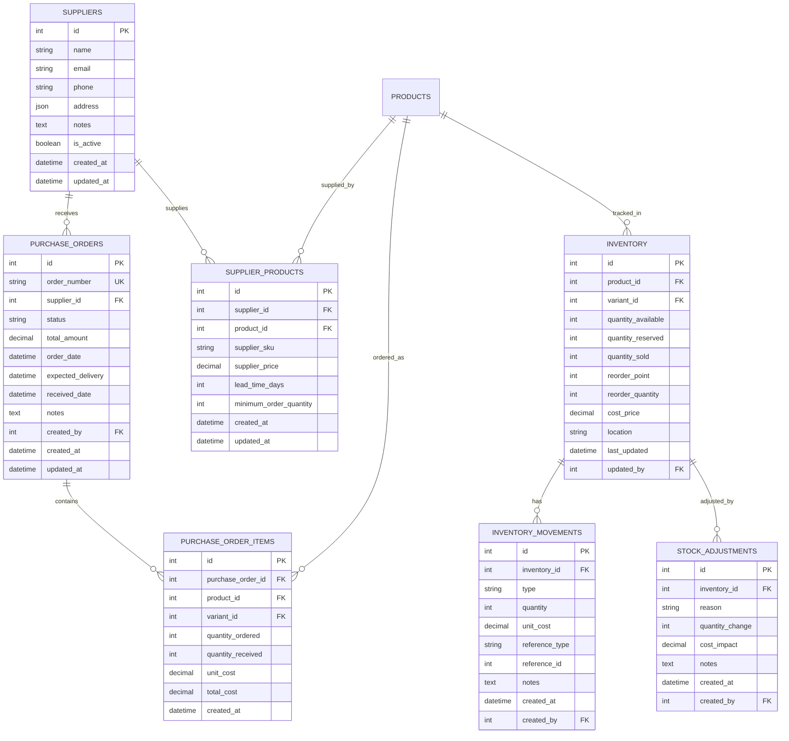
```mermaid
erDiagram
    INVENTORY {
        int id PK
        int product_id FK
        int variant_id FK
        int quantity_available
        int quantity_reserved
        int quantity_sold
        int reorder_point
        int reorder_quantity
        decimal cost_price
        string location
        datetime last_updated
        int updated_by FK
    }

    INVENTORY_MOVEMENTS {
        int id PK
        int inventory_id FK
        string type
        int quantity
        decimal unit_cost
        string reference_type
        int reference_id
        text notes
        datetime created_at
        int created_by FK
    }

    SUPPLIERS {
        int id PK
        string name
        string email
        string phone
        json address
        text notes
        boolean is_active
        datetime created_at
        datetime updated_at
    }

    SUPPLIER_PRODUCTS {
        int id PK
        int supplier_id FK
        int product_id FK
        string supplier_sku
        decimal supplier_price
        int lead_time_days
        int minimum_order_quantity
        datetime created_at
        datetime updated_at
    }

    PURCHASE_ORDERS {
        int id PK
        string order_number UK
        int supplier_id FK
        string status
        decimal total_amount
        datetime order_date
        datetime expected_delivery
        datetime received_date
        text notes
        int created_by FK
        datetime created_at
        datetime updated_at
    }

    PURCHASE_ORDER_ITEMS {
        int id PK
        int purchase_order_id FK
        int product_id FK
        int variant_id FK
        int quantity_ordered
        int quantity_received
        decimal unit_cost
        decimal total_cost
        datetime created_at
    }

    STOCK_ADJUSTMENTS {
        int id PK
        int inventory_id FK
        string reason
        int quantity_change
        decimal cost_impact
        text notes
        datetime created_at
        int created_by FK
    }

    PRODUCTS ||--o{ INVENTORY : tracked_in
    INVENTORY ||--o{ INVENTORY_MOVEMENTS : has
    SUPPLIERS ||--o{ SUPPLIER_PRODUCTS : supplies
    SUPPLIERS ||--o{ PURCHASE_ORDERS : receives
    PURCHASE_ORDERS ||--o{ PURCHASE_ORDER_ITEMS : contains
    PRODUCTS ||--o{ SUPPLIER_PRODUCTS : supplied_by
    PRODUCTS ||--o{ PURCHASE_ORDER_ITEMS : ordered_as
    INVENTORY ||--o{ STOCK_ADJUSTMENTS : adjusted_by
```

---

## 👥 Domínio de CRM

### 👤 **Gestão de Clientes**

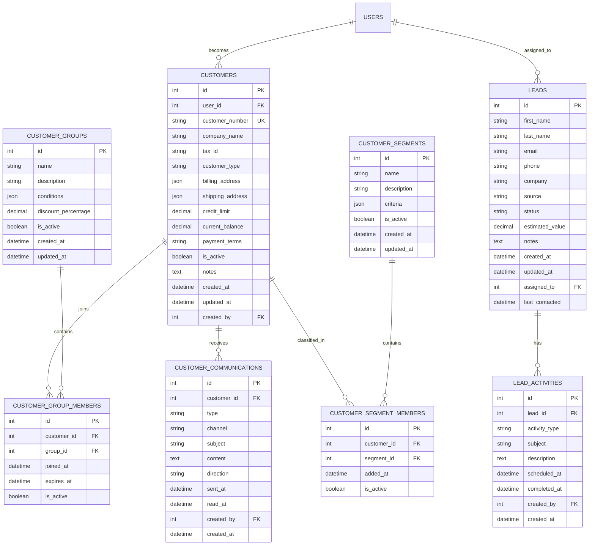
```mermaid
erDiagram
    CUSTOMERS {
        int id PK
        int user_id FK
        string customer_number UK
        string company_name
        string tax_id
        string customer_type
        json billing_address
        json shipping_address
        decimal credit_limit
        decimal current_balance
        string payment_terms
        boolean is_active
        text notes
        datetime created_at
        datetime updated_at
        int created_by FK
    }

    CUSTOMER_GROUPS {
        int id PK
        string name
        string description
        json conditions
        decimal discount_percentage
        boolean is_active
        datetime created_at
        datetime updated_at
    }

    CUSTOMER_GROUP_MEMBERS {
        int id PK
        int customer_id FK
        int group_id FK
        datetime joined_at
        datetime expires_at
        boolean is_active
    }

    LEADS {
        int id PK
        string first_name
        string last_name
        string email
        string phone
        string company
        string source
        string status
        decimal estimated_value
        text notes
        datetime created_at
        datetime updated_at
        int assigned_to FK
        datetime last_contacted
    }

    LEAD_ACTIVITIES {
        int id PK
        int lead_id FK
        string activity_type
        string subject
        text description
        datetime scheduled_at
        datetime completed_at
        int created_by FK
        datetime created_at
    }

    CUSTOMER_COMMUNICATIONS {
        int id PK
        int customer_id FK
        string type
        string channel
        string subject
        text content
        string direction
        datetime sent_at
        datetime read_at
        int created_by FK
        datetime created_at
    }

    CUSTOMER_SEGMENTS {
        int id PK
        string name
        string description
        json criteria
        boolean is_active
        datetime created_at
        datetime updated_at
    }

    CUSTOMER_SEGMENT_MEMBERS {
        int id PK
        int customer_id FK
        int segment_id FK
        datetime added_at
        boolean is_active
    }

    USERS ||--o{ CUSTOMERS : becomes
    CUSTOMERS ||--o{ CUSTOMER_GROUP_MEMBERS : joins
    CUSTOMER_GROUPS ||--o{ CUSTOMER_GROUP_MEMBERS : contains
    CUSTOMERS ||--o{ CUSTOMER_COMMUNICATIONS : receives
    CUSTOMERS ||--o{ CUSTOMER_SEGMENT_MEMBERS : classified_in
    CUSTOMER_SEGMENTS ||--o{ CUSTOMER_SEGMENT_MEMBERS : contains
    LEADS ||--o{ LEAD_ACTIVITIES : has
    USERS ||--o{ LEADS : assigned_to
```

---

## 📢 Domínio de Marketing

### 🎯 **Campanhas e Newsletter**

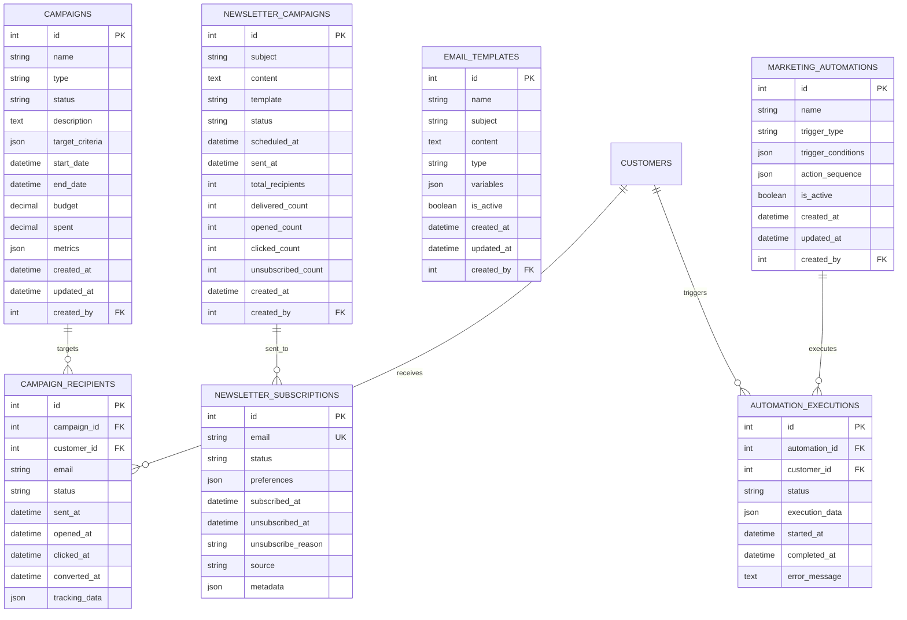
```mermaid
erDiagram
    CAMPAIGNS {
        int id PK
        string name
        string type
        string status
        text description
        json target_criteria
        datetime start_date
        datetime end_date
        decimal budget
        decimal spent
        json metrics
        datetime created_at
        datetime updated_at
        int created_by FK
    }

    CAMPAIGN_RECIPIENTS {
        int id PK
        int campaign_id FK
        int customer_id FK
        string email
        string status
        datetime sent_at
        datetime opened_at
        datetime clicked_at
        datetime converted_at
        json tracking_data
    }

    NEWSLETTER_SUBSCRIPTIONS {
        int id PK
        string email UK
        string status
        json preferences
        datetime subscribed_at
        datetime unsubscribed_at
        string unsubscribe_reason
        string source
        json metadata
    }

    NEWSLETTER_CAMPAIGNS {
        int id PK
        string subject
        text content
        string template
        string status
        datetime scheduled_at
        datetime sent_at
        int total_recipients
        int delivered_count
        int opened_count
        int clicked_count
        int unsubscribed_count
        datetime created_at
        int created_by FK
    }

    EMAIL_TEMPLATES {
        int id PK
        string name
        string subject
        text content
        string type
        json variables
        boolean is_active
        datetime created_at
        datetime updated_at
        int created_by FK
    }

    MARKETING_AUTOMATIONS {
        int id PK
        string name
        string trigger_type
        json trigger_conditions
        json action_sequence
        boolean is_active
        datetime created_at
        datetime updated_at
        int created_by FK
    }

    AUTOMATION_EXECUTIONS {
        int id PK
        int automation_id FK
        int customer_id FK
        string status
        json execution_data
        datetime started_at
        datetime completed_at
        text error_message
    }

    CAMPAIGNS ||--o{ CAMPAIGN_RECIPIENTS : targets
    CUSTOMERS ||--o{ CAMPAIGN_RECIPIENTS : receives
    NEWSLETTER_CAMPAIGNS ||--o{ NEWSLETTER_SUBSCRIPTIONS : sent_to
    MARKETING_AUTOMATIONS ||--o{ AUTOMATION_EXECUTIONS : executes
    CUSTOMERS ||--o{ AUTOMATION_EXECUTIONS : triggers
```

---

## 📝 Domínio de Conteúdo

### 📄 **Blog e Cursos**

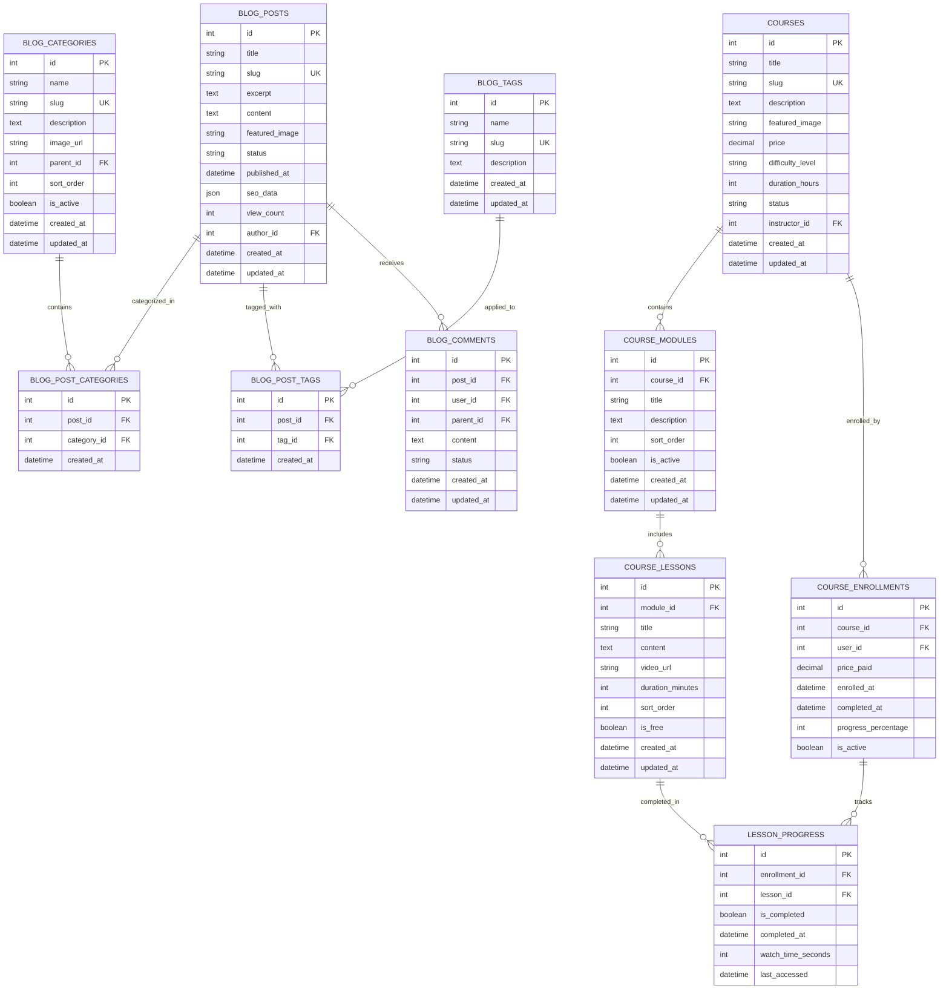
```mermaid
erDiagram
    BLOG_POSTS {
        int id PK
        string title
        string slug UK
        text excerpt
        text content
        string featured_image
        string status
        datetime published_at
        json seo_data
        int view_count
        int author_id FK
        datetime created_at
        datetime updated_at
    }

    BLOG_CATEGORIES {
        int id PK
        string name
        string slug UK
        text description
        string image_url
        int parent_id FK
        int sort_order
        boolean is_active
        datetime created_at
        datetime updated_at
    }

    BLOG_TAGS {
        int id PK
        string name
        string slug UK
        text description
        datetime created_at
        datetime updated_at
    }

    BLOG_POST_CATEGORIES {
        int id PK
        int post_id FK
        int category_id FK
        datetime created_at
    }

    BLOG_POST_TAGS {
        int id PK
        int post_id FK
        int tag_id FK
        datetime created_at
    }

    BLOG_COMMENTS {
        int id PK
        int post_id FK
        int user_id FK
        int parent_id FK
        text content
        string status
        datetime created_at
        datetime updated_at
    }

    COURSES {
        int id PK
        string title
        string slug UK
        text description
        string featured_image
        decimal price
        string difficulty_level
        int duration_hours
        string status
        int instructor_id FK
        datetime created_at
        datetime updated_at
    }

    COURSE_MODULES {
        int id PK
        int course_id FK
        string title
        text description
        int sort_order
        boolean is_active
        datetime created_at
        datetime updated_at
    }

    COURSE_LESSONS {
        int id PK
        int module_id FK
        string title
        text content
        string video_url
        int duration_minutes
        int sort_order
        boolean is_free
        datetime created_at
        datetime updated_at
    }

    COURSE_ENROLLMENTS {
        int id PK
        int course_id FK
        int user_id FK
        decimal price_paid
        datetime enrolled_at
        datetime completed_at
        int progress_percentage
        boolean is_active
    }

    LESSON_PROGRESS {
        int id PK
        int enrollment_id FK
        int lesson_id FK
        boolean is_completed
        datetime completed_at
        int watch_time_seconds
        datetime last_accessed
    }

    BLOG_POSTS ||--o{ BLOG_POST_CATEGORIES : categorized_in
    BLOG_POSTS ||--o{ BLOG_POST_TAGS : tagged_with
    BLOG_POSTS ||--o{ BLOG_COMMENTS : receives
    BLOG_CATEGORIES ||--o{ BLOG_POST_CATEGORIES : contains
    BLOG_TAGS ||--o{ BLOG_POST_TAGS : applied_to
    COURSES ||--o{ COURSE_MODULES : contains
    COURSE_MODULES ||--o{ COURSE_LESSONS : includes
    COURSES ||--o{ COURSE_ENROLLMENTS : enrolled_by
    COURSE_ENROLLMENTS ||--o{ LESSON_PROGRESS : tracks
    COURSE_LESSONS ||--o{ LESSON_PROGRESS : completed_in
```

---

## 🎮 Domínio de Gamificação

### 🏆 **Sistema de Pontos e Recompensas**

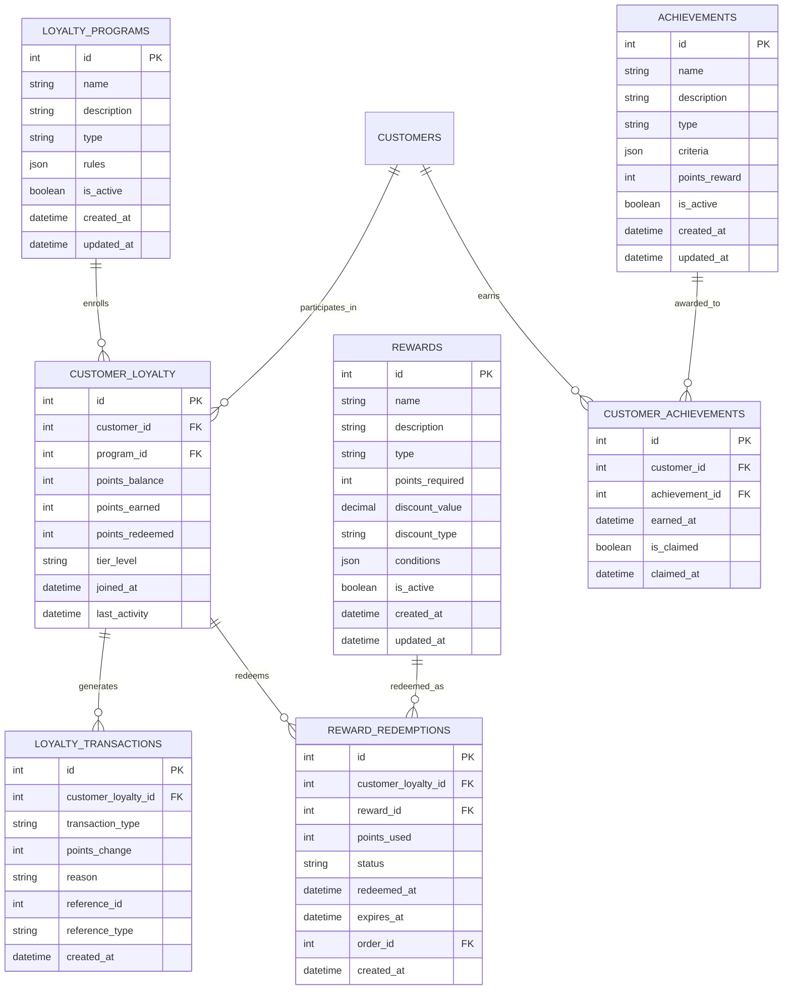
```mermaid
erDiagram
    LOYALTY_PROGRAMS {
        int id PK
        string name
        string description
        string type
        json rules
        boolean is_active
        datetime created_at
        datetime updated_at
    }

    CUSTOMER_LOYALTY {
        int id PK
        int customer_id FK
        int program_id FK
        int points_balance
        int points_earned
        int points_redeemed
        string tier_level
        datetime joined_at
        datetime last_activity
    }

    LOYALTY_TRANSACTIONS {
        int id PK
        int customer_loyalty_id FK
        string transaction_type
        int points_change
        string reason
        int reference_id
        string reference_type
        datetime created_at
    }

    REWARDS {
        int id PK
        string name
        string description
        string type
        int points_required
        decimal discount_value
        string discount_type
        json conditions
        boolean is_active
        datetime created_at
        datetime updated_at
    }

    REWARD_REDEMPTIONS {
        int id PK
        int customer_loyalty_id FK
        int reward_id FK
        int points_used
        string status
        datetime redeemed_at
        datetime expires_at
        int order_id FK
        datetime created_at
    }

    ACHIEVEMENTS {
        int id PK
        string name
        string description
        string type
        json criteria
        int points_reward
        boolean is_active
        datetime created_at
        datetime updated_at
    }

    CUSTOMER_ACHIEVEMENTS {
        int id PK
        int customer_id FK
        int achievement_id FK
        datetime earned_at
        boolean is_claimed
        datetime claimed_at
    }

    LOYALTY_PROGRAMS ||--o{ CUSTOMER_LOYALTY : enrolls
    CUSTOMERS ||--o{ CUSTOMER_LOYALTY : participates_in
    CUSTOMER_LOYALTY ||--o{ LOYALTY_TRANSACTIONS : generates
    CUSTOMER_LOYALTY ||--o{ REWARD_REDEMPTIONS : redeems
    REWARDS ||--o{ REWARD_REDEMPTIONS : redeemed_as
    CUSTOMERS ||--o{ CUSTOMER_ACHIEVEMENTS : earns
    ACHIEVEMENTS ||--o{ CUSTOMER_ACHIEVEMENTS : awarded_to
```

---

## ⚙️ Domínio de Sistema

### 📊 **Configuração e Logs**

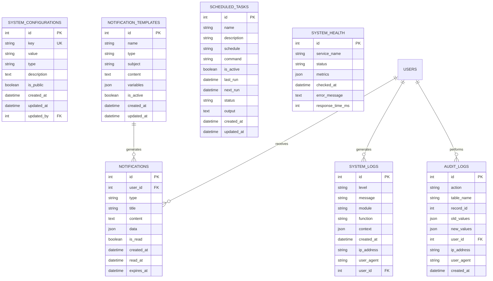
```mermaid
erDiagram
    SYSTEM_CONFIGURATIONS {
        int id PK
        string key UK
        string value
        string type
        text description
        boolean is_public
        datetime created_at
        datetime updated_at
        int updated_by FK
    }

    AUDIT_LOGS {
        int id PK
        string action
        string table_name
        int record_id
        json old_values
        json new_values
        int user_id FK
        string ip_address
        string user_agent
        datetime created_at
    }

    SYSTEM_LOGS {
        int id PK
        string level
        string message
        string module
        string function
        json context
        datetime created_at
        string ip_address
        string user_agent
        int user_id FK
    }

    NOTIFICATIONS {
        int id PK
        int user_id FK
        string type
        string title
        text content
        json data
        boolean is_read
        datetime created_at
        datetime read_at
        datetime expires_at
    }

    NOTIFICATION_TEMPLATES {
        int id PK
        string name
        string type
        string subject
        text content
        json variables
        boolean is_active
        datetime created_at
        datetime updated_at
    }

    SCHEDULED_TASKS {
        int id PK
        string name
        string description
        string schedule
        string command
        boolean is_active
        datetime last_run
        datetime next_run
        string status
        text output
        datetime created_at
        datetime updated_at
    }

    SYSTEM_HEALTH {
        int id PK
        string service_name
        string status
        json metrics
        datetime checked_at
        text error_message
        int response_time_ms
    }

    USERS ||--o{ AUDIT_LOGS : performs
    USERS ||--o{ SYSTEM_LOGS : generates
    USERS ||--o{ NOTIFICATIONS : receives
    NOTIFICATION_TEMPLATES ||--o{ NOTIFICATIONS : generates
```

---

## 🔧 Otimizações e Índices

### 📈 **Estratégia de Indexação**

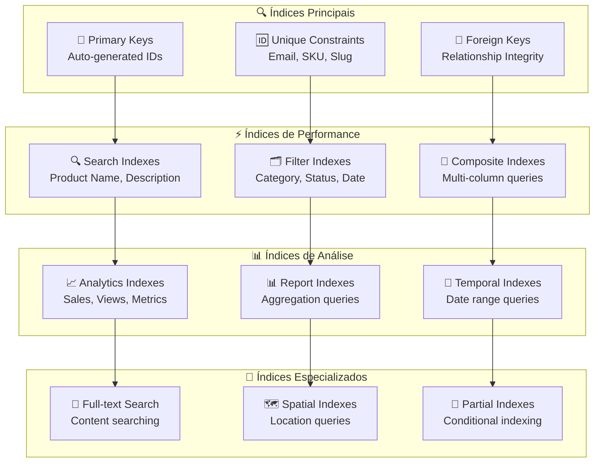
```mermaid
graph TB
    subgraph "🔍 Índices Principais"
        PRIMARY[🔑 Primary Keys<br/>Auto-generated IDs]
        UNIQUE[🆔 Unique Constraints<br/>Email, SKU, Slug]
        FOREIGN[🔗 Foreign Keys<br/>Relationship Integrity]
    end

    subgraph "⚡ Índices de Performance"
        SEARCH[🔍 Search Indexes<br/>Product Name, Description]
        FILTER[🗂️ Filter Indexes<br/>Category, Status, Date]
        COMPOSITE[🔗 Composite Indexes<br/>Multi-column queries]
    end

    subgraph "📊 Índices de Análise"
        ANALYTICS[📈 Analytics Indexes<br/>Sales, Views, Metrics]
        REPORT[📊 Report Indexes<br/>Aggregation queries]
        TEMPORAL[📅 Temporal Indexes<br/>Date range queries]
    end

    subgraph "🎯 Índices Especializados"
        FULLTEXT[📝 Full-text Search<br/>Content searching]
        SPATIAL[🗺️ Spatial Indexes<br/>Location queries]
        PARTIAL[🎯 Partial Indexes<br/>Conditional indexing]
    end

    PRIMARY --> SEARCH
    UNIQUE --> FILTER
    FOREIGN --> COMPOSITE

    SEARCH --> ANALYTICS
    FILTER --> REPORT
    COMPOSITE --> TEMPORAL

    ANALYTICS --> FULLTEXT
    REPORT --> SPATIAL
    TEMPORAL --> PARTIAL
```

### 🔧 **Configurações de Índices**

```sql
-- Índices de Performance Críticos
CREATE INDEX idx_products_category_active ON products(category_id, is_active);
CREATE INDEX idx_orders_user_status ON orders(user_id, status);
CREATE INDEX idx_inventory_product_location ON inventory(product_id, location);
CREATE INDEX idx_customers_email_active ON customers(email, is_active);

-- Índices de Busca
CREATE INDEX idx_products_search ON products USING gin(to_tsvector('portuguese', name || ' ' || description));
CREATE INDEX idx_blog_posts_search ON blog_posts USING gin(to_tsvector('portuguese', title || ' ' || content));

-- Índices Compostos para Relatórios
CREATE INDEX idx_orders_date_status ON orders(created_at, status);
CREATE INDEX idx_order_items_product_date ON order_items(product_id, created_at);
CREATE INDEX idx_payments_date_status ON payments(created_at, status);

-- Índices Parciais
CREATE INDEX idx_active_products ON products(name) WHERE is_active = true;
CREATE INDEX idx_pending_orders ON orders(created_at) WHERE status = 'pending';
CREATE INDEX idx_unread_notifications ON notifications(user_id, created_at) WHERE is_read = false;
```

---

## 🗂️ Particionamento

### 📊 **Estratégia de Particionamento**

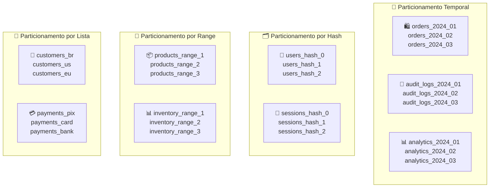
```mermaid
graph TB
    subgraph "📅 Particionamento Temporal"
        ORDERS_PART[🛍️ orders_2024_01<br/>orders_2024_02<br/>orders_2024_03]
        LOGS_PART[📝 audit_logs_2024_01<br/>audit_logs_2024_02<br/>audit_logs_2024_03]
        ANALYTICS_PART[📊 analytics_2024_01<br/>analytics_2024_02<br/>analytics_2024_03]
    end

    subgraph "🗂️ Particionamento por Hash"
        USERS_PART[👥 users_hash_0<br/>users_hash_1<br/>users_hash_2]
        SESSIONS_PART[🎫 sessions_hash_0<br/>sessions_hash_1<br/>sessions_hash_2]
    end

    subgraph "🎯 Particionamento por Range"
        PRODUCTS_PART[📦 products_range_1<br/>products_range_2<br/>products_range_3]
        INVENTORY_PART[📊 inventory_range_1<br/>inventory_range_2<br/>inventory_range_3]
    end

    subgraph "📍 Particionamento por Lista"
        CUSTOMERS_PART[👤 customers_br<br/>customers_us<br/>customers_eu]
        PAYMENTS_PART[💳 payments_pix<br/>payments_card<br/>payments_bank]
    end
```

---

## 💾 Backup e Recuperação

### 🔄 **Estratégia de Backup**

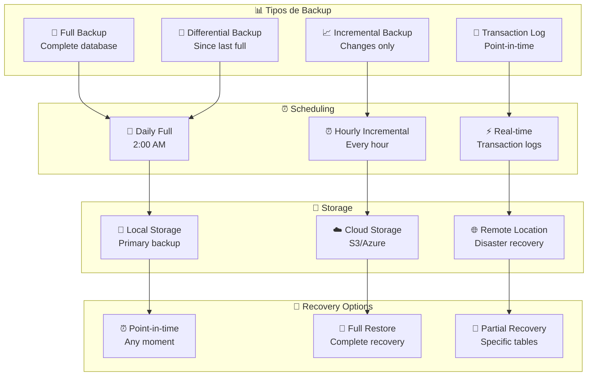
```mermaid
graph TB
    subgraph "📊 Tipos de Backup"
        FULL[💾 Full Backup<br/>Complete database]
        INCREMENTAL[📈 Incremental Backup<br/>Changes only]
        DIFFERENTIAL[🔄 Differential Backup<br/>Since last full]
        TRANSACTION[📝 Transaction Log<br/>Point-in-time]
    end

    subgraph "⏰ Scheduling"
        DAILY[📅 Daily Full<br/>2:00 AM]
        HOURLY[⏰ Hourly Incremental<br/>Every hour]
        REALTIME[⚡ Real-time<br/>Transaction logs]
    end

    subgraph "🏪 Storage"
        LOCAL[💽 Local Storage<br/>Primary backup]
        CLOUD[☁️ Cloud Storage<br/>S3/Azure]
        REMOTE[🌐 Remote Location<br/>Disaster recovery]
    end

    subgraph "🔧 Recovery Options"
        POINT_TIME[⏰ Point-in-time<br/>Any moment]
        FULL_RESTORE[💾 Full Restore<br/>Complete recovery]
        PARTIAL[🎯 Partial Recovery<br/>Specific tables]
    end

    FULL --> DAILY
    INCREMENTAL --> HOURLY
    DIFFERENTIAL --> DAILY
    TRANSACTION --> REALTIME

    DAILY --> LOCAL
    HOURLY --> CLOUD
    REALTIME --> REMOTE

    LOCAL --> POINT_TIME
    CLOUD --> FULL_RESTORE
    REMOTE --> PARTIAL
```

---

## ⚡ Cache Strategy

### 🔄 **Arquitetura de Cache**

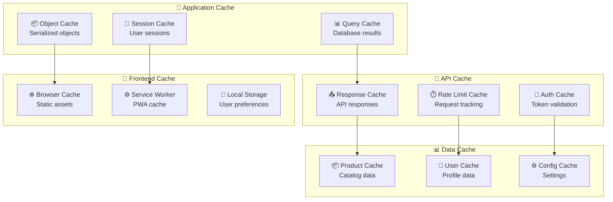
```mermaid
graph TB
    subgraph "🧠 Application Cache"
        QUERY_CACHE[📊 Query Cache<br/>Database results]
        OBJECT_CACHE[📦 Object Cache<br/>Serialized objects]
        SESSION_CACHE[🎫 Session Cache<br/>User sessions]
    end

    subgraph "📡 API Cache"
        RESPONSE_CACHE[📤 Response Cache<br/>API responses]
        RATE_LIMIT_CACHE[⏱️ Rate Limit Cache<br/>Request tracking]
        AUTH_CACHE[🔐 Auth Cache<br/>Token validation]
    end

    subgraph "🎨 Frontend Cache"
        BROWSER_CACHE[🌐 Browser Cache<br/>Static assets]
        SERVICE_WORKER[⚙️ Service Worker<br/>PWA cache]
        LOCAL_STORAGE[💾 Local Storage<br/>User preferences]
    end

    subgraph "📊 Data Cache"
        PRODUCT_CACHE[📦 Product Cache<br/>Catalog data]
        USER_CACHE[👤 User Cache<br/>Profile data]
        CONFIG_CACHE[⚙️ Config Cache<br/>Settings]
    end

    QUERY_CACHE --> RESPONSE_CACHE
    OBJECT_CACHE --> BROWSER_CACHE
    SESSION_CACHE --> SERVICE_WORKER

    RESPONSE_CACHE --> PRODUCT_CACHE
    RATE_LIMIT_CACHE --> USER_CACHE
    AUTH_CACHE --> CONFIG_CACHE
```

### 🔧 **Configurações de Cache**

```python
# Redis Cache Configuration
CACHE_CONFIG = {
    'product_catalog': {
        'ttl': 3600,  # 1 hour
        'pattern': 'product:*',
        'invalidation': 'on_update'
    },
    'user_sessions': {
        'ttl': 86400,  # 24 hours
        'pattern': 'session:*',
        'invalidation': 'on_logout'
    },
    'api_responses': {
        'ttl': 300,  # 5 minutes
        'pattern': 'api:*',
        'invalidation': 'time_based'
    },
    'query_results': {
        'ttl': 1800,  # 30 minutes
        'pattern': 'query:*',
        'invalidation': 'on_data_change'
    }
}
```

---

## 📊 Monitoramento de Performance

### 📈 **Métricas de Database**

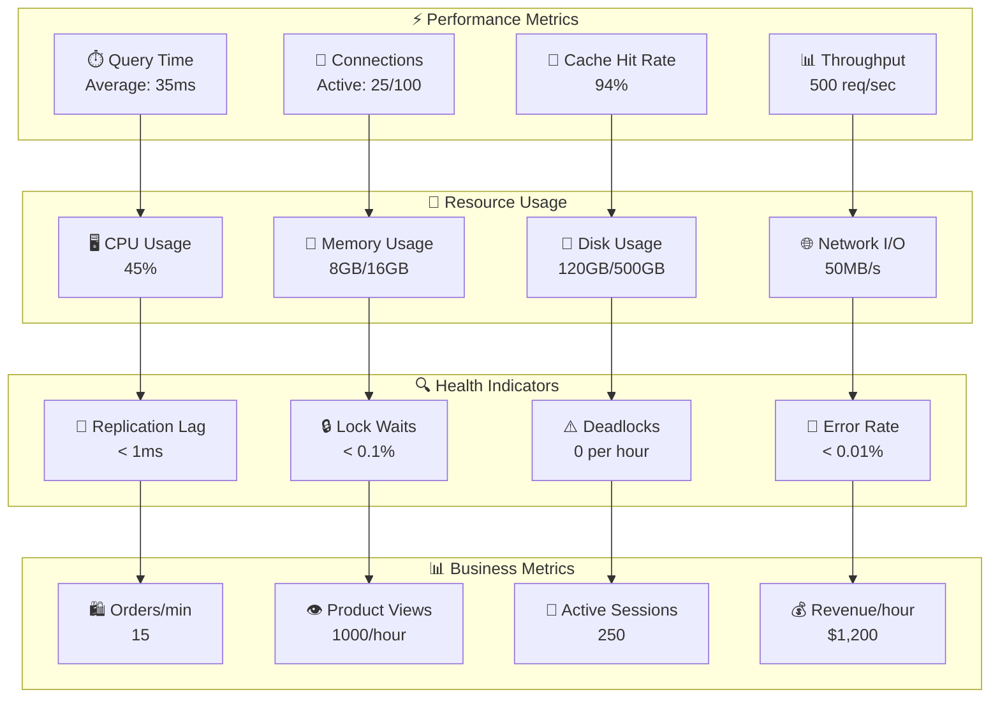
```mermaid
graph TB
    subgraph "⚡ Performance Metrics"
        QUERY_TIME[⏱️ Query Time<br/>Average: 35ms]
        CONN_COUNT[🔗 Connections<br/>Active: 25/100]
        CACHE_HIT[🎯 Cache Hit Rate<br/>94%]
        THROUGHPUT[📊 Throughput<br/>500 req/sec]
    end

    subgraph "💾 Resource Usage"
        CPU_USAGE[🖥️ CPU Usage<br/>45%]
        MEMORY_USAGE[💾 Memory Usage<br/>8GB/16GB]
        DISK_USAGE[💽 Disk Usage<br/>120GB/500GB]
        NETWORK_IO[🌐 Network I/O<br/>50MB/s]
    end

    subgraph "🔍 Health Indicators"
        REPLICATION_LAG[🔄 Replication Lag<br/>< 1ms]
        LOCK_WAITS[🔒 Lock Waits<br/>< 0.1%]
        DEADLOCKS[⚠️ Deadlocks<br/>0 per hour]
        ERROR_RATE[🚨 Error Rate<br/>< 0.01%]
    end

    subgraph "📊 Business Metrics"
        ORDERS_PER_MIN[🛍️ Orders/min<br/>15]
        PRODUCTS_VIEWS[👁️ Product Views<br/>1000/hour]
        USER_SESSIONS[👥 Active Sessions<br/>250]
        REVENUE_RATE[💰 Revenue/hour<br/>$1,200]
    end

    QUERY_TIME --> CPU_USAGE
    CONN_COUNT --> MEMORY_USAGE
    CACHE_HIT --> DISK_USAGE
    THROUGHPUT --> NETWORK_IO

    CPU_USAGE --> REPLICATION_LAG
    MEMORY_USAGE --> LOCK_WAITS
    DISK_USAGE --> DEADLOCKS
    NETWORK_IO --> ERROR_RATE

    REPLICATION_LAG --> ORDERS_PER_MIN
    LOCK_WAITS --> PRODUCTS_VIEWS
    DEADLOCKS --> USER_SESSIONS
    ERROR_RATE --> REVENUE_RATE
```

---

## 🎯 Data Governance

### 📋 **Políticas de Dados**

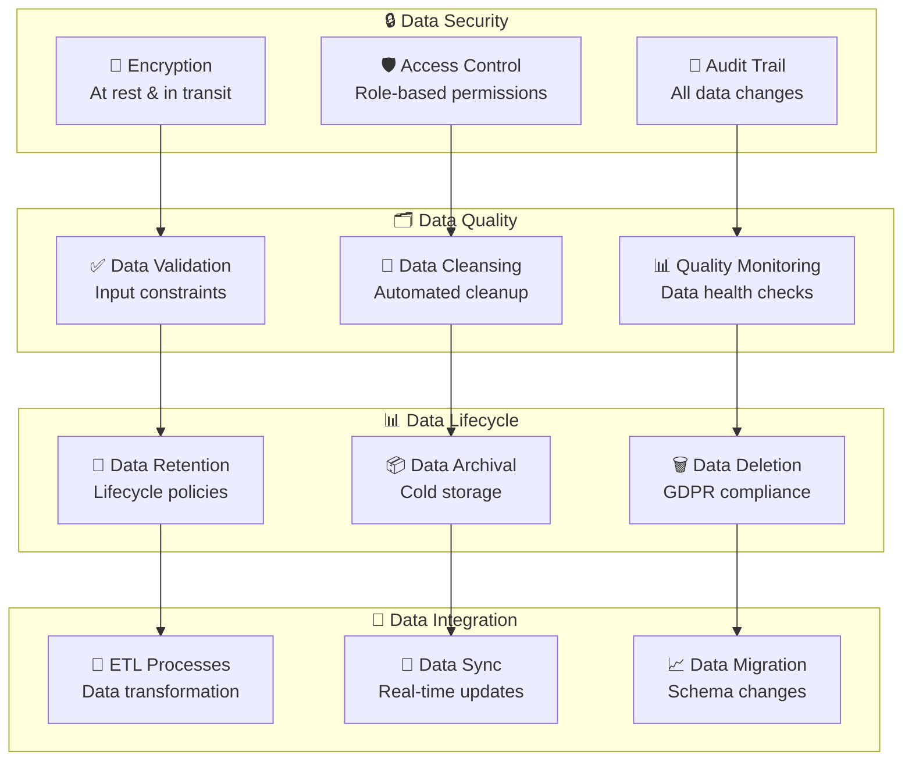
```mermaid
graph TB
    subgraph "🔒 Data Security"
        ENCRYPTION[🔐 Encryption<br/>At rest & in transit]
        ACCESS_CONTROL[🛡️ Access Control<br/>Role-based permissions]
        AUDIT_TRAIL[📝 Audit Trail<br/>All data changes]
    end

    subgraph "🗂️ Data Quality"
        VALIDATION[✅ Data Validation<br/>Input constraints]
        CLEANSING[🧹 Data Cleansing<br/>Automated cleanup]
        MONITORING[📊 Quality Monitoring<br/>Data health checks]
    end

    subgraph "📊 Data Lifecycle"
        RETENTION[📅 Data Retention<br/>Lifecycle policies]
        ARCHIVAL[📦 Data Archival<br/>Cold storage]
        DELETION[🗑️ Data Deletion<br/>GDPR compliance]
    end

    subgraph "🔄 Data Integration"
        ETL[🔄 ETL Processes<br/>Data transformation]
        SYNC[🔄 Data Sync<br/>Real-time updates]
        MIGRATION[📈 Data Migration<br/>Schema changes]
    end

    ENCRYPTION --> VALIDATION
    ACCESS_CONTROL --> CLEANSING
    AUDIT_TRAIL --> MONITORING

    VALIDATION --> RETENTION
    CLEANSING --> ARCHIVAL
    MONITORING --> DELETION

    RETENTION --> ETL
    ARCHIVAL --> SYNC
    DELETION --> MIGRATION
```

---

## 📋 Conclusão

A arquitetura de dados do **Mestres Café Enterprise** foi projetada para oferecer **robustez**, **escalabilidade** e **performance** em um ambiente enterprise complexo. Com mais de **50 tabelas organizadas em domínios funcionais**, o sistema oferece uma base sólida para operações de e-commerce, CRM e ERP.

### 🎯 **Pontos Fortes**

- **Modelo normalizado** com integridade referencial
- **Índices otimizados** para consultas críticas
- **Particionamento inteligente** para escalabilidade
- **Estratégia de cache** multi-camada
- **Backup e recuperação** robustos

### 🚀 **Próximos Passos**

- **Implementação de sharding** para escala extrema
- **Data lake** para analytics avançado
- **Machine learning** para insights preditivos
- **Real-time streaming** para dados dinâmicos

---

_Documento técnico mantido pela equipe de dados_
_Última atualização: Janeiro 2025_
