# 🗄️ Arquitetura de Dados - Mestres Café Enterprise

> **Documentação completa do modelo de dados e estratégias de persistência**

---

## 📋 Visão Geral

O **Mestres Café Enterprise** possui uma arquitetura de dados robusta projetada para suportar operações complexas de **e-commerce**, **ERP** e **CRM**. O sistema utiliza **PostgreSQL** como banco principal com **Redis** para cache e sessões, totalizando **50+ tabelas** organizadas em domínios funcionais.

### 🎯 **Características da Arquitetura**

- **Modelo Relacional** - Integridade referencial garantida
- **Normalização 3NF** - Redução de redundância
- **Índices Otimizados** - Performance de consultas
- **Particionamento** - Escalabilidade horizontal
- **Auditoria Completa** - Rastreabilidade de mudanças

---

## 🏗️ Estrutura Geral do Banco

### 📊 **Estatísticas do Banco**

```mermaid
pie title 🗄️ Distribuição de Tabelas por Domínio
    "E-commerce (Products, Orders)" : 15
    "CRM (Customers, Leads)" : 12
    "ERP (Inventory, Finance)" : 10
    "Auth & Users" : 8
    "Content & Media" : 6
    "System & Logs" : 4
```



### 🔗 **Domínios Funcionais**

```mermaid
graph TB
    subgraph "👤 Auth & Users Domain"
        USERS[👥 users<br/>8 tables]
        ROLES[🔐 roles & permissions<br/>User management]
        SESSIONS[🎫 sessions<br/>Authentication]
    end

    subgraph "🛒 E-commerce Domain"
        PRODUCTS[📦 products<br/>Product catalog]
        ORDERS[🛍️ orders<br/>Order management]
        CART[🛒 cart<br/>Shopping cart]
        PAYMENTS[💳 payments<br/>Payment processing]
    end

    subgraph "👥 CRM Domain"
        CUSTOMERS[👤 customers<br/>Customer data]
        LEADS[📈 leads<br/>Lead management]
        CAMPAIGNS[📢 campaigns<br/>Marketing]
        COMMUNICATIONS[📧 communications<br/>Customer interaction]
    end

    subgraph "📊 ERP Domain"
        INVENTORY[📦 inventory<br/>Stock management]
        SUPPLIERS[🏭 suppliers<br/>Vendor management]
        FINANCE[💰 finance<br/>Financial data]
        REPORTS[📊 reports<br/>Business intelligence]
    end

    subgraph "📱 Content Domain"
        BLOG[📝 blog<br/>Content management]
        COURSES[🎓 courses<br/>Learning platform]
        MEDIA[🖼️ media<br/>File management]
    end

    subgraph "⚙️ System Domain"
        LOGS[📝 logs<br/>System logging]
        CONFIG[⚙️ configuration<br/>System settings]
        NOTIFICATIONS[🔔 notifications<br/>Alert system]
    end

    USERS --> ORDERS
    USERS --> CUSTOMERS
    PRODUCTS --> ORDERS
    CUSTOMERS --> LEADS
    INVENTORY --> PRODUCTS
    ORDERS --> PAYMENTS
```



---

## 🔐 Domínio de Autenticação

### 👤 **Modelo de Usuários**


---

## 🛒 Domínio de E-commerce

### 📦 **Catálogo de Produtos**


### 🛍️ **Gestão de Pedidos**


---

## 💳 Domínio de Pagamentos

### 💰 **Sistema de Pagamentos**


---

## 📊 Domínio de Inventário

### 📦 **Gestão de Estoque**


---

## 👥 Domínio de CRM

### 👤 **Gestão de Clientes**


---

## 📢 Domínio de Marketing

### 🎯 **Campanhas e Newsletter**


---

## 📝 Domínio de Conteúdo

### 📄 **Blog e Cursos**


---

## 🎮 Domínio de Gamificação

### 🏆 **Sistema de Pontos e Recompensas**


---

## ⚙️ Domínio de Sistema

### 📊 **Configuração e Logs**


---

## 🔧 Otimizações e Índices

### 📈 **Estratégia de Indexação**

```mermaid
graph TB
    subgraph "🔍 Índices Principais"
        PRIMARY[🔑 Primary Keys<br/>Auto-generated IDs]
        UNIQUE[🆔 Unique Constraints<br/>Email, SKU, Slug]
        FOREIGN[🔗 Foreign Keys<br/>Relationship Integrity]
    end

    subgraph "⚡ Índices de Performance"
        SEARCH[🔍 Search Indexes<br/>Product Name, Description]
        FILTER[🗂️ Filter Indexes<br/>Category, Status, Date]
        COMPOSITE[🔗 Composite Indexes<br/>Multi-column queries]
    end

    subgraph "📊 Índices de Análise"
        ANALYTICS[📈 Analytics Indexes<br/>Sales, Views, Metrics]
        REPORT[📊 Report Indexes<br/>Aggregation queries]
        TEMPORAL[📅 Temporal Indexes<br/>Date range queries]
    end

    subgraph "🎯 Índices Especializados"
        FULLTEXT[📝 Full-text Search<br/>Content searching]
        SPATIAL[🗺️ Spatial Indexes<br/>Location queries]
        PARTIAL[🎯 Partial Indexes<br/>Conditional indexing]
    end

    PRIMARY --> SEARCH
    UNIQUE --> FILTER
    FOREIGN --> COMPOSITE

    SEARCH --> ANALYTICS
    FILTER --> REPORT
    COMPOSITE --> TEMPORAL

    ANALYTICS --> FULLTEXT
    REPORT --> SPATIAL
    TEMPORAL --> PARTIAL
```



### 🔧 **Configurações de Índices**

```sql
-- Índices de Performance Críticos
CREATE INDEX idx_products_category_active ON products(category_id, is_active);
CREATE INDEX idx_orders_user_status ON orders(user_id, status);
CREATE INDEX idx_inventory_product_location ON inventory(product_id, location);
CREATE INDEX idx_customers_email_active ON customers(email, is_active);

-- Índices de Busca
CREATE INDEX idx_products_search ON products USING gin(to_tsvector('portuguese', name || ' ' || description));
CREATE INDEX idx_blog_posts_search ON blog_posts USING gin(to_tsvector('portuguese', title || ' ' || content));

-- Índices Compostos para Relatórios
CREATE INDEX idx_orders_date_status ON orders(created_at, status);
CREATE INDEX idx_order_items_product_date ON order_items(product_id, created_at);
CREATE INDEX idx_payments_date_status ON payments(created_at, status);

-- Índices Parciais
CREATE INDEX idx_active_products ON products(name) WHERE is_active = true;
CREATE INDEX idx_pending_orders ON orders(created_at) WHERE status = 'pending';
CREATE INDEX idx_unread_notifications ON notifications(user_id, created_at) WHERE is_read = false;
```

---

## 🗂️ Particionamento

### 📊 **Estratégia de Particionamento**

```mermaid
graph TB
    subgraph "📅 Particionamento Temporal"
        ORDERS_PART[🛍️ orders_2024_01<br/>orders_2024_02<br/>orders_2024_03]
        LOGS_PART[📝 audit_logs_2024_01<br/>audit_logs_2024_02<br/>audit_logs_2024_03]
        ANALYTICS_PART[📊 analytics_2024_01<br/>analytics_2024_02<br/>analytics_2024_03]
    end

    subgraph "🗂️ Particionamento por Hash"
        USERS_PART[👥 users_hash_0<br/>users_hash_1<br/>users_hash_2]
        SESSIONS_PART[🎫 sessions_hash_0<br/>sessions_hash_1<br/>sessions_hash_2]
    end

    subgraph "🎯 Particionamento por Range"
        PRODUCTS_PART[📦 products_range_1<br/>products_range_2<br/>products_range_3]
        INVENTORY_PART[📊 inventory_range_1<br/>inventory_range_2<br/>inventory_range_3]
    end

    subgraph "📍 Particionamento por Lista"
        CUSTOMERS_PART[👤 customers_br<br/>customers_us<br/>customers_eu]
        PAYMENTS_PART[💳 payments_pix<br/>payments_card<br/>payments_bank]
    end
```



---

## 💾 Backup e Recuperação

### 🔄 **Estratégia de Backup**

```mermaid
graph TB
    subgraph "📊 Tipos de Backup"
        FULL[💾 Full Backup<br/>Complete database]
        INCREMENTAL[📈 Incremental Backup<br/>Changes only]
        DIFFERENTIAL[🔄 Differential Backup<br/>Since last full]
        TRANSACTION[📝 Transaction Log<br/>Point-in-time]
    end

    subgraph "⏰ Scheduling"
        DAILY[📅 Daily Full<br/>2:00 AM]
        HOURLY[⏰ Hourly Incremental<br/>Every hour]
        REALTIME[⚡ Real-time<br/>Transaction logs]
    end

    subgraph "🏪 Storage"
        LOCAL[💽 Local Storage<br/>Primary backup]
        CLOUD[☁️ Cloud Storage<br/>S3/Azure]
        REMOTE[🌐 Remote Location<br/>Disaster recovery]
    end

    subgraph "🔧 Recovery Options"
        POINT_TIME[⏰ Point-in-time<br/>Any moment]
        FULL_RESTORE[💾 Full Restore<br/>Complete recovery]
        PARTIAL[🎯 Partial Recovery<br/>Specific tables]
    end

    FULL --> DAILY
    INCREMENTAL --> HOURLY
    DIFFERENTIAL --> DAILY
    TRANSACTION --> REALTIME

    DAILY --> LOCAL
    HOURLY --> CLOUD
    REALTIME --> REMOTE

    LOCAL --> POINT_TIME
    CLOUD --> FULL_RESTORE
    REMOTE --> PARTIAL
```



---

## ⚡ Cache Strategy

### 🔄 **Arquitetura de Cache**

```mermaid
graph TB
    subgraph "🧠 Application Cache"
        QUERY_CACHE[📊 Query Cache<br/>Database results]
        OBJECT_CACHE[📦 Object Cache<br/>Serialized objects]
        SESSION_CACHE[🎫 Session Cache<br/>User sessions]
    end

    subgraph "📡 API Cache"
        RESPONSE_CACHE[📤 Response Cache<br/>API responses]
        RATE_LIMIT_CACHE[⏱️ Rate Limit Cache<br/>Request tracking]
        AUTH_CACHE[🔐 Auth Cache<br/>Token validation]
    end

    subgraph "🎨 Frontend Cache"
        BROWSER_CACHE[🌐 Browser Cache<br/>Static assets]
        SERVICE_WORKER[⚙️ Service Worker<br/>PWA cache]
        LOCAL_STORAGE[💾 Local Storage<br/>User preferences]
    end

    subgraph "📊 Data Cache"
        PRODUCT_CACHE[📦 Product Cache<br/>Catalog data]
        USER_CACHE[👤 User Cache<br/>Profile data]
        CONFIG_CACHE[⚙️ Config Cache<br/>Settings]
    end

    QUERY_CACHE --> RESPONSE_CACHE
    OBJECT_CACHE --> BROWSER_CACHE
    SESSION_CACHE --> SERVICE_WORKER

    RESPONSE_CACHE --> PRODUCT_CACHE
    RATE_LIMIT_CACHE --> USER_CACHE
    AUTH_CACHE --> CONFIG_CACHE
```



### 🔧 **Configurações de Cache**

```python
# Redis Cache Configuration
CACHE_CONFIG = {
    'product_catalog': {
        'ttl': 3600,  # 1 hour
        'pattern': 'product:*',
        'invalidation': 'on_update'
    },
    'user_sessions': {
        'ttl': 86400,  # 24 hours
        'pattern': 'session:*',
        'invalidation': 'on_logout'
    },
    'api_responses': {
        'ttl': 300,  # 5 minutes
        'pattern': 'api:*',
        'invalidation': 'time_based'
    },
    'query_results': {
        'ttl': 1800,  # 30 minutes
        'pattern': 'query:*',
        'invalidation': 'on_data_change'
    }
}
```

---

## 📊 Monitoramento de Performance

### 📈 **Métricas de Database**

```mermaid
graph TB
    subgraph "⚡ Performance Metrics"
        QUERY_TIME[⏱️ Query Time<br/>Average: 35ms]
        CONN_COUNT[🔗 Connections<br/>Active: 25/100]
        CACHE_HIT[🎯 Cache Hit Rate<br/>94%]
        THROUGHPUT[📊 Throughput<br/>500 req/sec]
    end

    subgraph "💾 Resource Usage"
        CPU_USAGE[🖥️ CPU Usage<br/>45%]
        MEMORY_USAGE[💾 Memory Usage<br/>8GB/16GB]
        DISK_USAGE[💽 Disk Usage<br/>120GB/500GB]
        NETWORK_IO[🌐 Network I/O<br/>50MB/s]
    end

    subgraph "🔍 Health Indicators"
        REPLICATION_LAG[🔄 Replication Lag<br/>< 1ms]
        LOCK_WAITS[🔒 Lock Waits<br/>< 0.1%]
        DEADLOCKS[⚠️ Deadlocks<br/>0 per hour]
        ERROR_RATE[🚨 Error Rate<br/>< 0.01%]
    end

    subgraph "📊 Business Metrics"
        ORDERS_PER_MIN[🛍️ Orders/min<br/>15]
        PRODUCTS_VIEWS[👁️ Product Views<br/>1000/hour]
        USER_SESSIONS[👥 Active Sessions<br/>250]
        REVENUE_RATE[💰 Revenue/hour<br/>$1,200]
    end

    QUERY_TIME --> CPU_USAGE
    CONN_COUNT --> MEMORY_USAGE
    CACHE_HIT --> DISK_USAGE
    THROUGHPUT --> NETWORK_IO

    CPU_USAGE --> REPLICATION_LAG
    MEMORY_USAGE --> LOCK_WAITS
    DISK_USAGE --> DEADLOCKS
    NETWORK_IO --> ERROR_RATE

    REPLICATION_LAG --> ORDERS_PER_MIN
    LOCK_WAITS --> PRODUCTS_VIEWS
    DEADLOCKS --> USER_SESSIONS
    ERROR_RATE --> REVENUE_RATE
```



---

## 🎯 Data Governance

### 📋 **Políticas de Dados**

```mermaid
graph TB
    subgraph "🔒 Data Security"
        ENCRYPTION[🔐 Encryption<br/>At rest & in transit]
        ACCESS_CONTROL[🛡️ Access Control<br/>Role-based permissions]
        AUDIT_TRAIL[📝 Audit Trail<br/>All data changes]
    end

    subgraph "🗂️ Data Quality"
        VALIDATION[✅ Data Validation<br/>Input constraints]
        CLEANSING[🧹 Data Cleansing<br/>Automated cleanup]
        MONITORING[📊 Quality Monitoring<br/>Data health checks]
    end

    subgraph "📊 Data Lifecycle"
        RETENTION[📅 Data Retention<br/>Lifecycle policies]
        ARCHIVAL[📦 Data Archival<br/>Cold storage]
        DELETION[🗑️ Data Deletion<br/>GDPR compliance]
    end

    subgraph "🔄 Data Integration"
        ETL[🔄 ETL Processes<br/>Data transformation]
        SYNC[🔄 Data Sync<br/>Real-time updates]
        MIGRATION[📈 Data Migration<br/>Schema changes]
    end

    ENCRYPTION --> VALIDATION
    ACCESS_CONTROL --> CLEANSING
    AUDIT_TRAIL --> MONITORING

    VALIDATION --> RETENTION
    CLEANSING --> ARCHIVAL
    MONITORING --> DELETION

    RETENTION --> ETL
    ARCHIVAL --> SYNC
    DELETION --> MIGRATION
```



---

## 📋 Conclusão

A arquitetura de dados do **Mestres Café Enterprise** foi projetada para oferecer **robustez**, **escalabilidade** e **performance** em um ambiente enterprise complexo. Com mais de **50 tabelas organizadas em domínios funcionais**, o sistema oferece uma base sólida para operações de e-commerce, CRM e ERP.

### 🎯 **Pontos Fortes**

- **Modelo normalizado** com integridade referencial
- **Índices otimizados** para consultas críticas
- **Particionamento inteligente** para escalabilidade
- **Estratégia de cache** multi-camada
- **Backup e recuperação** robustos

### 🚀 **Próximos Passos**

- **Implementação de sharding** para escala extrema
- **Data lake** para analytics avançado
- **Machine learning** para insights preditivos
- **Real-time streaming** para dados dinâmicos

---

_Documento técnico mantido pela equipe de dados_
_Última atualização: Janeiro 2025_
