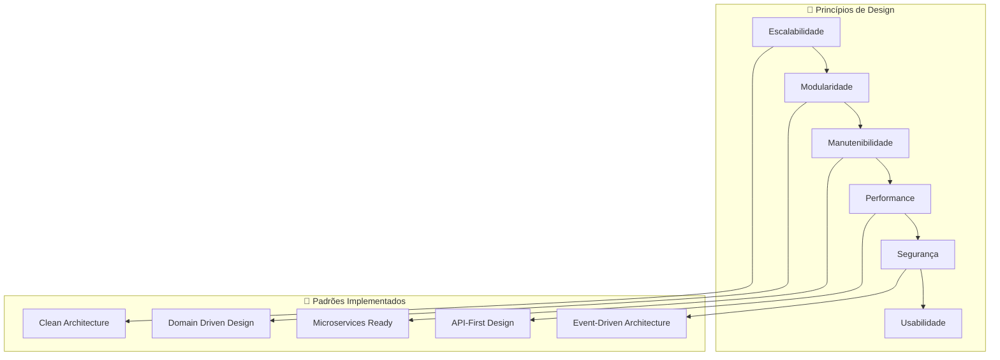
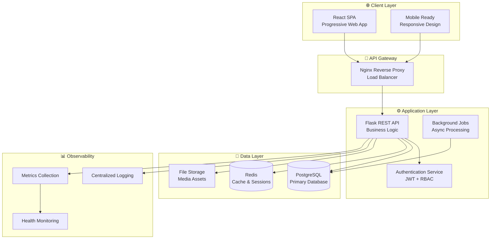
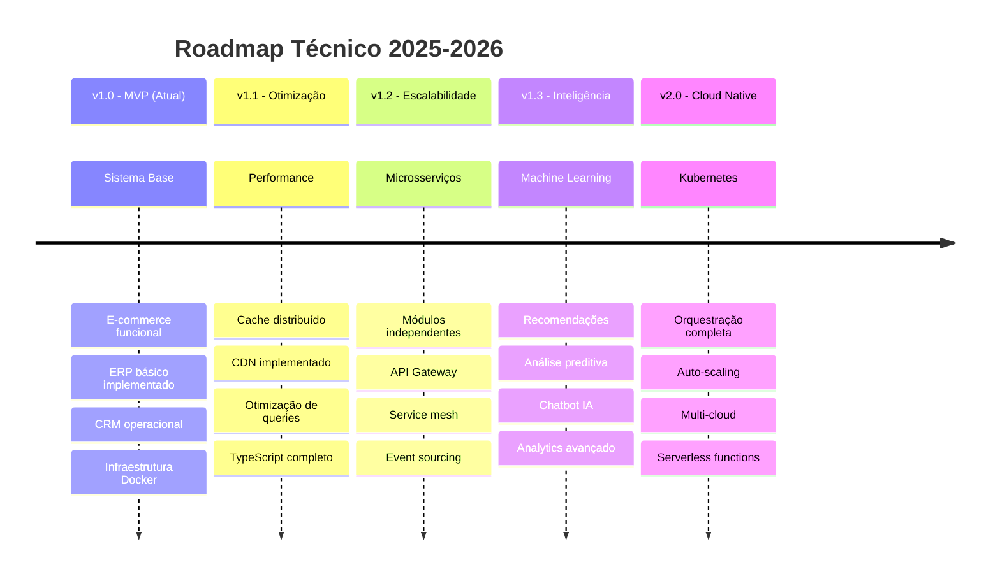

# 🎯 Visão Executiva - Mestres Café Enterprise

> **Sistema Enterprise de E-commerce e ERP para Torrefação Artesanal**

---

## 📋 Resumo Executivo

O **Mestres Café Enterprise** é uma plataforma digital completa que integra **e-commerce**, **ERP** e **CRM** em uma solução robusta e escalável para o mercado de cafés especiais. Desenvolvido como um sistema enterprise moderno, combina as melhores práticas de desenvolvimento full-stack com arquitetura orientada a escalabilidade.

### 🎯 **Missão do Sistema**

Fornecer uma plataforma tecnológica avançada que permita a torrefações artesanais gerenciar completamente suas operações comerciais, desde a venda online até a gestão interna de recursos, clientes e processos.

---

## 🏢 Contexto de Negócio

### 📊 **Mercado Alvo**

- **Torrefações artesanais** de cafés especiais
- **Produtores de café** que vendem diretamente
- **Distribuidores** de cafés premium
- **Coffee shops** e cafeterias especializadas

### 💡 **Proposta de Valor**

- **All-in-One**: E-commerce + ERP + CRM em uma única plataforma
- **Especialização**: Focado no mercado de cafés especiais
- **Escalabilidade**: Arquitetura preparada para crescimento
- **Experiência**: UX otimizada para o mercado brasileiro

### 🎯 **Objetivos Estratégicos**

1. **Digitalizar** operações de torrefações tradicionais
2. **Otimizar** processos de vendas e gestão
3. **Expandir** alcance de mercado através do e-commerce
4. **Profissionalizar** gestão de clientes e leads

---

## 🏗️ Visão Arquitetural

### 📐 **Princípios Arquiteturais**



### 🏛️ **Arquitetura de Alto Nível**



---

## 🔧 Stack Tecnológica

### 🎨 **Frontend Stack**

```yaml
Framework: React 18
Build Tool: Vite 5.0
Language: JavaScript + TypeScript (parcial)
Styling: Tailwind CSS + Shadcn/UI
State: Context API + Custom Hooks
Routing: React Router v6
```

### ⚙️ **Backend Stack**

```yaml
Framework: Flask 3.0
Language: Python 3.9+
ORM: SQLAlchemy 2.0
Authentication: Flask-JWT-Extended
API: RESTful + Blueprint Organization
Background: Celery (planejado)
```

### 🗄️ **Data Stack**

```yaml
Primary DB: PostgreSQL 15
Cache: Redis 7
Development DB: SQLite
File Storage: Local + S3 (planejado)
Migrations: Alembic
```

### 🚀 **DevOps Stack**

```yaml
Containerization: Docker + Docker Compose
CI/CD: GitHub Actions
Reverse Proxy: Nginx
Monitoring: Prometheus + Grafana
Logging: ELK Stack (planejado)
```

---

## 📊 Métricas do Sistema

### 🔢 **Complexidade Técnica**

- **Backend**: 20+ módulos Flask organizados
- **Frontend**: 25+ páginas React componentizadas
- **Database**: 50+ tabelas relacionadas
- **APIs**: 100+ endpoints RESTful
- **Testes**: Cobertura planejada de 80%+

### 📈 **Capacidades Funcionais**

- **E-commerce**: Catálogo completo, carrinho, checkout, pagamentos
- **ERP**: Estoque, financeiro, RH, compras, produção
- **CRM**: Clientes, leads, campanhas, segmentação
- **Content**: Blog, newsletter, cursos, gamificação

### ⚡ **Performance Targets**

```yaml
Frontend:
  First Contentful Paint: < 1.5s
  Time to Interactive: < 3s
  Largest Contentful Paint: < 2.5s

Backend:
  API Response Time: < 200ms (95th percentile)
  Database Query Time: < 100ms (average)
  Concurrent Users: 1000+ supported

Infrastructure:
  Uptime: 99.9%
  CPU Usage: < 70% (normal operation)
  Memory Usage: < 80% (peak load)
```

---

## 🎯 Stakeholders

### 👥 **Stakeholders Técnicos**

- **Tech Lead**: KallebyX - Arquitetura e liderança técnica
- **Full Stack Developer**: Desenvolvimento frontend/backend
- **DevOps Engineer**: Infraestrutura e deployment
- **QA Engineer**: Testes e qualidade

### 🏢 **Stakeholders de Negócio**

- **Product Owner**: Definição de funcionalidades
- **Business Analyst**: Requisitos e processos
- **UX/UI Designer**: Experiência do usuário
- **Marketing**: Estratégias digitais

### 🎯 **Usuários Finais**

- **Administradores**: Gestão completa do sistema
- **Funcionários**: Operações diárias (estoque, vendas)
- **Clientes B2B**: Distribuidores e coffee shops
- **Clientes B2C**: Consumidores finais

---

## 🚀 Roadmap Estratégico

### 📅 **Fases de Evolução**



### 🎯 **Objetivos por Fase**

#### **v1.1 - Otimização (Q2 2025)**

- **Performance**: Melhorar tempos de resposta em 40%
- **UX**: Implementar PWA completa
- **Observabilidade**: Dashboards operacionais avançados
- **Qualidade**: Cobertura de testes 80%+

#### **v1.2 - Escalabilidade (Q3 2025)**

- **Arquitetura**: Transição para microsserviços críticos
- **Integração**: APIs externas e webhooks
- **Mobile**: App nativo planejado
- **Global**: Internacionalização (i18n)

#### **v1.3 - Inteligência (Q4 2025)**

- **IA/ML**: Sistema de recomendações
- **Analytics**: Business Intelligence avançado
- **Automação**: Workflows inteligentes
- **Personalização**: Experiência customizada

#### **v2.0 - Cloud Native (Q1 2026)**

- **Kubernetes**: Migração completa
- **Serverless**: Functions específicas
- **Edge Computing**: CDN e edge functions
- **Global Scale**: Multi-região

---

## 💼 Business Case

### 📊 **ROI Esperado**

- **Redução de custos operacionais**: 30-40%
- **Aumento de vendas online**: 200-300%
- **Melhoria na gestão de estoque**: 50% redução de perdas
- **Eficiência operacional**: 60% melhoria em processos

### 🎯 **KPIs de Sucesso**

```yaml
Técnicos:
  - Uptime: 99.9%
  - Performance: < 200ms API response
  - Escalabilidade: 1000+ usuários simultâneos
  - Segurança: Zero breaches

Negócio:
  - Conversão: 3%+ no e-commerce
  - NPS: 70+ score
  - Retention: 80%+ cliente recorrente
  - Growth: 25%+ usuários/mês
```

### 💰 **Investimento vs Retorno**

- **Desenvolvimento inicial**: 6-8 meses
- **ROI projetado**: 18-24 meses
- **Break-even**: 12 meses
- **Escalabilidade**: Suporte para 10x crescimento

---

## 🔒 Considerações de Segurança

### 🛡️ **Security by Design**

- **Autenticação**: JWT com refresh tokens
- **Autorização**: RBAC granular
- **Proteção de dados**: Criptografia em repouso e trânsito
- **Compliance**: LGPD e padrões de segurança

### 🔍 **Auditoria e Monitoramento**

- **Logs centralizados** de todas as operações
- **Monitoring em tempo real** de ameaças
- **Backup automatizado** com disaster recovery
- **Penetration testing** regular

---

## 📈 Conclusão

O **Mestres Café Enterprise** representa uma evolução significativa na digitalização do setor de cafés especiais, oferecendo uma plataforma tecnológica robusta, escalável e orientada ao futuro. Com arquitetura moderna e foco na experiência do usuário, o sistema está posicionado para ser referência no mercado e suportar o crescimento sustentável dos negócios de nossos clientes.

A implementação segue as melhores práticas da indústria, garantindo **qualidade**, **performance** e **segurança**, enquanto mantém a flexibilidade necessária para evolução contínua e adaptação às necessidades do mercado.

---

_Documento atualizado em: Janeiro 2025_
_Versão: 1.0_
_Próxima revisão: Março 2025_
