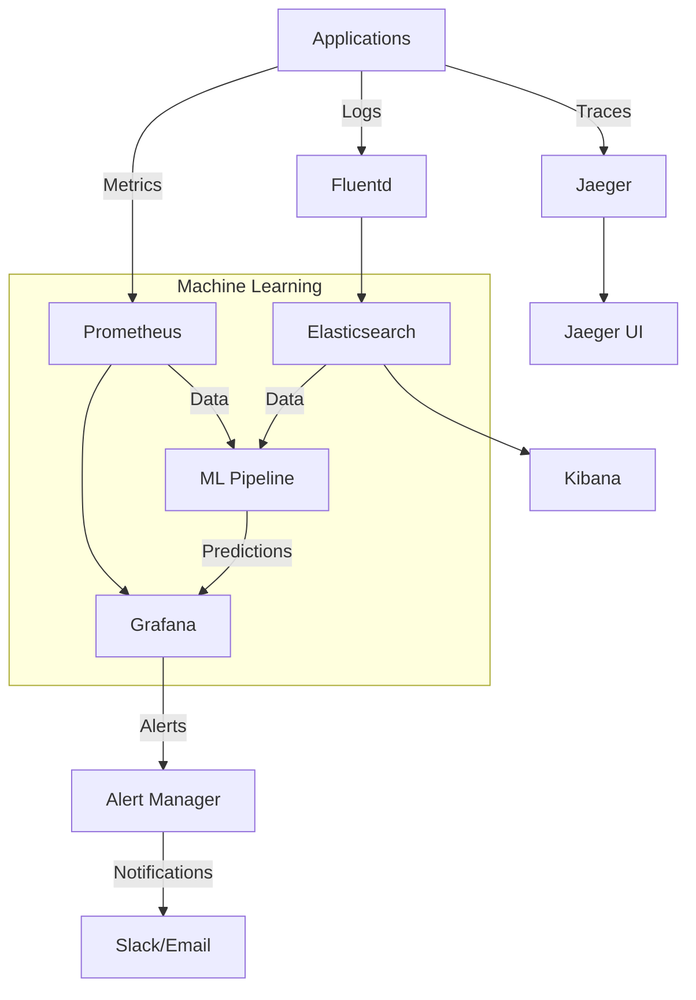

# Arquitetura de Monitoramento - Mestres Café Enterprise

## Visão Geral

O sistema de monitoramento do Mestres Café Enterprise implementa uma arquitetura de observabilidade completa, fornecendo visibilidade detalhada sobre performance, saúde, segurança e comportamento da aplicação em tempo real.

## Stack de Monitoramento

### Core Components



## 1. Métricas e Alertas (Prometheus + Grafana)

### Prometheus Configuration

```yaml
# prometheus.yml
global:
  scrape_interval: 15s
  evaluation_interval: 15s

rule_files:
  - "alerts/*.yml"

scrape_configs:
  # Flask API Metrics
  - job_name: "mestres-cafe-api"
    static_configs:
      - targets: ["api:5000"]
    metrics_path: "/metrics"
    scrape_interval: 5s

  # React App Metrics (via nginx)
  - job_name: "mestres-cafe-web"
    static_configs:
      - targets: ["web:80"]

  # Infrastructure Metrics
  - job_name: "node-exporter"
    static_configs:
      - targets: ["node-exporter:9100"]

  # Database Metrics
  - job_name: "postgres-exporter"
    static_configs:
      - targets: ["postgres-exporter:9187"]

  # Redis Metrics
  - job_name: "redis-exporter"
    static_configs:
      - targets: ["redis-exporter:9121"]

alerting:
  alertmanagers:
    - static_configs:
        - targets:
            - alertmanager:9093
```

### Application Metrics (Flask)

```python
# apps/api/src/monitoring/metrics.py
from prometheus_client import Counter, Histogram, Gauge, generate_latest
from flask import Response
import time
import psutil

# Business Metrics
orders_total = Counter('orders_total', 'Total number of orders', ['status'])
revenue_total = Counter('revenue_total', 'Total revenue')
products_sold = Counter('products_sold_total', 'Products sold', ['product_id'])

# Performance Metrics
request_duration = Histogram(
    'http_request_duration_seconds',
    'HTTP request duration',
    ['method', 'endpoint', 'status']
)

request_count = Counter(
    'http_requests_total',
    'Total HTTP requests',
    ['method', 'endpoint', 'status']
)

# Infrastructure Metrics
active_connections = Gauge('active_connections', 'Active database connections')
memory_usage = Gauge('memory_usage_bytes', 'Memory usage in bytes')
cpu_usage = Gauge('cpu_usage_percent', 'CPU usage percentage')

class MonitoringMiddleware:
    def __init__(self, app):
        self.app = app
        self.app.before_request(self.before_request)
        self.app.after_request(self.after_request)

    def before_request(self):
        request.start_time = time.time()

    def after_request(self, response):
        duration = time.time() - request.start_time

        request_duration.labels(
            method=request.method,
            endpoint=request.endpoint or 'unknown',
            status=response.status_code
        ).observe(duration)

        request_count.labels(
            method=request.method,
            endpoint=request.endpoint or 'unknown',
            status=response.status_code
        ).inc()

        return response

@app.route('/metrics')
def metrics():
    # Update infrastructure metrics
    memory_usage.set(psutil.virtual_memory().used)
    cpu_usage.set(psutil.cpu_percent())

    return Response(generate_latest(), mimetype='text/plain')
```

### Business Metrics Tracking

```python
# apps/api/src/services/metrics_service.py
from monitoring.metrics import orders_total, revenue_total, products_sold

class MetricsService:
    @staticmethod
    def track_order(order):
        orders_total.labels(status=order.status).inc()
        revenue_total.inc(order.total_amount)

        for item in order.items:
            products_sold.labels(product_id=item.product_id).inc(item.quantity)

    @staticmethod
    def track_user_action(action, user_id=None):
        user_actions.labels(action=action, user_type='guest' if not user_id else 'authenticated').inc()

    @staticmethod
    def track_inventory_movement(product_id, movement_type, quantity):
        inventory_movements.labels(
            product_id=product_id,
            movement_type=movement_type
        ).inc(quantity)
```

### Grafana Dashboards

```json
{
  "dashboard": {
    "title": "Mestres Café - Business Overview",
    "panels": [
      {
        "title": "Revenue Today",
        "type": "stat",
        "targets": [
          {
            "expr": "increase(revenue_total[24h])",
            "legendFormat": "Revenue"
          }
        ]
      },
      {
        "title": "Orders per Hour",
        "type": "graph",
        "targets": [
          {
            "expr": "rate(orders_total[1h])",
            "legendFormat": "Orders/hour"
          }
        ]
      },
      {
        "title": "Top Selling Products",
        "type": "table",
        "targets": [
          {
            "expr": "topk(10, increase(products_sold_total[24h]))",
            "legendFormat": "{{product_id}}"
          }
        ]
      }
    ]
  }
}
```

## 2. Logging Centralizado (ELK Stack)

### Fluentd Configuration

```ruby
# fluentd.conf
<source>
  @type forward
  port 24224
  bind 0.0.0.0
</source>

# Flask API Logs
<match mestres.api.**>
  @type elasticsearch
  host elasticsearch
  port 9200
  index_name mestres-api-logs
  type_name _doc
  logstash_format true
  logstash_prefix mestres-api

  <buffer>
    @type file
    path /var/log/fluentd-buffers/api
    flush_mode interval
    flush_interval 5s
    chunk_limit_size 2M
    queue_limit_length 32
  </buffer>
</match>

# React App Logs (nginx)
<match mestres.web.**>
  @type elasticsearch
  host elasticsearch
  port 9200
  index_name mestres-web-logs
  type_name _doc
  logstash_format true
  logstash_prefix mestres-web
</match>

# Infrastructure Logs
<match mestres.infra.**>
  @type elasticsearch
  host elasticsearch
  port 9200
  index_name mestres-infra-logs
  type_name _doc
  logstash_format true
  logstash_prefix mestres-infra
</match>
```

### Structured Logging (Flask)

```python
# apps/api/src/monitoring/logging.py
import logging
import json
from datetime import datetime
from flask import request, g
import uuid

class StructuredLogger:
    def __init__(self, app=None):
        self.app = app
        if app:
            self.init_app(app)

    def init_app(self, app):
        app.before_request(self.before_request)
        app.after_request(self.after_request)

        # Configure structured logging
        logging.basicConfig(
            level=logging.INFO,
            format='%(message)s'
        )

    def before_request(self):
        g.request_id = str(uuid.uuid4())
        g.start_time = datetime.utcnow()

    def after_request(self, response):
        duration = (datetime.utcnow() - g.start_time).total_seconds()

        log_data = {
            'timestamp': datetime.utcnow().isoformat(),
            'request_id': g.request_id,
            'method': request.method,
            'url': request.url,
            'endpoint': request.endpoint,
            'status_code': response.status_code,
            'duration_seconds': duration,
            'user_agent': request.headers.get('User-Agent'),
            'ip_address': request.remote_addr,
            'user_id': getattr(g, 'user_id', None)
        }

        logging.info(json.dumps(log_data))
        return response

# Business Event Logging
class BusinessLogger:
    @staticmethod
    def log_order_created(order):
        log_data = {
            'event': 'order_created',
            'order_id': order.id,
            'user_id': order.user_id,
            'total_amount': float(order.total_amount),
            'items_count': len(order.items),
            'timestamp': datetime.utcnow().isoformat()
        }
        logging.info(json.dumps(log_data))

    @staticmethod
    def log_payment_processed(payment):
        log_data = {
            'event': 'payment_processed',
            'payment_id': payment.id,
            'order_id': payment.order_id,
            'amount': float(payment.amount),
            'method': payment.method,
            'status': payment.status,
            'timestamp': datetime.utcnow().isoformat()
        }
        logging.info(json.dumps(log_data))
```

### Kibana Dashboards

```json
{
  "dashboard": {
    "title": "Mestres Café - Application Logs",
    "visualizations": [
      {
        "title": "Error Rate by Endpoint",
        "type": "line",
        "query": "status_code:[400 TO 599]",
        "aggregation": "terms",
        "field": "endpoint"
      },
      {
        "title": "Slow Requests (>2s)",
        "type": "table",
        "query": "duration_seconds:>2",
        "sort": "duration_seconds:desc"
      },
      {
        "title": "Business Events Timeline",
        "type": "timeline",
        "query": "event:(order_created OR payment_processed OR user_registered)"
      }
    ]
  }
}
```

## 3. Distributed Tracing (Jaeger)

### OpenTelemetry Integration

```python
# apps/api/src/monitoring/tracing.py
from opentelemetry import trace
from opentelemetry.exporter.jaeger.thrift import JaegerExporter
from opentelemetry.sdk.trace import TracerProvider
from opentelemetry.sdk.trace.export import BatchSpanProcessor
from opentelemetry.instrumentation.flask import FlaskInstrumentor
from opentelemetry.instrumentation.sqlalchemy import SQLAlchemyInstrumentor
from opentelemetry.instrumentation.redis import RedisInstrumentor

def init_tracing(app):
    # Configure tracer provider
    trace.set_tracer_provider(TracerProvider())

    # Configure Jaeger exporter
    jaeger_exporter = JaegerExporter(
        agent_host_name="jaeger",
        agent_port=14268,
    )

    # Add span processor
    span_processor = BatchSpanProcessor(jaeger_exporter)
    trace.get_tracer_provider().add_span_processor(span_processor)

    # Auto-instrument Flask
    FlaskInstrumentor().instrument_app(app)

    # Auto-instrument SQLAlchemy
    SQLAlchemyInstrumentor().instrument()

    # Auto-instrument Redis
    RedisInstrumentor().instrument()

# Custom tracing for business operations
class BusinessTracer:
    def __init__(self):
        self.tracer = trace.get_tracer(__name__)

    def trace_order_processing(self, order_data):
        with self.tracer.start_as_current_span("process_order") as span:
            span.set_attribute("order.user_id", order_data.get('user_id'))
            span.set_attribute("order.items_count", len(order_data.get('items', [])))

            # Process order items
            with self.tracer.start_as_current_span("validate_inventory") as child_span:
                # Inventory validation logic
                pass

            with self.tracer.start_as_current_span("calculate_totals") as child_span:
                # Total calculation logic
                pass

            with self.tracer.start_as_current_span("process_payment") as child_span:
                # Payment processing logic
                pass
```

## 4. Performance Monitoring

### Real User Monitoring (RUM)

```javascript
// apps/web/src/monitoring/rum.js
class RUMMonitoring {
  constructor() {
    this.metrics = {};
    this.initPerformanceObserver();
    this.initErrorTracking();
  }

  initPerformanceObserver() {
    if ("PerformanceObserver" in window) {
      // Core Web Vitals
      new PerformanceObserver((list) => {
        for (const entry of list.getEntries()) {
          this.trackWebVital(entry.name, entry.value);
        }
      }).observe({
        entryTypes: ["largest-contentful-paint", "first-input", "layout-shift"],
      });

      // Navigation timing
      new PerformanceObserver((list) => {
        for (const entry of list.getEntries()) {
          this.trackNavigation(entry);
        }
      }).observe({ entryTypes: ["navigation"] });

      // Resource timing
      new PerformanceObserver((list) => {
        for (const entry of list.getEntries()) {
          this.trackResource(entry);
        }
      }).observe({ entryTypes: ["resource"] });
    }
  }

  initErrorTracking() {
    window.addEventListener("error", (event) => {
      this.trackError({
        type: "javascript",
        message: event.message,
        filename: event.filename,
        lineno: event.lineno,
        colno: event.colno,
        stack: event.error?.stack,
      });
    });

    window.addEventListener("unhandledrejection", (event) => {
      this.trackError({
        type: "promise_rejection",
        message: event.reason?.message || "Unhandled Promise Rejection",
        stack: event.reason?.stack,
      });
    });
  }

  trackWebVital(name, value) {
    const data = {
      metric: name,
      value: value,
      timestamp: Date.now(),
      url: window.location.href,
      user_agent: navigator.userAgent,
    };

    this.sendMetric("web_vitals", data);
  }

  trackBusinessEvent(event, data) {
    const eventData = {
      event: event,
      data: data,
      timestamp: Date.now(),
      session_id: this.getSessionId(),
      user_id: this.getUserId(),
    };

    this.sendMetric("business_events", eventData);
  }

  sendMetric(type, data) {
    fetch("/api/v1/metrics", {
      method: "POST",
      headers: { "Content-Type": "application/json" },
      body: JSON.stringify({ type, data }),
    }).catch(() => {
      // Store in localStorage for retry
      this.storeForRetry(type, data);
    });
  }
}

// Initialize RUM
const rum = new RUMMonitoring();

// Track business events
export const trackOrder = (orderData) => {
  rum.trackBusinessEvent("order_completed", orderData);
};

export const trackProductView = (productId) => {
  rum.trackBusinessEvent("product_viewed", { product_id: productId });
};
```

## 5. Health Checks e Uptime Monitoring

### Health Check Endpoints

```python
# apps/api/src/monitoring/health.py
from flask import Blueprint, jsonify
from datetime import datetime
import psutil
from models.database import db
import redis

health_bp = Blueprint('health', __name__)

@health_bp.route('/health')
def basic_health():
    return jsonify({
        'status': 'healthy',
        'timestamp': datetime.utcnow().isoformat(),
        'service': 'mestres-cafe-api'
    })

@health_bp.route('/health/detailed')
def detailed_health():
    checks = {}
    overall_status = 'healthy'

    # Database check
    try:
        db.session.execute('SELECT 1')
        checks['database'] = {
            'status': 'healthy',
            'response_time_ms': 10  # Measure actual response time
        }
    except Exception as e:
        checks['database'] = {
            'status': 'unhealthy',
            'error': str(e)
        }
        overall_status = 'unhealthy'

    # Redis check
    try:
        r = redis.Redis(host='redis', port=6379, db=0)
        r.ping()
        checks['redis'] = {
            'status': 'healthy',
            'response_time_ms': 5
        }
    except Exception as e:
        checks['redis'] = {
            'status': 'unhealthy',
            'error': str(e)
        }
        overall_status = 'degraded'

    # System resources
    checks['system'] = {
        'status': 'healthy',
        'cpu_percent': psutil.cpu_percent(),
        'memory_percent': psutil.virtual_memory().percent,
        'disk_percent': psutil.disk_usage('/').percent
    }

    if checks['system']['memory_percent'] > 90 or checks['system']['cpu_percent'] > 90:
        checks['system']['status'] = 'degraded'
        if overall_status == 'healthy':
            overall_status = 'degraded'

    return jsonify({
        'status': overall_status,
        'timestamp': datetime.utcnow().isoformat(),
        'checks': checks
    })

@health_bp.route('/health/readiness')
def readiness():
    # Check if service is ready to receive traffic
    try:
        # Verify database migrations
        # Verify required configuration
        # Verify external service connectivity

        return jsonify({
            'status': 'ready',
            'timestamp': datetime.utcnow().isoformat()
        })
    except Exception as e:
        return jsonify({
            'status': 'not_ready',
            'error': str(e),
            'timestamp': datetime.utcnow().isoformat()
        }), 503

@health_bp.route('/health/liveness')
def liveness():
    # Check if service is alive (for Kubernetes)
    return jsonify({
        'status': 'alive',
        'timestamp': datetime.utcnow().isoformat()
    })
```

## 6. Alerting Rules

### Prometheus Alerts

```yaml
# alerts/business.yml
groups:
  - name: business_alerts
    rules:
      - alert: LowOrderVolume
        expr: rate(orders_total[1h]) < 0.1
        for: 30m
        labels:
          severity: warning
          team: business
        annotations:
          summary: "Low order volume detected"
          description: "Order rate is {{ $value }} orders/hour, below expected threshold"

      - alert: HighErrorRate
        expr: rate(http_requests_total{status=~"5.."}[5m]) > 0.1
        for: 5m
        labels:
          severity: critical
          team: engineering
        annotations:
          summary: "High error rate detected"
          description: "Error rate is {{ $value }} errors/second"

      - alert: InventoryLow
        expr: inventory_level < 10
        for: 0m
        labels:
          severity: warning
          team: operations
        annotations:
          summary: "Low inventory for product {{ $labels.product_id }}"
          description: "Only {{ $value }} units remaining"

# alerts/infrastructure.yml
groups:
  - name: infrastructure_alerts
    rules:
      - alert: HighMemoryUsage
        expr: memory_usage_percent > 85
        for: 5m
        labels:
          severity: warning
          team: infrastructure
        annotations:
          summary: "High memory usage"
          description: "Memory usage is {{ $value }}%"

      - alert: DatabaseConnectionsHigh
        expr: active_connections > 80
        for: 2m
        labels:
          severity: critical
          team: database
        annotations:
          summary: "High database connections"
          description: "{{ $value }} active connections"
```

## 7. Machine Learning para Observabilidade

### Anomaly Detection Pipeline

```python
# monitoring/ml/anomaly_detection.py
import pandas as pd
import numpy as np
from sklearn.ensemble import IsolationForest
from sklearn.preprocessing import StandardScaler
import joblib
from datetime import datetime, timedelta
import prometheus_api_client

class AnomalyDetector:
    def __init__(self):
        self.model = IsolationForest(contamination=0.1, random_state=42)
        self.scaler = StandardScaler()
        self.prometheus = prometheus_api_client.PrometheusConnect(url="http://prometheus:9090")

    def collect_metrics(self, hours_back=24):
        """Collect metrics from Prometheus"""
        end_time = datetime.now()
        start_time = end_time - timedelta(hours=hours_back)

        queries = {
            'request_rate': 'rate(http_requests_total[1m])',
            'error_rate': 'rate(http_requests_total{status=~"5.."}[1m])',
            'response_time': 'histogram_quantile(0.95, rate(http_request_duration_seconds_bucket[1m]))',
            'order_rate': 'rate(orders_total[1m])',
            'revenue_rate': 'rate(revenue_total[1m])',
            'cpu_usage': 'cpu_usage_percent',
            'memory_usage': 'memory_usage_percent'
        }

        data = {}
        for metric, query in queries.items():
            result = self.prometheus.custom_query_range(
                query=query,
                start_time=start_time,
                end_time=end_time,
                step='1m'
            )
            data[metric] = self.extract_values(result)

        return pd.DataFrame(data)

    def extract_values(self, prometheus_result):
        """Extract numeric values from Prometheus result"""
        if not prometheus_result:
            return []

        values = []
        for series in prometheus_result:
            for timestamp, value in series['values']:
                try:
                    values.append(float(value))
                except (ValueError, TypeError):
                    values.append(0.0)
        return values

    def train_model(self, training_days=30):
        """Train anomaly detection model on historical data"""
        df = self.collect_metrics(hours_back=training_days * 24)

        # Feature engineering
        df_features = self.engineer_features(df)

        # Scale features
        X_scaled = self.scaler.fit_transform(df_features)

        # Train model
        self.model.fit(X_scaled)

        # Save model and scaler
        joblib.dump(self.model, 'anomaly_model.pkl')
        joblib.dump(self.scaler, 'scaler.pkl')

        print(f"Model trained on {len(df_features)} samples")

    def engineer_features(self, df):
        """Create features for anomaly detection"""
        features = df.copy()

        # Rolling statistics
        for col in df.columns:
            features[f'{col}_rolling_mean'] = df[col].rolling(window=10).mean()
            features[f'{col}_rolling_std'] = df[col].rolling(window=10).std()

        # Rate of change
        for col in df.columns:
            features[f'{col}_rate_change'] = df[col].pct_change()

        # Time-based features
        features['hour'] = pd.to_datetime(df.index).hour
        features['day_of_week'] = pd.to_datetime(df.index).dayofweek

        return features.dropna()

    def detect_anomalies(self):
        """Detect anomalies in real-time"""
        # Get recent data
        df = self.collect_metrics(hours_back=1)

        if len(df) == 0:
            return []

        # Engineer features
        df_features = self.engineer_features(df)

        # Scale features
        X_scaled = self.scaler.transform(df_features)

        # Predict anomalies
        anomalies = self.model.predict(X_scaled)
        anomaly_scores = self.model.decision_function(X_scaled)

        # Get anomalous points
        anomalous_points = []
        for i, (is_anomaly, score) in enumerate(zip(anomalies, anomaly_scores)):
            if is_anomaly == -1:  # Anomaly detected
                anomalous_points.append({
                    'timestamp': df.index[i],
                    'anomaly_score': score,
                    'metrics': df.iloc[i].to_dict()
                })

        return anomalous_points

# Predictive Analytics
class PredictiveAnalytics:
    def __init__(self):
        self.prometheus = prometheus_api_client.PrometheusConnect(url="http://prometheus:9090")

    def predict_demand(self, product_id, hours_ahead=24):
        """Predict product demand using time series analysis"""
        from sklearn.linear_model import LinearRegression
        from sklearn.preprocessing import PolynomialFeatures

        # Get historical sales data
        query = f'rate(products_sold_total{{product_id="{product_id}"}}[1h])'
        data = self.prometheus.custom_query_range(
            query=query,
            start_time=datetime.now() - timedelta(days=30),
            end_time=datetime.now(),
            step='1h'
        )

        if not data:
            return 0

        # Prepare data
        timestamps = []
        values = []
        for series in data:
            for timestamp, value in series['values']:
                timestamps.append(timestamp)
                values.append(float(value))

        df = pd.DataFrame({
            'timestamp': pd.to_datetime(timestamps, unit='s'),
            'demand': values
        })

        # Feature engineering
        df['hour'] = df['timestamp'].dt.hour
        df['day_of_week'] = df['timestamp'].dt.dayofweek
        df['day_of_month'] = df['timestamp'].dt.day

        # Create polynomial features
        poly_features = PolynomialFeatures(degree=2)
        X = poly_features.fit_transform(df[['hour', 'day_of_week', 'day_of_month']])
        y = df['demand']

        # Train model
        model = LinearRegression()
        model.fit(X, y)

        # Predict future demand
        future_time = datetime.now() + timedelta(hours=hours_ahead)
        future_features = poly_features.transform([[
            future_time.hour,
            future_time.weekday(),
            future_time.day
        ]])

        predicted_demand = model.predict(future_features)[0]
        return max(0, predicted_demand)  # Ensure non-negative

    def predict_server_load(self, hours_ahead=4):
        """Predict server load for auto-scaling decisions"""
        # Similar implementation for server load prediction
        pass

# Automated Incident Response
class IncidentResponseSystem:
    def __init__(self):
        self.anomaly_detector = AnomalyDetector()
        self.severity_thresholds = {
            'critical': 0.9,
            'high': 0.7,
            'medium': 0.5,
            'low': 0.3
        }

    def process_anomaly(self, anomaly):
        """Process detected anomaly and trigger appropriate response"""
        severity = self.calculate_severity(anomaly)

        # Create incident
        incident = {
            'id': self.generate_incident_id(),
            'timestamp': anomaly['timestamp'],
            'severity': severity,
            'anomaly_score': anomaly['anomaly_score'],
            'metrics': anomaly['metrics'],
            'status': 'open'
        }

        # Trigger response based on severity
        if severity == 'critical':
            self.trigger_immediate_response(incident)
        elif severity == 'high':
            self.trigger_escalated_response(incident)
        else:
            self.trigger_monitoring_response(incident)

        return incident

    def calculate_severity(self, anomaly):
        """Calculate incident severity based on anomaly characteristics"""
        score = abs(anomaly['anomaly_score'])

        if score > self.severity_thresholds['critical']:
            return 'critical'
        elif score > self.severity_thresholds['high']:
            return 'high'
        elif score > self.severity_thresholds['medium']:
            return 'medium'
        else:
            return 'low'

    def trigger_immediate_response(self, incident):
        """Trigger immediate response for critical incidents"""
        # Auto-scale infrastructure
        self.auto_scale_services()

        # Send alerts to on-call team
        self.send_alert(incident, channels=['slack', 'pagerduty', 'email'])

        # Create war room
        self.create_war_room(incident)

    def auto_scale_services(self):
        """Automatically scale services based on load"""
        # Implementation for auto-scaling
        pass
```

## 8. Deployment Configuration

### Docker Compose para Monitoring

```yaml
# docker-compose.monitoring.yml
version: "3.8"

services:
  prometheus:
    image: prom/prometheus:latest
    ports:
      - "9090:9090"
    volumes:
      - ./monitoring/prometheus.yml:/etc/prometheus/prometheus.yml
      - ./monitoring/alerts:/etc/prometheus/alerts
      - prometheus_data:/prometheus
    command:
      - "--config.file=/etc/prometheus/prometheus.yml"
      - "--storage.tsdb.path=/prometheus"
      - "--web.console.libraries=/etc/prometheus/console_libraries"
      - "--web.console.templates=/etc/prometheus/consoles"
      - "--storage.tsdb.retention.time=200h"
      - "--web.enable-lifecycle"

  grafana:
    image: grafana/grafana:latest
    ports:
      - "3001:3000"
    environment:
      - GF_SECURITY_ADMIN_PASSWORD=admin123
    volumes:
      - grafana_data:/var/lib/grafana
      - ./monitoring/grafana/dashboards:/etc/grafana/provisioning/dashboards
      - ./monitoring/grafana/datasources:/etc/grafana/provisioning/datasources

  alertmanager:
    image: prom/alertmanager:latest
    ports:
      - "9093:9093"
    volumes:
      - ./monitoring/alertmanager.yml:/etc/alertmanager/alertmanager.yml

  elasticsearch:
    image: docker.elastic.co/elasticsearch/elasticsearch:8.5.0
    environment:
      - discovery.type=single-node
      - xpack.security.enabled=false
    ports:
      - "9200:9200"
    volumes:
      - elasticsearch_data:/usr/share/elasticsearch/data

  kibana:
    image: docker.elastic.co/kibana/kibana:8.5.0
    ports:
      - "5601:5601"
    environment:
      - ELASTICSEARCH_HOSTS=http://elasticsearch:9200
    depends_on:
      - elasticsearch

  jaeger:
    image: jaegertracing/all-in-one:latest
    ports:
      - "14268:14268"
      - "16686:16686"
    environment:
      - COLLECTOR_OTLP_ENABLED=true

  fluentd:
    build: ./monitoring/fluentd
    ports:
      - "24224:24224"
    volumes:
      - ./monitoring/fluentd.conf:/fluentd/etc/fluent.conf
    depends_on:
      - elasticsearch

volumes:
  prometheus_data:
  grafana_data:
  elasticsearch_data:
```

## 9. Dashboards e Visualizações

### Executive Dashboard (Grafana)

- **KPIs Principais**: Revenue, Orders, Active Users, Conversion Rate
- **Real-time Metrics**: Current traffic, active sessions, cart abandonment
- **Business Trends**: Weekly/monthly growth, seasonal patterns
- **Geographic Distribution**: Orders by region, popular products by location

### Technical Dashboard (Grafana)

- **Performance Metrics**: Response times, throughput, error rates
- **Infrastructure Health**: CPU, memory, disk usage, network I/O
- **Database Performance**: Query times, connection pools, slow queries
- **Security Metrics**: Failed login attempts, suspicious activities

### Operations Dashboard (Kibana)

- **Log Analysis**: Error patterns, user journeys, API usage
- **Incident Timeline**: System events, deployments, alerts
- **Security Events**: Authentication logs, access patterns
- **Business Intelligence**: User behavior analysis, product performance

## 10. Alerting e Notificações

### Slack Integration

```python
# monitoring/notifications/slack.py
import requests
import json

class SlackNotifier:
    def __init__(self, webhook_url):
        self.webhook_url = webhook_url

    def send_alert(self, alert):
        color = {
            'critical': '#FF0000',
            'high': '#FF8C00',
            'medium': '#FFD700',
            'low': '#00FF00'
        }.get(alert['severity'], '#808080')

        payload = {
            "attachments": [
                {
                    "color": color,
                    "title": f"🚨 {alert['severity'].upper()} Alert",
                    "text": alert['description'],
                    "fields": [
                        {
                            "title": "Service",
                            "value": alert.get('service', 'Unknown'),
                            "short": True
                        },
                        {
                            "title": "Timestamp",
                            "value": alert['timestamp'],
                            "short": True
                        }
                    ],
                    "actions": [
                        {
                            "type": "button",
                            "text": "View in Grafana",
                            "url": alert.get('grafana_url', '#')
                        },
                        {
                            "type": "button",
                            "text": "View Logs",
                            "url": alert.get('kibana_url', '#')
                        }
                    ]
                }
            ]
        }

        response = requests.post(self.webhook_url, json=payload)
        return response.status_code == 200
```

## Conclusão

Esta arquitetura de monitoramento fornece observabilidade completa para o sistema Mestres Café Enterprise, combinando:

- **Métricas em tempo real** com Prometheus e Grafana
- **Logging centralizado** com ELK Stack
- **Distributed tracing** com Jaeger
- **Machine Learning** para detecção de anomalias e analytics preditivos
- **Alerting inteligente** com resposta automatizada a incidentes
- **Dashboards executivos e técnicos** para diferentes audiências

O sistema permite não apenas monitorar a saúde técnica da aplicação, mas também entender o comportamento do negócio e tomar decisões data-driven para otimização contínua.
