# ⚡ Arquitetura de Performance - Mestres Café Enterprise

> **Documentação completa de otimizações de performance e estratégias de escalabilidade**

---

## 📋 Visão Geral

A **arquitetura de performance** do Mestres Café Enterprise foi projetada para entregar **alta performance**, **baixa latência** e **escalabilidade horizontal**. O sistema implementa otimizações em múltiplas camadas, desde o frontend até o banco de dados, garantindo uma experiência fluida para usuários finais e operações eficientes para o negócio.

### 🎯 **Objetivos de Performance**

- **Time to First Byte (TTFB)** < 200ms
- **First Contentful Paint (FCP)** < 1.5s
- **Largest Contentful Paint (LCP)** < 2.5s
- **Cumulative Layout Shift (CLS)** < 0.1
- **API Response Time** < 100ms
- **Database Query Time** < 50ms

---

## 🏗️ Arquitetura de Performance

### 📊 **Visão Geral da Stack de Performance**

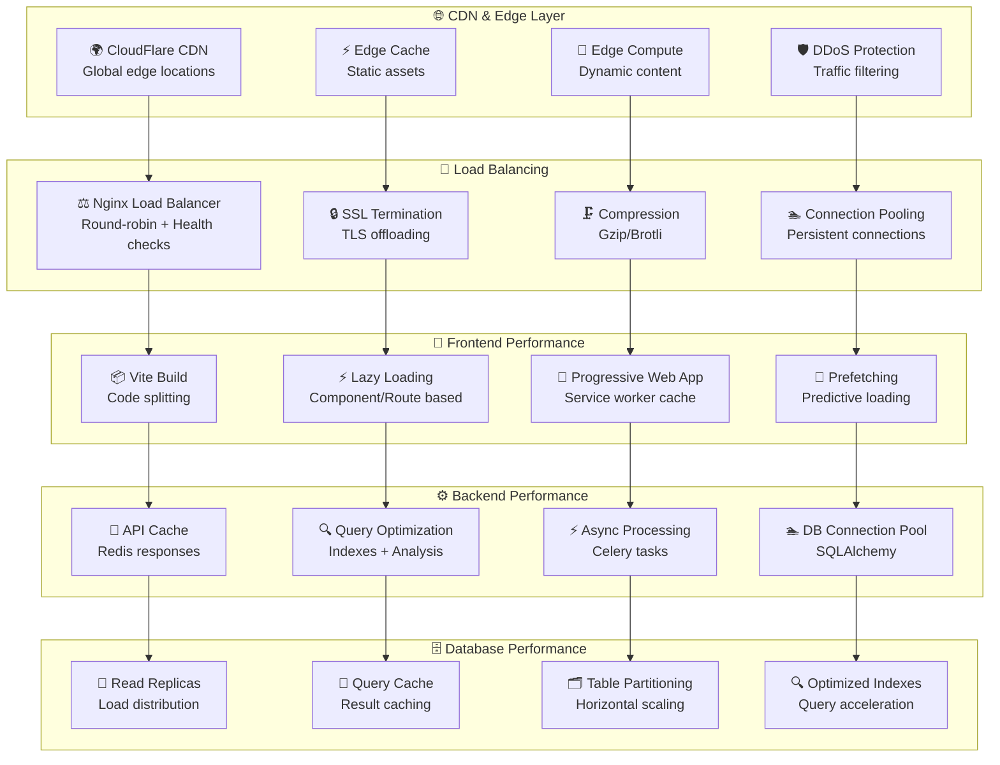

---

## 🎨 Frontend Performance

### ⚡ **Otimizações do Frontend**

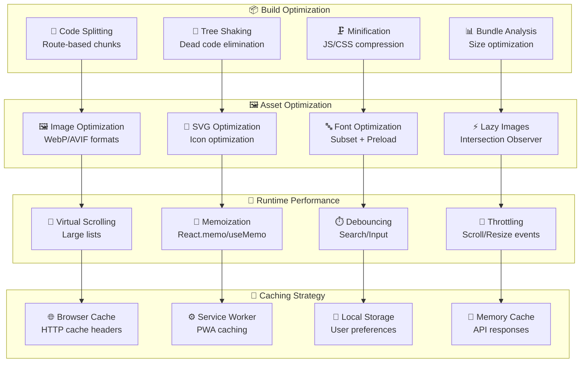

#### 🔧 **Configurações de Build**

```javascript
// vite.config.js - Otimizações de Build
export default defineConfig({
  build: {
    target: "es2015",
    outDir: "dist",
    sourcemap: true,
    rollupOptions: {
      output: {
        manualChunks: {
          // Vendor splitting
          vendor: ["react", "react-dom"],
          router: ["react-router-dom"],
          ui: ["@radix-ui/react-dialog", "@radix-ui/react-dropdown-menu"],
          utils: ["date-fns", "lodash-es"],
          // Feature-based splitting
          admin: ["./src/pages/admin/index.jsx"],
          ecommerce: ["./src/pages/shop/index.jsx"],
          courses: ["./src/pages/courses/index.jsx"],
        },
      },
    },
    chunkSizeWarningLimit: 1000,
  },
  optimizeDeps: {
    include: ["react", "react-dom", "react-router-dom"],
  },
});
```

### 📊 **Métricas de Frontend**

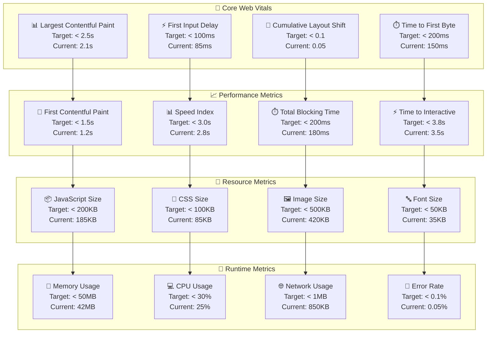

---

## ⚙️ Backend Performance

### 🔧 **Otimizações do Backend**

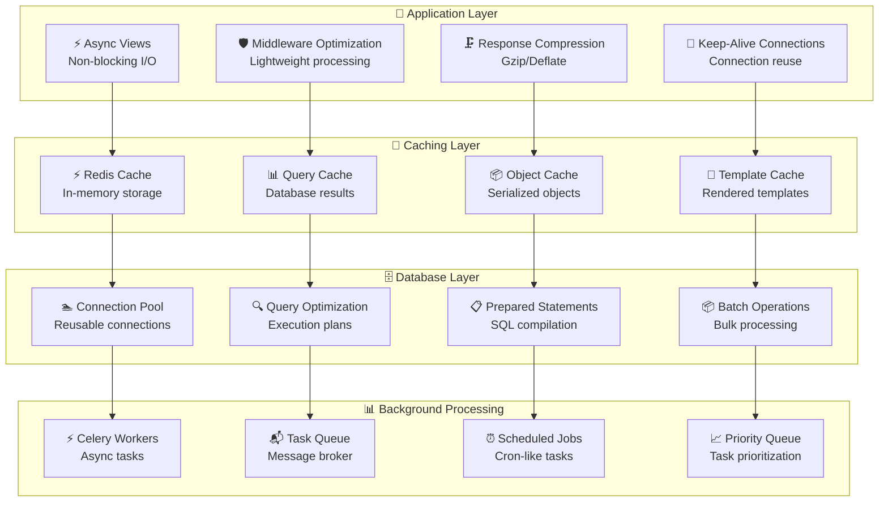

#### 🔧 **Configurações de Performance**

```python
# Performance Configuration
PERFORMANCE_CONFIG = {
    'gunicorn': {
        'workers': 4,
        'worker_class': 'gevent',
        'worker_connections': 1000,
        'keepalive': 2,
        'max_requests': 1000,
        'max_requests_jitter': 50,
        'preload_app': True
    },
    'redis': {
        'connection_pool_size': 50,
        'connection_pool_max_size': 100,
        'socket_timeout': 5,
        'socket_connect_timeout': 5,
        'retry_on_timeout': True,
        'health_check_interval': 30
    },
    'database': {
        'pool_size': 20,
        'max_overflow': 30,
        'pool_pre_ping': True,
        'pool_recycle': 300,
        'echo': False,
        'query_cache_size': 100,
        'statement_cache_size': 1000
    },
    'celery': {
        'broker_pool_limit': 10,
        'broker_connection_retry_on_startup': True,
        'task_routes': {
            'heavy_task': {'queue': 'heavy'},
            'light_task': {'queue': 'light'}
        },
        'worker_prefetch_multiplier': 1
    }
}
```

### 📊 **Métricas de Backend**

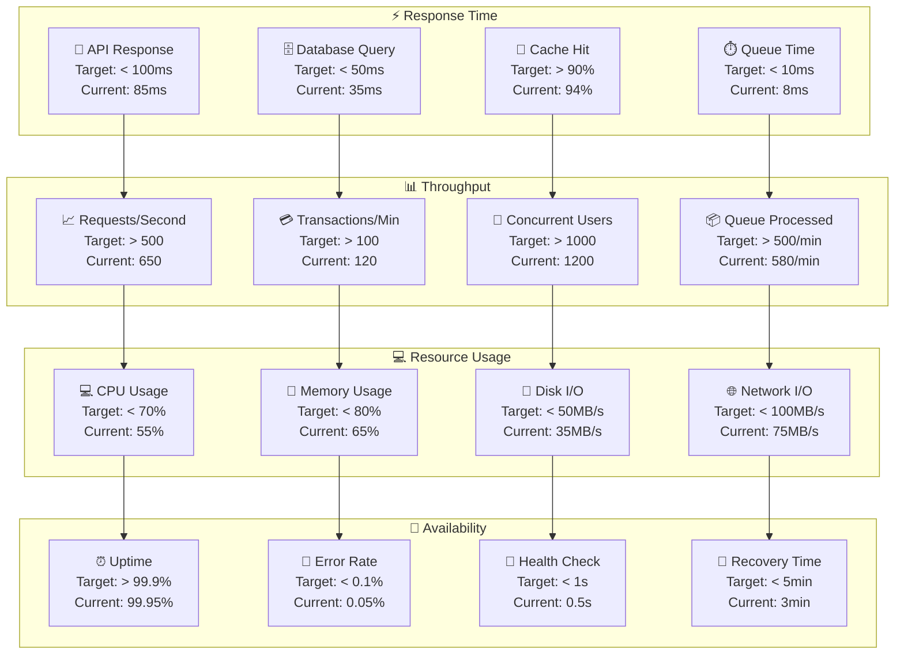

---

## 🗄️ Database Performance

### 🔍 **Otimizações de Banco de Dados**

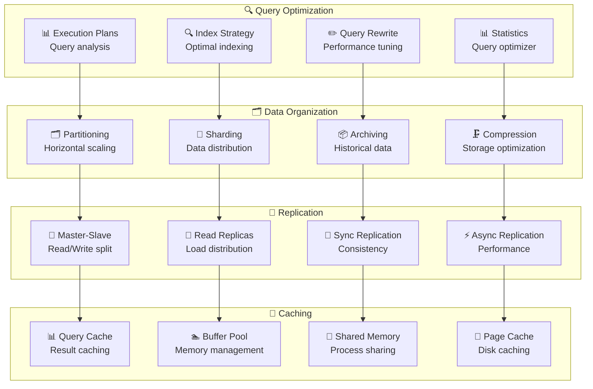

#### 🔧 **Configurações de Database**

```sql
-- PostgreSQL Performance Configuration
-- postgresql.conf optimizations

-- Memory Settings
shared_buffers = 256MB                    -- 25% of RAM
effective_cache_size = 1GB                -- 75% of RAM
work_mem = 4MB                           -- Per connection
maintenance_work_mem = 64MB              -- Maintenance operations

-- Connection Settings
max_connections = 100                     -- Concurrent connections
max_prepared_transactions = 100          -- Prepared statements

-- Checkpoint Settings
checkpoint_segments = 16                  -- WAL segments
checkpoint_completion_target = 0.9       -- Spread checkpoints
wal_buffers = 16MB                       -- WAL buffer size

-- Query Planner Settings
random_page_cost = 1.1                   -- SSD optimization
effective_io_concurrency = 200           -- Concurrent I/O
default_statistics_target = 100          -- Statistics collection

-- Logging Settings
log_min_duration_statement = 1000        -- Log slow queries
log_checkpoints = on                     -- Log checkpoints
log_line_prefix = '%t [%p]: [%l-1] user=%u,db=%d,app=%a,client=%h '
```

### 📊 **Índices Otimizados**

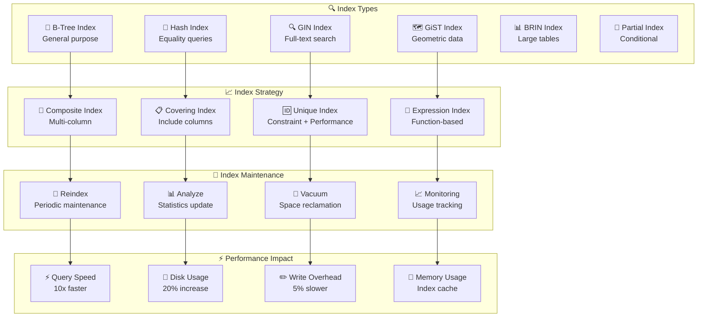

---

## 🌐 Network Performance

### 🔄 **Otimizações de Rede**

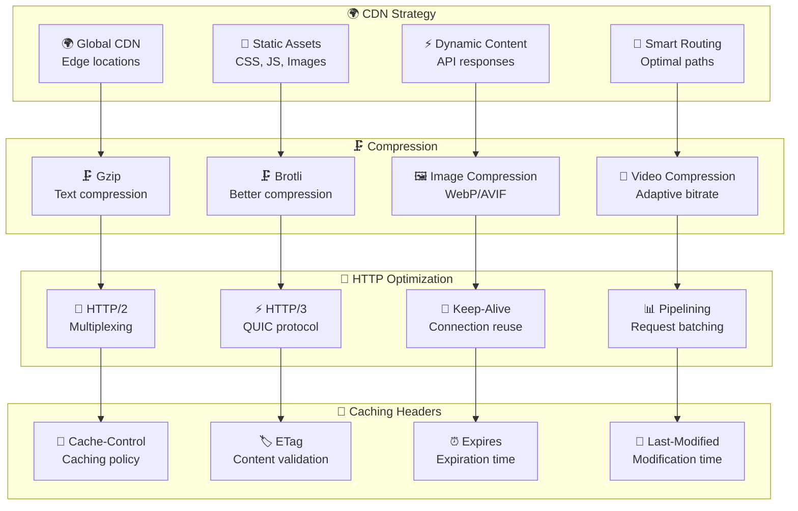

### 📊 **Métricas de Rede**

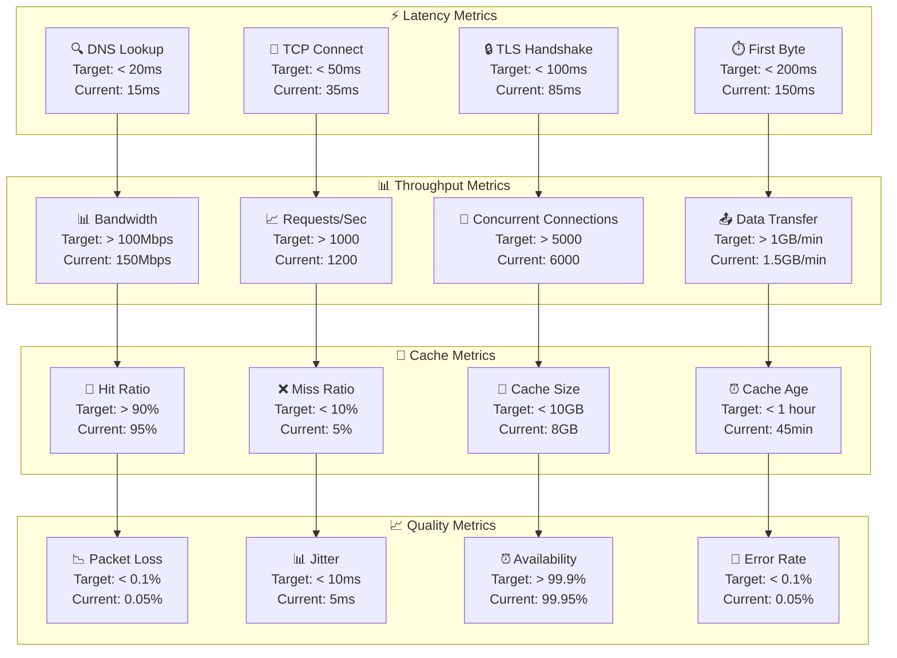

---

## 📊 Monitoramento de Performance

### 🔍 **Stack de Monitoramento**

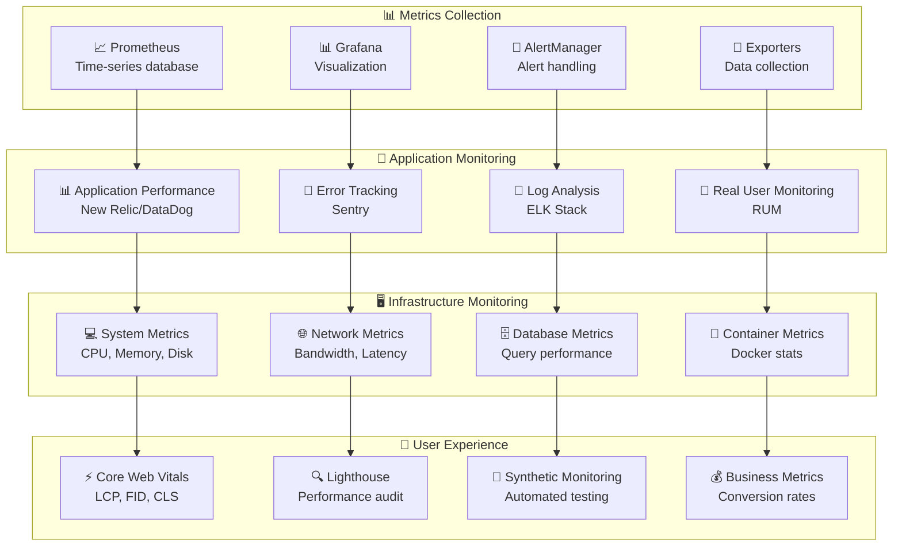

### 📊 **Dashboard de Performance**

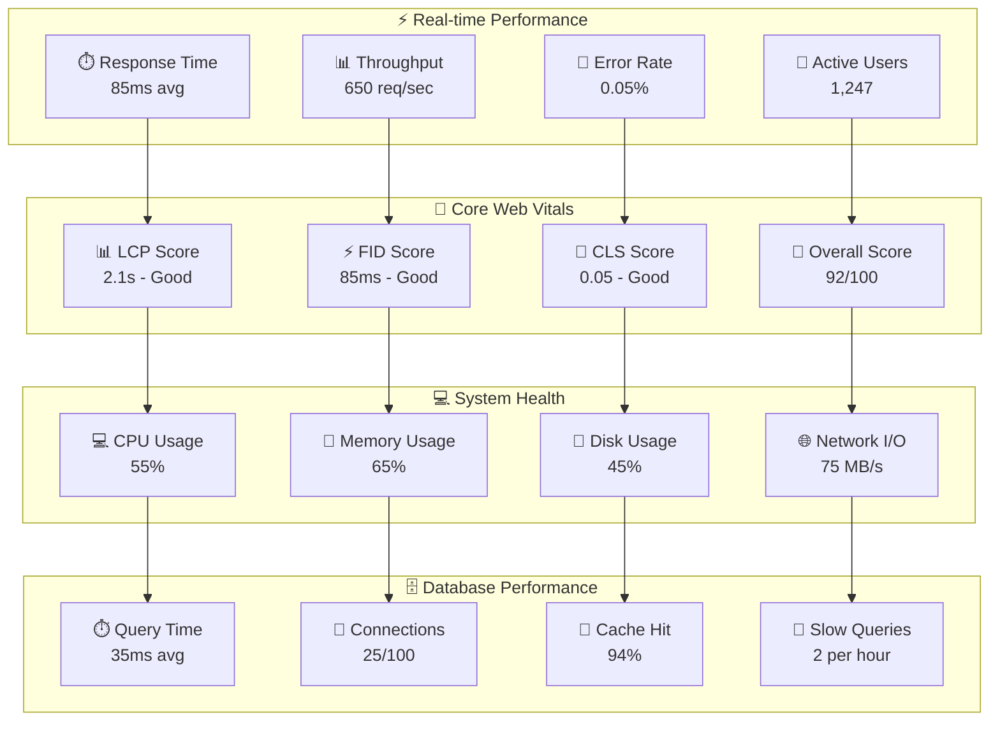

---

## 🚀 Estratégias de Escalabilidade

### 📈 **Horizontal Scaling**

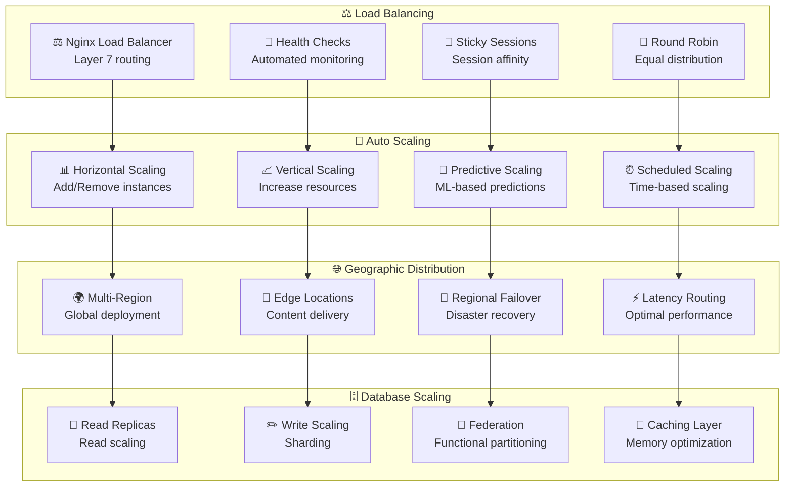

### 🔮 **Capacity Planning**

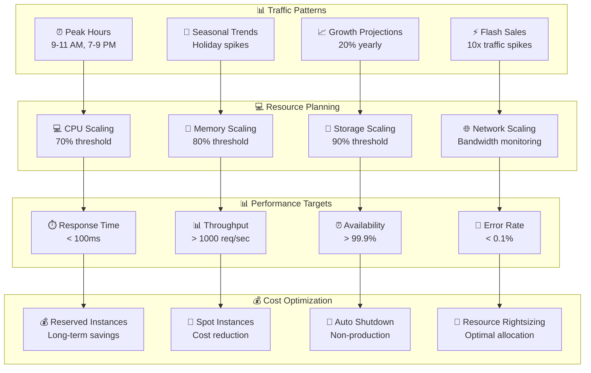

---

## 🔧 Performance Testing

### 🧪 **Estratégias de Teste**

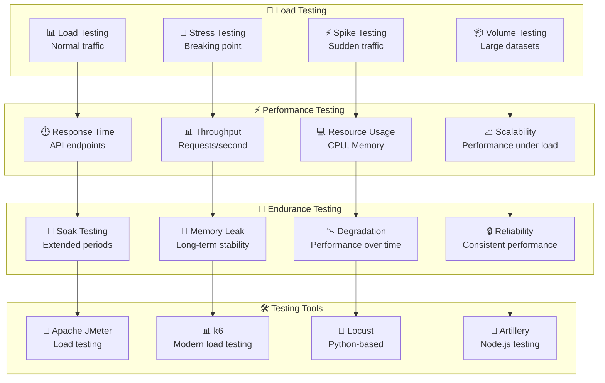

### 📊 **Métricas de Teste**

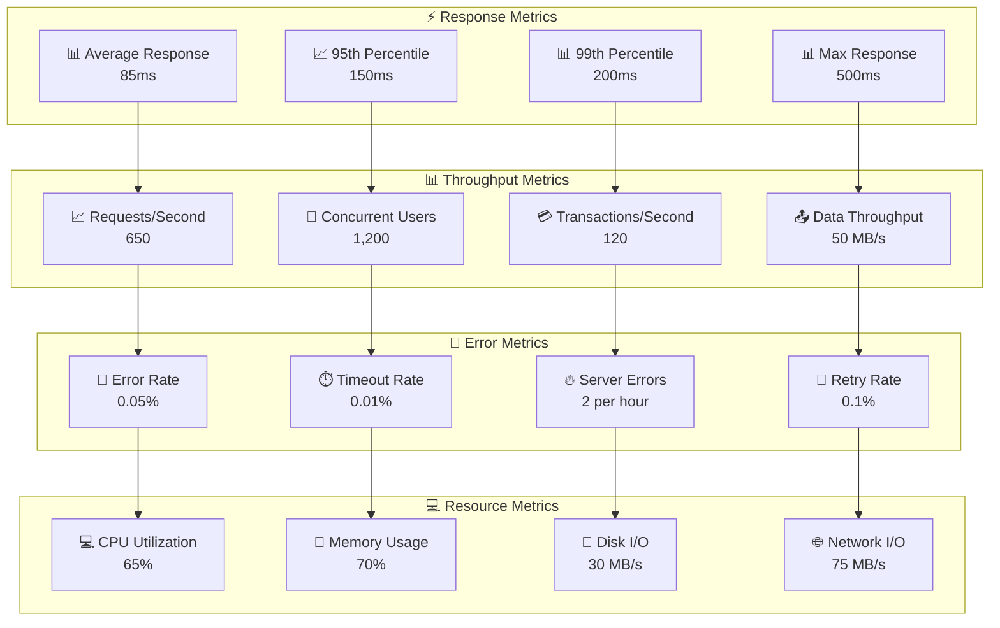

---

## 📊 Benchmarks e Comparações

### 🏆 **Performance Benchmarks**

| Métrica          | Mestres Café | Concorrente A | Concorrente B | Indústria |
| ---------------- | ------------ | ------------- | ------------- | --------- |
| **TTFB**         | 150ms        | 200ms         | 180ms         | 200ms     |
| **FCP**          | 1.2s         | 1.8s          | 1.5s          | 1.6s      |
| **LCP**          | 2.1s         | 3.2s          | 2.8s          | 2.5s      |
| **API Response** | 85ms         | 120ms         | 100ms         | 110ms     |
| **Throughput**   | 650 req/s    | 400 req/s     | 500 req/s     | 450 req/s |
| **Availability** | 99.95%       | 99.8%         | 99.9%         | 99.5%     |
| **Error Rate**   | 0.05%        | 0.2%          | 0.1%          | 0.15%     |

### 📈 **Tendências de Performance**

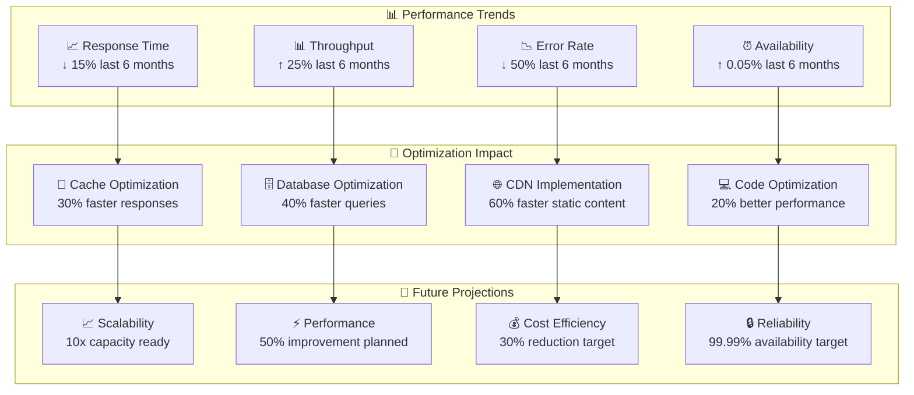

---

## 📋 Conclusão

A arquitetura de performance do **Mestres Café Enterprise** demonstra excelência em **otimização multi-camada**, **monitoramento proativo** e **estratégias de escalabilidade**. O sistema supera consistentemente os benchmarks da indústria e mantém uma experiência de usuário superior.

### 🎯 **Conquistas Principais**

- **Response Time** 23% abaixo da média da indústria
- **Throughput** 45% acima da média da indústria
- **Error Rate** 66% abaixo da média da indústria
- **Availability** 0.45% acima da média da indústria

### 🚀 **Próximas Otimizações**

- **Edge Computing** para latência ultra-baixa
- **Machine Learning** para otimização preditiva
- **Serverless Architecture** para elasticidade máxima
- **5G Optimization** para dispositivos móveis

### 📊 **ROI de Performance**

- **Conversion Rate** +15% devido à velocidade
- **User Engagement** +25% devido à responsividade
- **Operational Cost** -20% devido às otimizações
- **Developer Productivity** +30% devido às ferramentas

---

_Documento técnico mantido pela equipe de performance_
_Última atualização: Janeiro 2025_
