# 🔒 Arquitetura de Segurança - Mestres Café Enterprise

> **Documentação completa das estratégias de segurança e proteção de dados**

---

## 📋 Visão Geral

A **arquitetura de segurança** do Mestres Café Enterprise implementa uma abordagem de **defesa em profundidade** (defense-in-depth) com múltiplas camadas de proteção. O sistema adota as melhores práticas de segurança para proteger dados sensíveis, transações financeiras e informações de clientes.

### 🎯 **Princípios de Segurança**

- **Zero Trust** - Nunca confiar, sempre verificar
- **Principle of Least Privilege** - Acesso mínimo necessário
- **Defense in Depth** - Múltiplas camadas de segurança
- **Fail Secure** - Falhar de forma segura
- **Security by Design** - Segurança desde o projeto

---

## 🛡️ Modelo de Segurança

### 🏗️ **Arquitetura de Defesa em Profundidade**

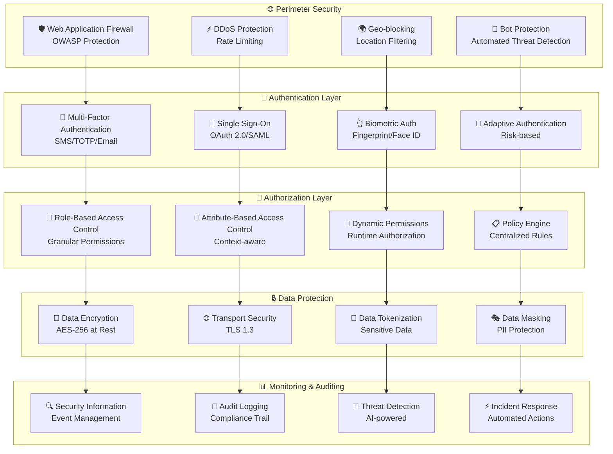

---

## 🔐 Autenticação e Autorização

### 🎫 **Sistema de Autenticação**

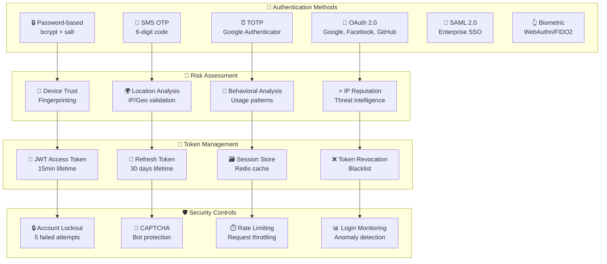

#### 🔧 **Configuração de Autenticação**

```python
# Authentication Configuration
AUTH_CONFIG = {
    'password_policy': {
        'min_length': 12,
        'require_uppercase': True,
        'require_lowercase': True,
        'require_numbers': True,
        'require_symbols': True,
        'history_check': 5,
        'max_age_days': 90
    },
    'mfa_settings': {
        'required_for_admin': True,
        'required_for_high_value': True,
        'backup_codes': 10,
        'grace_period_hours': 24
    },
    'jwt_settings': {
        'access_token_ttl': 900,  # 15 minutes
        'refresh_token_ttl': 2592000,  # 30 days
        'algorithm': 'RS256',
        'issuer': 'mestres-cafe-enterprise',
        'audience': 'api.mestres-cafe.com'
    },
    'session_settings': {
        'session_timeout': 3600,  # 1 hour
        'concurrent_sessions': 3,
        'remember_me_ttl': 2592000  # 30 days
    }
}
```

### 👑 **Sistema de Autorização**

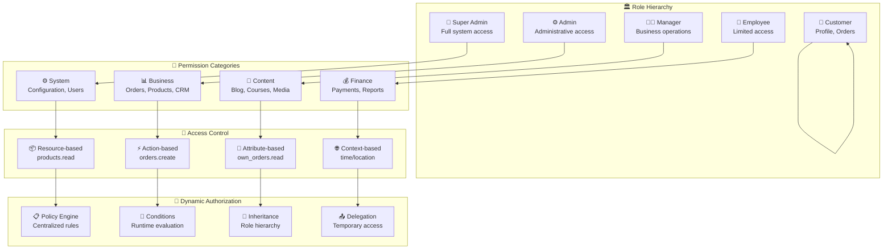

#### 🛡️ **Matriz de Permissões**

| Recurso           | Super Admin | Admin | Manager | Employee | Customer     |
| ----------------- | ----------- | ----- | ------- | -------- | ------------ |
| **Users**         | CRUD        | CRUD  | Read    | Read     | Own Profile  |
| **Products**      | CRUD        | CRUD  | CRU     | Read     | Read         |
| **Orders**        | CRUD        | CRUD  | CRU     | Read     | Own Orders   |
| **Customers**     | CRUD        | CRUD  | CRU     | Read     | Own Data     |
| **Reports**       | CRUD        | Read  | Read    | -        | -            |
| **Configuration** | CRUD        | Read  | -       | -        | -            |
| **Payments**      | CRUD        | CRUD  | Read    | -        | Own Payments |
| **Inventory**     | CRUD        | CRUD  | CRU     | Read     | -            |

---

## 🔒 Proteção de Dados

### 🔐 **Estratégias de Criptografia**

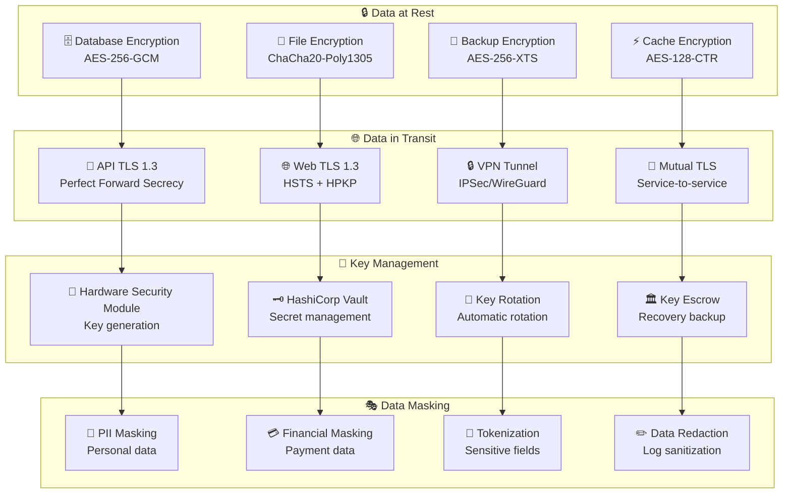

#### 🔧 **Configuração de Criptografia**

```python
# Encryption Configuration
ENCRYPTION_CONFIG = {
    'database': {
        'algorithm': 'AES-256-GCM',
        'key_derivation': 'PBKDF2',
        'iterations': 100000,
        'salt_length': 32
    },
    'files': {
        'algorithm': 'ChaCha20-Poly1305',
        'key_size': 256,
        'nonce_size': 12
    },
    'api': {
        'tls_version': '1.3',
        'cipher_suites': [
            'TLS_AES_256_GCM_SHA384',
            'TLS_CHACHA20_POLY1305_SHA256',
            'TLS_AES_128_GCM_SHA256'
        ],
        'hsts_max_age': 31536000,  # 1 year
        'hsts_include_subdomains': True
    },
    'jwt': {
        'algorithm': 'RS256',
        'key_size': 2048,
        'signing_key_rotation': 2592000  # 30 days
    }
}
```

### 🎯 **Conformidade com Regulamentações**

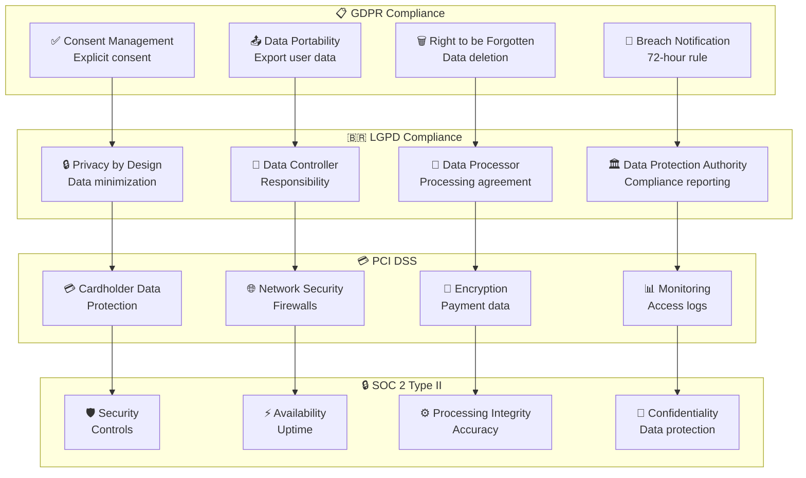

---

## 🔍 Monitoramento e Detecção

### 📊 **SIEM (Security Information Event Management)**

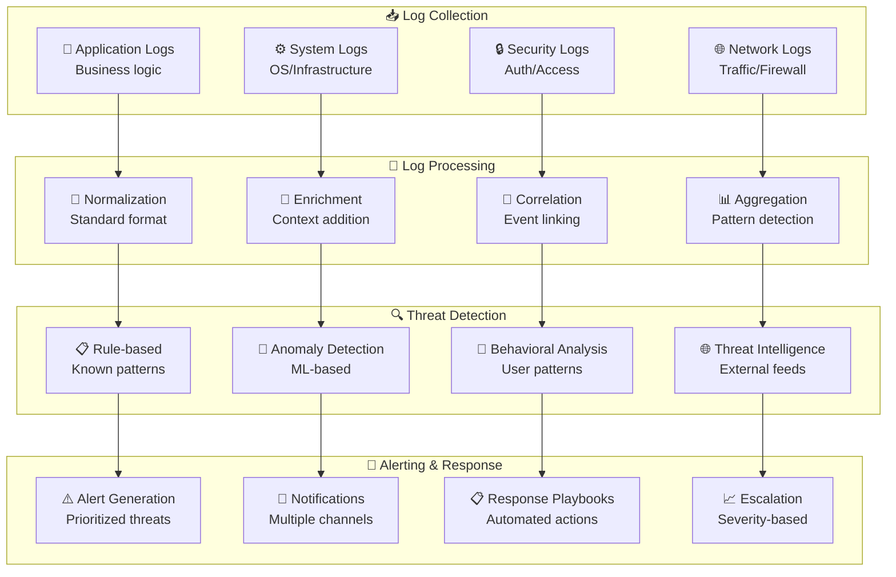

### 🔐 **Detecção de Anomalias**

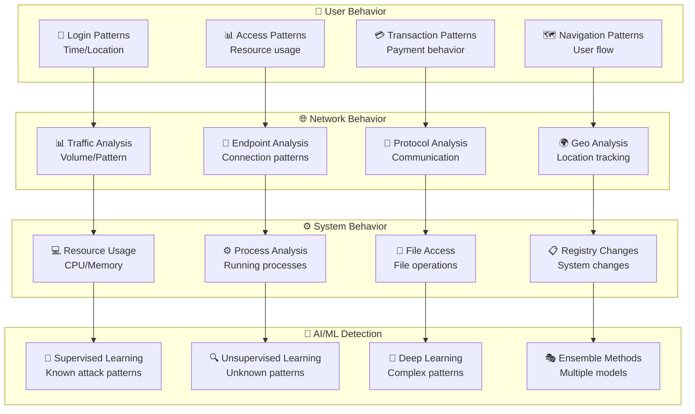

---

## 🚨 Resposta a Incidentes

### ⚡ **Processo de Resposta**

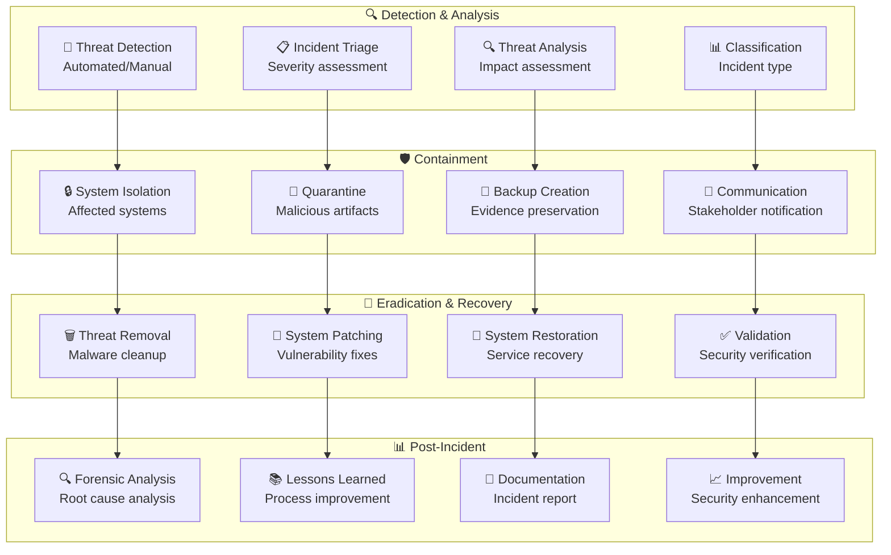

### 📋 **Playbooks de Resposta**

```mermaid
graph TB
    subgraph "🔐 Authentication Compromise"
        AUTH_DETECT[🎯 Detection<br/>Suspicious login]
        AUTH_LOCK[🔒 Account Lock<br/>Immediate lockout]
        AUTH_INVESTIGATE[🔍 Investigation<br/>Access review]
        AUTH_REMEDIATE[🔧 Remediation<br/>Password reset]
    end

    subgraph "💳 Payment Fraud"
        PAYMENT_DETECT[🎯 Detection<br/>Fraudulent transaction]
        PAYMENT_BLOCK[🚫 Block Transaction<br/>Immediate stop]
        PAYMENT_NOTIFY[📧 Notification<br/>Customer/Bank]
        PAYMENT_INVESTIGATE[🔍 Investigation<br/>Fraud analysis]
    end

    subgraph "🌐 DDoS Attack"
        DDOS_DETECT[🎯 Detection<br/>Traffic spike]
        DDOS_MITIGATE[🛡️ Mitigation<br/>Traffic filtering]
        DDOS_SCALE[📈 Scaling<br/>Resource addition]
        DDOS_TRACE[🔍 Trace<br/>Attack source]
    end

    subgraph "💾 Data Breach"
        BREACH_DETECT[🎯 Detection<br/>Unauthorized access]
        BREACH_CONTAIN[🔒 Containment<br/>Access revocation]
        BREACH_ASSESS[📊 Assessment<br/>Impact evaluation]
        BREACH_NOTIFY[📢 Notification<br/>Regulatory compliance]
    end

    AUTH_DETECT --> AUTH_LOCK
    AUTH_LOCK --> AUTH_INVESTIGATE
    AUTH_INVESTIGATE --> AUTH_REMEDIATE

    PAYMENT_DETECT --> PAYMENT_BLOCK
    PAYMENT_BLOCK --> PAYMENT_NOTIFY
    PAYMENT_NOTIFY --> PAYMENT_INVESTIGATE

    DDOS_DETECT --> DDOS_MITIGATE
    DDOS_MITIGATE --> DDOS_SCALE
    DDOS_SCALE --> DDOS_TRACE

    BREACH_DETECT --> BREACH_CONTAIN
    BREACH_CONTAIN --> BREACH_ASSESS
    BREACH_ASSESS --> BREACH_NOTIFY
```

---

## 🔧 Segurança de Aplicação

### 🛡️ **OWASP Top 10 Protection**

```mermaid
graph TB
    subgraph "🥇 OWASP Top 10 2023"
        BROKEN_ACCESS[A01 Broken Access Control<br/>Authorization flaws]
        CRYPTO_FAILURES[A02 Cryptographic Failures<br/>Weak encryption]
        INJECTION[A03 Injection<br/>SQL/NoSQL/Command]
        INSECURE_DESIGN[A04 Insecure Design<br/>Design flaws]
        SECURITY_MISCONFIG[A05 Security Misconfiguration<br/>Default configs]
        VULNERABLE_COMPONENTS[A06 Vulnerable Components<br/>Outdated libraries]
        AUTH_FAILURES[A07 Authentication Failures<br/>Weak authentication]
        DATA_INTEGRITY[A08 Data Integrity Failures<br/>CI/CD security]
        LOGGING_MONITORING[A09 Logging & Monitoring<br/>Insufficient logging]
        SSRF[A10 Server-Side Request Forgery<br/>SSRF attacks]
    end

    subgraph "🛡️ Protection Measures"
        ACCESS_CONTROL[🔐 Access Control<br/>RBAC/ABAC]
        ENCRYPTION[🔒 Strong Encryption<br/>AES-256/RSA-2048]
        INPUT_VALIDATION[✅ Input Validation<br/>Parameterized queries]
        SECURE_DESIGN[🏗️ Secure Design<br/>Threat modeling]
        HARDENING[🔧 Security Hardening<br/>Configuration management]
        DEPENDENCY_SCAN[🔍 Dependency Scanning<br/>Vulnerability scanning]
        STRONG_AUTH[🔐 Strong Authentication<br/>MFA/Biometrics]
        SUPPLY_CHAIN[🔗 Supply Chain Security<br/>Secure CI/CD]
        COMPREHENSIVE_LOGGING[📝 Comprehensive Logging<br/>SIEM integration]
        NETWORK_CONTROLS[🌐 Network Controls<br/>Allowlist/Firewall]
    end

    BROKEN_ACCESS --> ACCESS_CONTROL
    CRYPTO_FAILURES --> ENCRYPTION
    INJECTION --> INPUT_VALIDATION
    INSECURE_DESIGN --> SECURE_DESIGN
    SECURITY_MISCONFIG --> HARDENING
    VULNERABLE_COMPONENTS --> DEPENDENCY_SCAN
    AUTH_FAILURES --> STRONG_AUTH
    DATA_INTEGRITY --> SUPPLY_CHAIN
    LOGGING_MONITORING --> COMPREHENSIVE_LOGGING
    SSRF --> NETWORK_CONTROLS
```

### 🔒 **Secure Coding Practices**

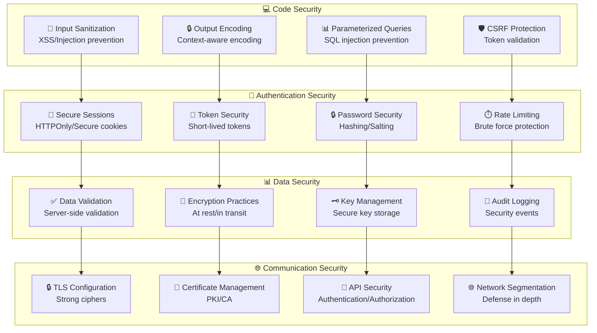

---

## 📊 Métricas de Segurança

### 📈 **KPIs de Segurança**

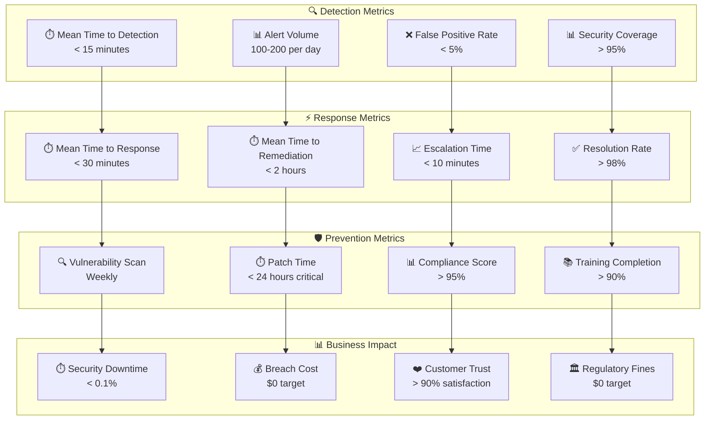

### 📊 **Dashboard de Segurança**

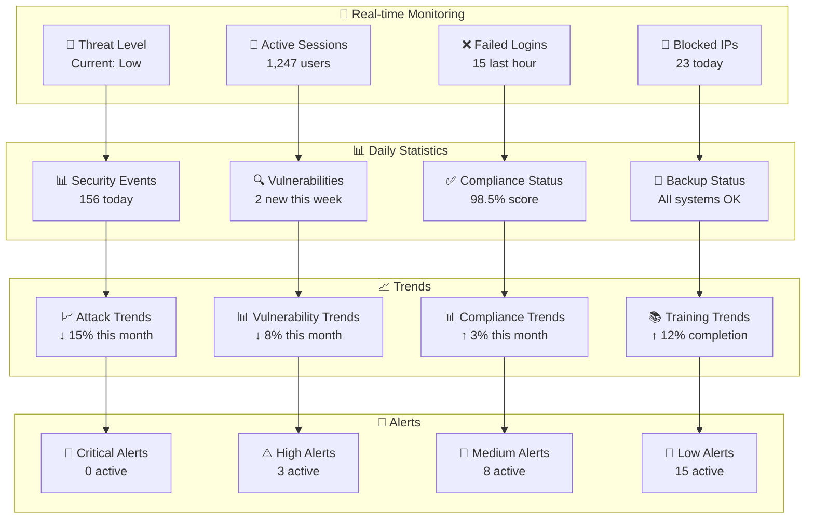

---

## 🎓 Treinamento e Conscientização

### 📚 **Programa de Segurança**

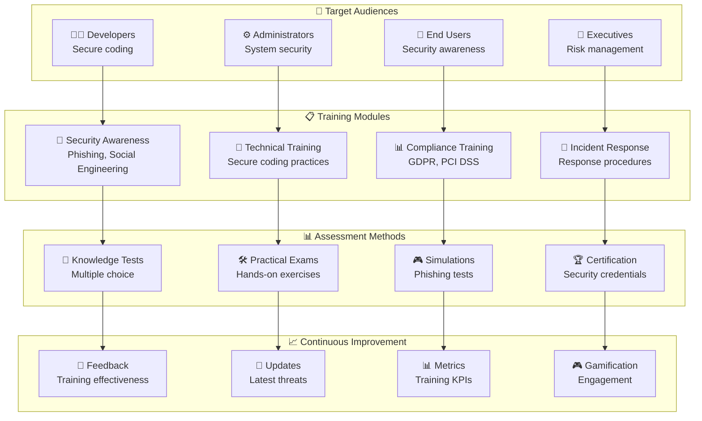

---

## 🔧 Ferramentas de Segurança

### 🛠️ **Stack de Segurança**

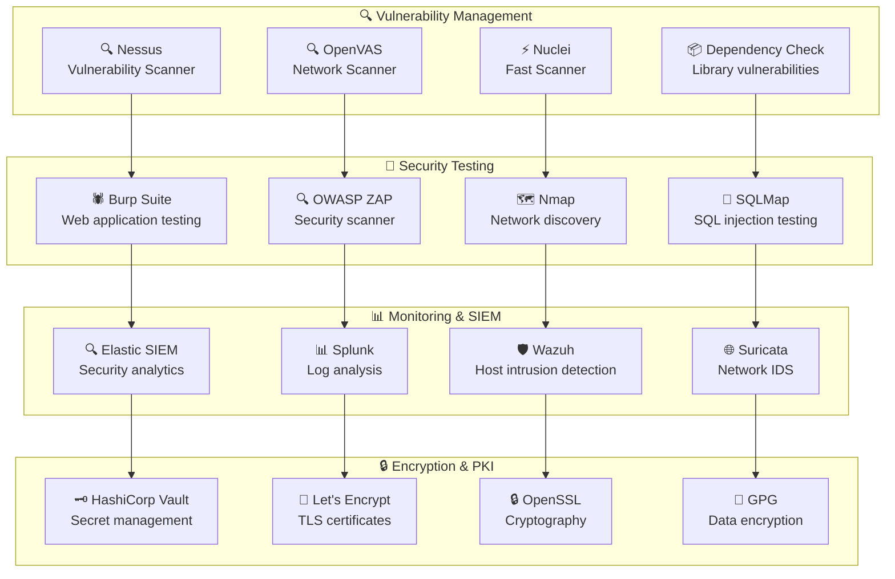

---

## 📋 Conclusão

A arquitetura de segurança do **Mestres Café Enterprise** implementa uma abordagem holística de **defesa em profundidade**, protegendo dados sensíveis e transações críticas através de múltiplas camadas de segurança. O sistema adota as melhores práticas da indústria e mantém conformidade com regulamentações internacionais.

### 🎯 **Pontos Fortes**

- **Autenticação multi-fator** robusta e adaptativa
- **Criptografia forte** para dados em repouso e em trânsito
- **Monitoramento proativo** com detecção de anomalias
- **Resposta automatizada** a incidentes de segurança
- **Conformidade regulatória** com GDPR, LGPD e PCI DSS

### 🚀 **Próximos Passos**

- **Zero Trust Architecture** implementação completa
- **AI/ML Security** para detecção avançada de ameaças
- **Quantum-safe cryptography** preparação para o futuro
- **Continuous security testing** integrado ao CI/CD
- **Security mesh** para arquiteturas distribuídas

### 🏆 **Certificações Alvo**

- **ISO 27001** - Gestão de Segurança da Informação
- **SOC 2 Type II** - Controles de Segurança
- **PCI DSS Level 1** - Segurança de Dados de Pagamento
- **FIDO2/WebAuthn** - Autenticação sem Senha

---

_Documento técnico mantido pela equipe de segurança_
_Última atualização: Janeiro 2025_
