# 🏛️ Arquitetura de Sistema - Mestres Café Enterprise

> **Documentação técnica detalhada da arquitetura do sistema**

---

## 📋 Visão Geral

O **Mestres Café Enterprise** é construído seguindo uma **arquitetura monolítica bem estruturada** com preparação para evolução a **microsserviços**. O sistema implementa padrões modernos de desenvolvimento full-stack com foco em **escalabilidade**, **manutenibilidade** e **performance**.

### 🎯 **Características Arquiteturais**

- **Monorepo**: Código unificado com workspaces organizados
- **Full-Stack**: Frontend React + Backend Flask integrados
- **API-First**: Arquitetura orientada a APIs RESTful
- **Cloud-Ready**: Containerização completa com Docker
- **Microservices-Ready**: Preparado para decomposição futura

---

## 🏗️ Arquitetura de Alto Nível

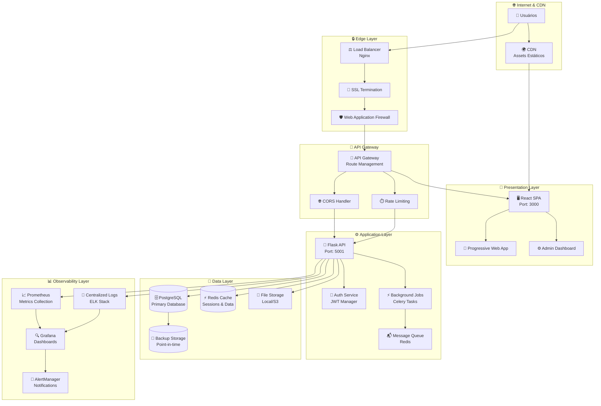

---

## 🧩 Componentes Principais

### 🎨 **Frontend Components**

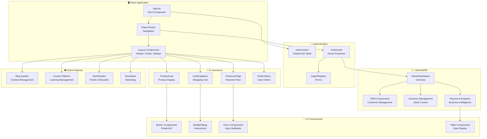

### ⚙️ **Backend Components**

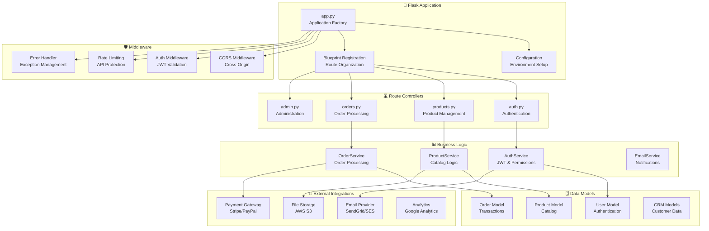

---

## 🔄 Fluxos de Sistema

### 🔐 **Fluxo de Autenticação**

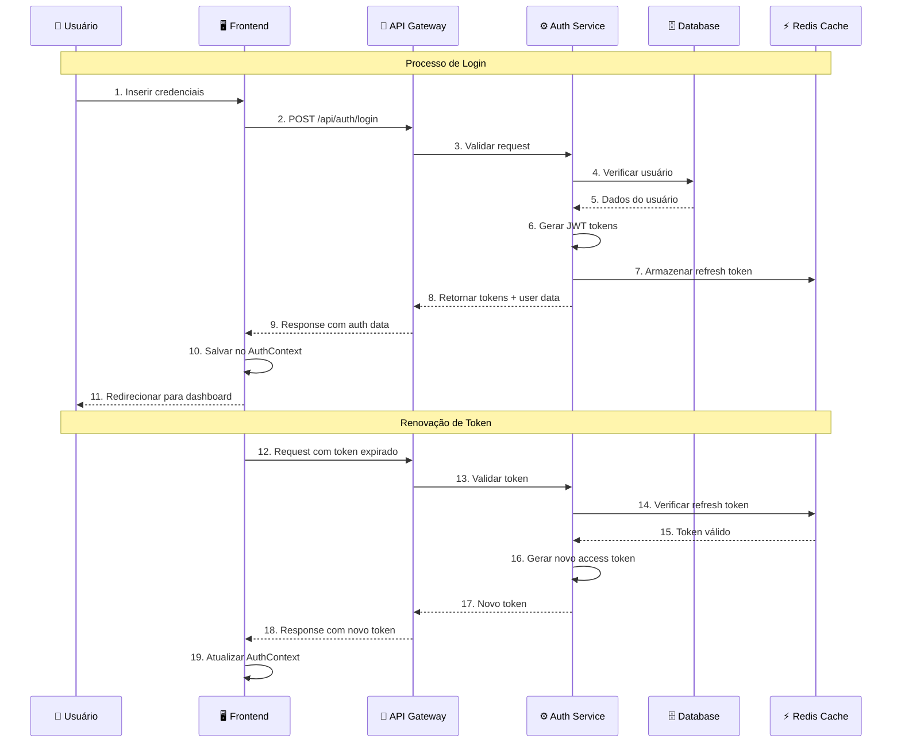

### 🛒 **Fluxo de E-commerce**

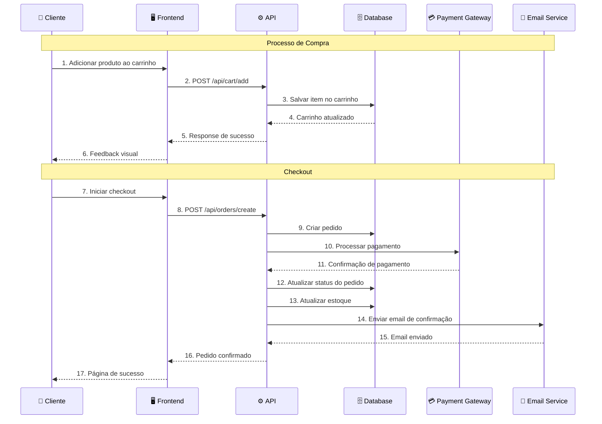

### 📊 **Fluxo de CRM/ERP**

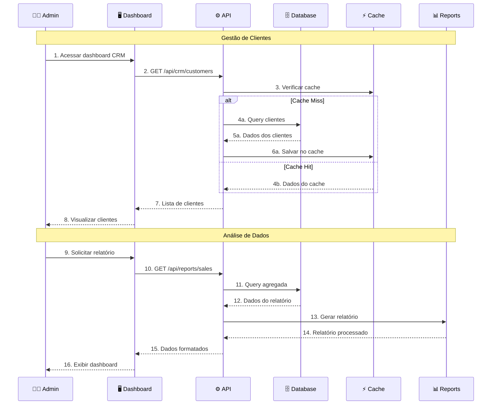

---

## 🎯 Padrões Arquiteturais

### 🏗️ **Clean Architecture**

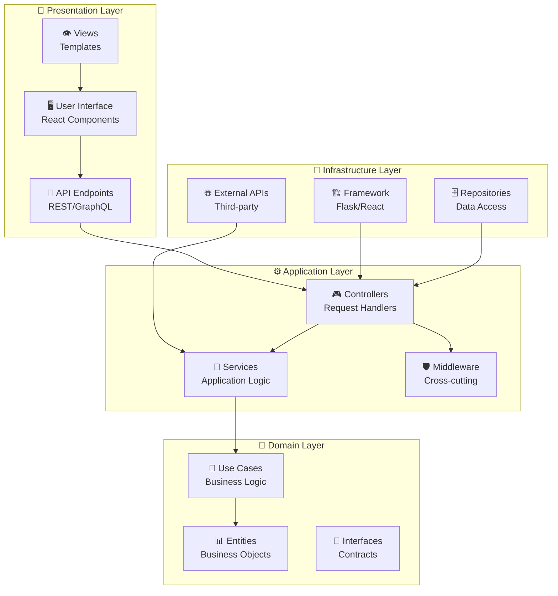

### 🔄 **Event-Driven Architecture**

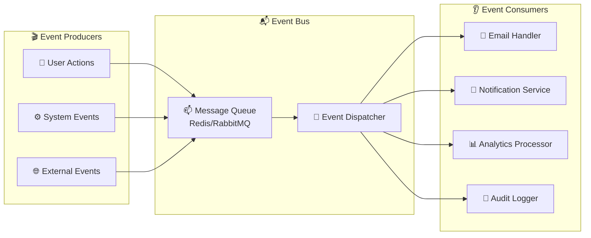

---

## 🔧 Decisões Arquiteturais

### 📋 **ADR (Architecture Decision Records)**

#### **ADR-001: Monorepo vs Multi-repo**

- **Decisão**: Adotar estrutura monorepo
- **Contexto**: Facilitar compartilhamento de código e coordenação de releases
- **Consequências**:
  - ✅ Melhor sincronização entre frontend/backend
  - ✅ Simplified dependency management
  - ❌ Repositório mais pesado

#### **ADR-002: Flask vs FastAPI**

- **Decisão**: Utilizar Flask 3.0
- **Contexto**: Maior maturidade e ecossistema estabelecido
- **Consequências**:
  - ✅ Comunidade ativa e documentação extensa
  - ✅ Flexibilidade para customização
  - ❌ Performance inferior ao FastAPI

#### **ADR-003: PostgreSQL vs MongoDB**

- **Decisão**: PostgreSQL como banco principal
- **Contexto**: Dados relacionais complexos e ACID compliance
- **Consequências**:
  - ✅ Integridade referencial garantida
  - ✅ Query optimization avançada
  - ❌ Menos flexibilidade para dados não estruturados

#### **ADR-004: Context API vs Redux**

- **Decisão**: Context API para state management
- **Contexto**: Simplicidade e redução de boilerplate
- **Consequências**:
  - ✅ Menos complexidade de setup
  - ✅ Performance adequada para escala atual
  - ❌ Limitações para state complexo

### 🎯 **Design Principles**

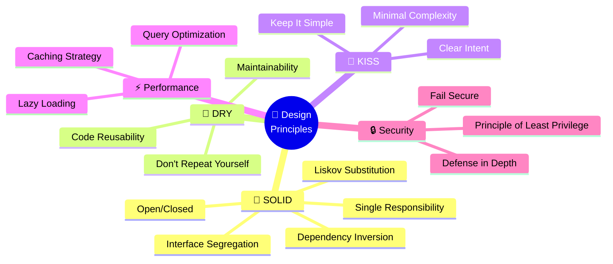

---

## 🚀 Escalabilidade

### 📈 **Horizontal Scaling Strategy**

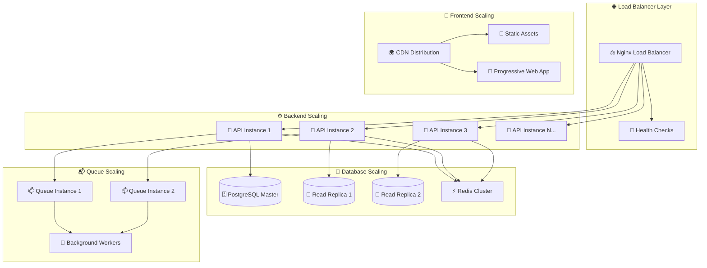

### 🔄 **Microservices Transition Plan**

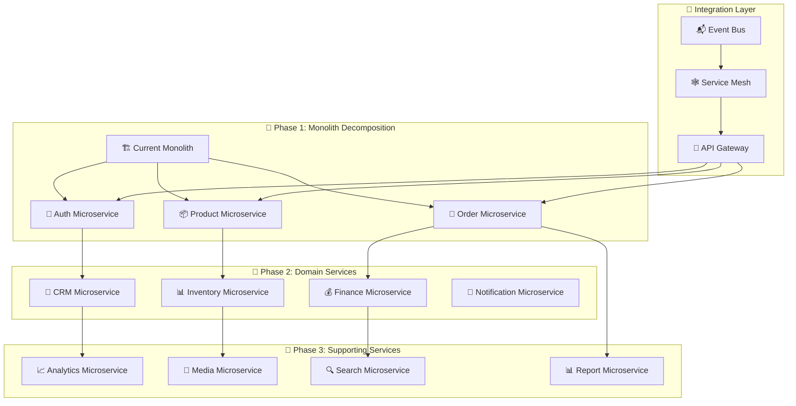

---

## 🔍 Monitoramento Arquitetural

### 📊 **Observability Stack**

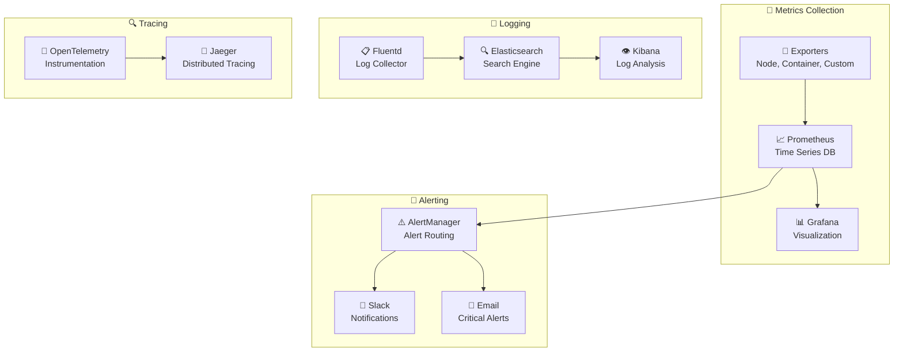

---

## 📋 Conclusão

A arquitetura do **Mestres Café Enterprise** foi projetada para balancear **simplicidade operacional** com **preparação para o futuro**. A estrutura monolítica atual oferece facilidade de desenvolvimento e deploy, enquanto os padrões implementados facilitam a evolução para microsserviços quando necessário.

### 🎯 **Pontos Fortes**

- **Arquitetura bem estruturada** com separação clara de responsabilidades
- **Padrões modernos** implementados (Clean Architecture, DDD)
- **Escalabilidade horizontal** preparada
- **Observabilidade completa** implementada

### 🚀 **Próximos Passos**

- **Performance optimization** contínua
- **Microservices decomposition** planejada
- **Cloud-native transition** preparada
- **Advanced monitoring** expandido

---

_Documento técnico mantido pela equipe de arquitetura_
_Última atualização: Janeiro 2025_
