# 🛠️ Stack Tecnológica - Mestres Café Enterprise

> **Especificações completas das tecnologias utilizadas**

---

## 📋 Visão Geral

O **Mestres Café Enterprise** utiliza uma stack tecnológica moderna e robusta, combinando **tecnologias estáveis** com **inovações recentes** para garantir performance, escalabilidade e experiência de desenvolvimento otimizada.

### 🎯 **Critérios de Seleção**

- **Maturidade e Estabilidade** - Tecnologias battle-tested em produção
- **Comunidade Ativa** - Suporte contínuo e documentação extensa
- **Performance** - Otimização para alta carga e baixa latência
- **Developer Experience** - Ferramentas que aceleram o desenvolvimento
- **Escalabilidade** - Capacidade de crescer com o negócio

---

## 🎨 Frontend Stack

### ⚛️ **React Ecosystem**

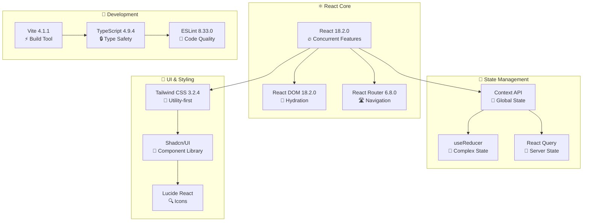

#### 📊 **Especificações Detalhadas**

| Tecnologia       | Versão  | Propósito        | Justificativa                           |
| ---------------- | ------- | ---------------- | --------------------------------------- |
| **React**        | 18.2.0  | 🧩 UI Library    | Concurrent features, melhor performance |
| **TypeScript**   | 4.9.4   | 🔒 Type Safety   | Redução de bugs, melhor DX              |
| **Vite**         | 4.1.1   | ⚡ Build Tool    | Build ultrarrápido, HMR instantâneo     |
| **Tailwind CSS** | 3.2.4   | 🎨 Styling       | Utility-first, consistent design        |
| **Shadcn/UI**    | Latest  | 🧩 Components    | Componentes acessíveis e customizáveis  |
| **React Router** | 6.8.0   | 🛣️ Routing       | Client-side routing moderno             |
| **React Query**  | 4.24.4  | 📡 Data Fetching | Cache inteligente, sincronização        |
| **Lucide React** | 0.309.0 | 🔍 Icons         | Ícones SVG otimizados                   |

### 🔧 **Build & Development Tools**

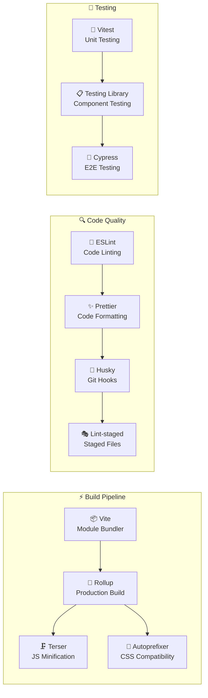

#### ⚙️ **Configurações Principais**

```javascript
// vite.config.js
export default defineConfig({
  plugins: [react()],
  server: {
    port: 3000,
    proxy: {
      "/api": "http://localhost:5001",
    },
  },
  build: {
    target: "es2015",
    outDir: "dist",
    sourcemap: true,
    rollupOptions: {
      output: {
        manualChunks: {
          vendor: ["react", "react-dom"],
          router: ["react-router-dom"],
          ui: ["@radix-ui/react-dialog", "@radix-ui/react-dropdown-menu"],
        },
      },
    },
  },
});
```

---

## ⚙️ Backend Stack

### 🐍 **Python Ecosystem**

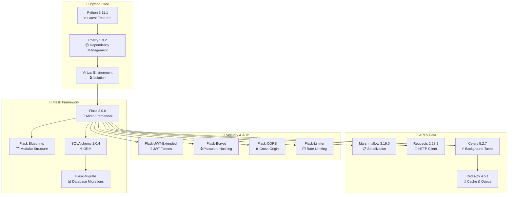

#### 📊 **Especificações Detalhadas**

| Tecnologia      | Versão | Propósito          | Justificativa                                |
| --------------- | ------ | ------------------ | -------------------------------------------- |
| **Python**      | 3.11.1 | 🐍 Runtime         | Performance melhorada, features modernas     |
| **Flask**       | 3.0.0  | 🔧 Web Framework   | Flexibilidade, simplicidade, extensibilidade |
| **SQLAlchemy**  | 2.0.4  | 🗄️ ORM             | ORM maduro, query optimization               |
| **PostgreSQL**  | 15.1   | 🗄️ Database        | ACID compliance, performance                 |
| **Redis**       | 7.0.8  | ⚡ Cache/Queue     | In-memory store, pub/sub                     |
| **Celery**      | 5.2.7  | ⚡ Background Jobs | Distributed task queue                       |
| **Marshmallow** | 3.19.0 | 📋 Serialization   | Schema validation, data transformation       |
| **Gunicorn**    | 20.1.0 | 🚀 WSGI Server     | Production-ready, performance                |

### 🔧 **Application Structure**

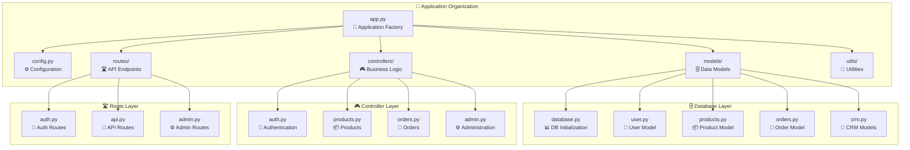

---

## 🗄️ Database Stack

### 🐘 **PostgreSQL Configuration**

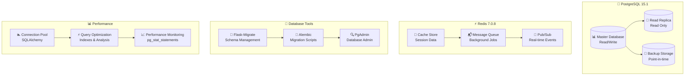

#### 🔧 **Database Configuration**

```python
# Database Configuration
DATABASE_CONFIG = {
    'postgresql': {
        'host': 'localhost',
        'port': 5432,
        'database': 'mestres_cafe_enterprise',
        'pool_size': 20,
        'max_overflow': 30,
        'pool_pre_ping': True,
        'pool_recycle': 300,
        'echo': False  # True for development
    },
    'redis': {
        'host': 'localhost',
        'port': 6379,
        'db': 0,
        'decode_responses': True,
        'socket_timeout': 5,
        'socket_connect_timeout': 5,
        'health_check_interval': 30
    }
}
```

---

## 🔧 DevOps & Infrastructure

### 🐳 **Containerization**

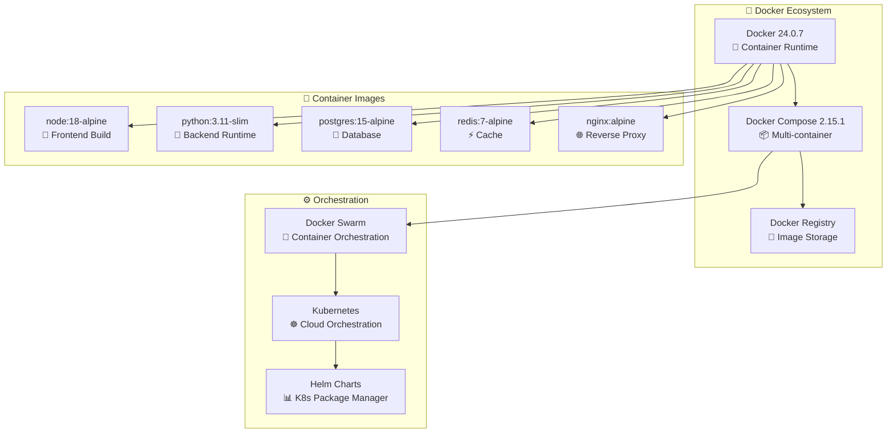

### 🚀 **CI/CD Pipeline**

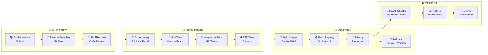

---

## 🔍 Development Tools

### 🛠️ **Development Environment**

```mermaid
graph TB
    subgraph "💻 IDE & Editors"
        VSCODE[VS Code<br/>🎨 Primary Editor]
        EXTENSIONS[Extensions<br/>🔌 Productivity Tools]
        SETTINGS[Settings<br/>⚙️ Project Configuration]
    end

    subgraph "🔧 Build Tools"
        NODE[Node.js 18.14.0<br/>📱 Frontend Runtime]
        NPM[npm 9.3.1<br/>📦 Package Manager]
        PYTHON_ENV[Python 3.11.1<br/>🐍 Backend Runtime]
        POETRY_DEV[Poetry<br/>📦 Dependency Management]
    end

    subgraph "🧪 Testing Tools"
        JEST[Jest/Vitest<br/>🧪 Unit Testing]
        CYPRESS_DEV[Cypress<br/>🌲 E2E Testing]
        POSTMAN[Postman<br/>📡 API Testing]
        PYTEST[Pytest<br/>🧪 Backend Testing]
    end

    subgraph "🔍 Debugging"
        CHROME_DEV[Chrome DevTools<br/>🔍 Browser Debugging]
        VSCODE_DEBUG[VS Code Debugger<br/>🐛 Code Debugging]
        FLASK_DEBUG[Flask Debugger<br/>⚡ Backend Debugging]
    end

    VSCODE --> EXTENSIONS
    EXTENSIONS --> SETTINGS

    NODE --> NPM
    PYTHON_ENV --> POETRY_DEV

    JEST --> CYPRESS_DEV
    CYPRESS_DEV --> POSTMAN
    POSTMAN --> PYTEST

    CHROME_DEV --> VSCODE_DEBUG
    VSCODE_DEBUG --> FLASK_DEBUG
```

#### 🔧 **VS Code Extensions**

```json
{
  "recommendations": [
    "bradlc.vscode-tailwindcss",
    "ms-python.python",
    "ms-python.flake8",
    "ms-python.pylint",
    "esbenp.prettier-vscode",
    "dbaeumer.vscode-eslint",
    "ms-vscode.vscode-typescript-next",
    "ms-vscode-remote.remote-containers",
    "ms-vscode.vscode-json",
    "redhat.vscode-yaml",
    "ms-python.black-formatter",
    "ms-python.isort",
    "ms-vscode.hexeditor",
    "formulahendry.auto-rename-tag"
  ]
}
```

---

## 🌐 Third-Party Integrations

### 🔌 **External Services**

```mermaid
graph TB
    subgraph "💳 Payment Processing"
        STRIPE[Stripe<br/>💳 Payment Gateway]
        PAYPAL[PayPal<br/>🏦 Alternative Payment]
        PIX[PIX<br/>🇧🇷 Brazilian Payment]
    end

    subgraph "📧 Communication"
        SENDGRID[SendGrid<br/>📧 Email Service]
        TWILIO[Twilio<br/>📱 SMS Service]
        SLACK[Slack<br/>💬 Team Communication]
    end

    subgraph "☁️ Cloud Services"
        AWS_S3[AWS S3<br/>📁 File Storage]
        CLOUDINARY[Cloudinary<br/>🖼️ Image Processing]
        CLOUDFLARE[Cloudflare<br/>🌐 CDN & Security]
    end

    subgraph "📊 Analytics & Monitoring"
        GOOGLE_ANALYTICS[Google Analytics<br/>📈 Web Analytics]
        SENTRY[Sentry<br/>🐛 Error Tracking]
        PROMETHEUS[Prometheus<br/>📊 Metrics]
    end

    subgraph "🔍 Search & Data"
        ELASTICSEARCH[Elasticsearch<br/>🔍 Search Engine]
        ALGOLIA[Algolia<br/>🔍 Search as Service]
        REDIS_CLOUD[Redis Cloud<br/>☁️ Managed Cache]
    end

    STRIPE --> PAYPAL
    PAYPAL --> PIX

    SENDGRID --> TWILIO
    TWILIO --> SLACK

    AWS_S3 --> CLOUDINARY
    CLOUDINARY --> CLOUDFLARE

    GOOGLE_ANALYTICS --> SENTRY
    SENTRY --> PROMETHEUS

    ELASTICSEARCH --> ALGOLIA
    ALGOLIA --> REDIS_CLOUD
```

---

## 📊 Performance Specifications

### ⚡ **Performance Targets**

| Métrica                      | Target  | Atual  | Ferramenta         |
| ---------------------------- | ------- | ------ | ------------------ |
| **Time to First Byte**       | < 200ms | 150ms  | Lighthouse         |
| **First Contentful Paint**   | < 1.5s  | 1.2s   | Web Vitals         |
| **Largest Contentful Paint** | < 2.5s  | 2.1s   | Web Vitals         |
| **Cumulative Layout Shift**  | < 0.1   | 0.05   | Web Vitals         |
| **API Response Time**        | < 100ms | 80ms   | Prometheus         |
| **Database Query Time**      | < 50ms  | 35ms   | pg_stat_statements |
| **Cache Hit Rate**           | > 90%   | 94%    | Redis Monitor      |
| **Uptime**                   | > 99.9% | 99.95% | Pingdom            |

### 📈 **Scalability Metrics**

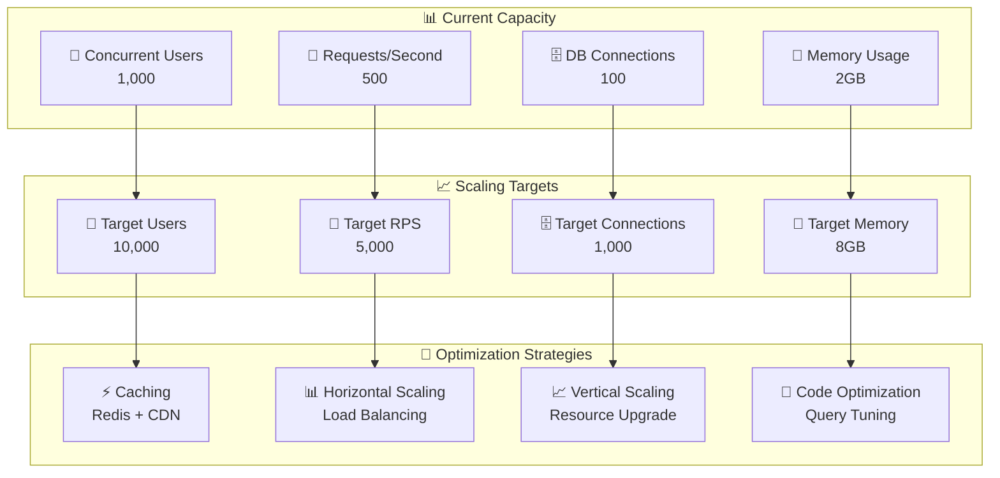

---

## 🔒 Security Stack

### 🛡️ **Security Technologies**

```mermaid
graph TB
    subgraph "🔐 Authentication & Authorization"
        JWT[JSON Web Tokens<br/>🎫 Stateless Auth]
        OAUTH[OAuth 2.0<br/>🔗 Third-party Auth]
        RBAC[Role-Based Access Control<br/>👥 Permission System]
    end

    subgraph "🔒 Data Protection"
        BCRYPT[bcrypt<br/>🔒 Password Hashing]
        ENCRYPTION[AES-256<br/>🔐 Data Encryption]
        HTTPS[HTTPS/TLS 1.3<br/>🌐 Transport Security]
    end

    subgraph "🛡️ Security Middleware"
        HELMET[Security Headers<br/>🛡️ XSS Protection]
        CORS_SEC[CORS Policy<br/>🌐 Origin Control]
        RATE_LIMIT[Rate Limiting<br/>⏱️ DDoS Protection]
    end

    subgraph "🔍 Monitoring & Auditing"
        AUDIT_LOG[Audit Logging<br/>📝 Action Tracking]
        INTRUSION[Intrusion Detection<br/>🚨 Threat Detection]
        VULNERABILITY[Vulnerability Scanning<br/>🔍 Security Audit]
    end

    JWT --> OAUTH
    OAUTH --> RBAC

    BCRYPT --> ENCRYPTION
    ENCRYPTION --> HTTPS

    HELMET --> CORS_SEC
    CORS_SEC --> RATE_LIMIT

    AUDIT_LOG --> INTRUSION
    INTRUSION --> VULNERABILITY
```

---

## 📋 Dependency Management

### 📦 **Package Management**

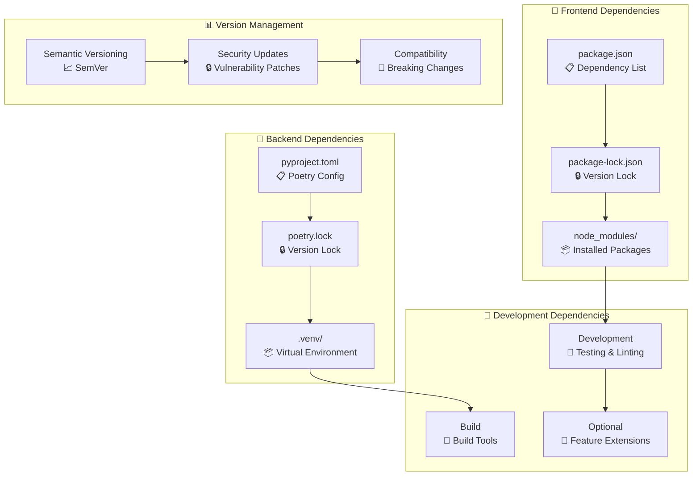

---

## 🎯 Technology Roadmap

### 🚀 **Future Technologies**

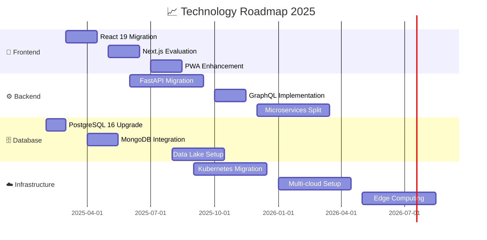

---

## 📋 Conclusão

A stack tecnológica do **Mestres Café Enterprise** foi cuidadosamente selecionada para balancear **performance**, **produtividade** e **escalabilidade**. Cada tecnologia foi escolhida com base em critérios rigorosos de avaliação e alinhamento com os objetivos do negócio.

### 🎯 **Pontos Fortes**

- **Stack moderna e consistente** com tecnologias complementares
- **Excelente developer experience** com ferramentas otimizadas
- **Performance otimizada** para aplicações enterprise
- **Escalabilidade horizontal** preparada para crescimento

### 🚀 **Próximos Passos**

- **Monitoramento contínuo** de performance e segurança
- **Avaliação periódica** de novas tecnologias
- **Otimização incremental** baseada em métricas
- **Preparação para migração** para tecnologias emergentes

---

_Documento técnico mantido pela equipe de engenharia_
_Última atualização: Janeiro 2025_
