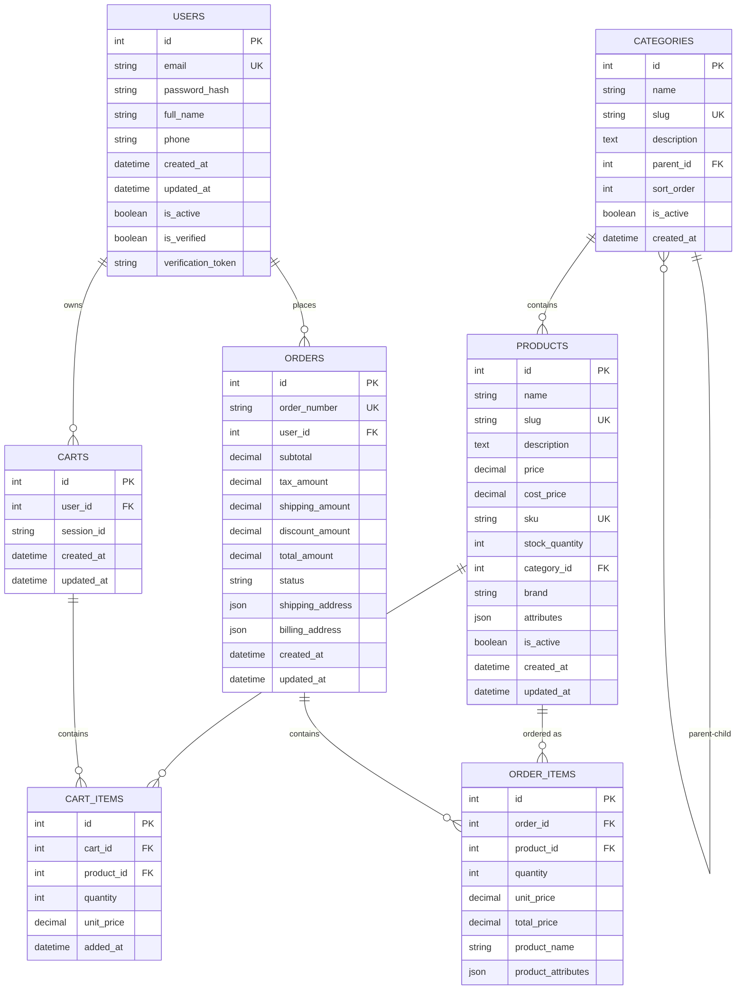
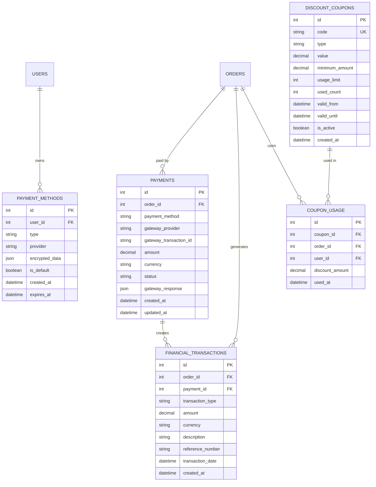
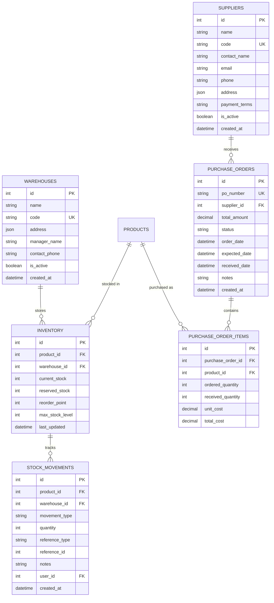
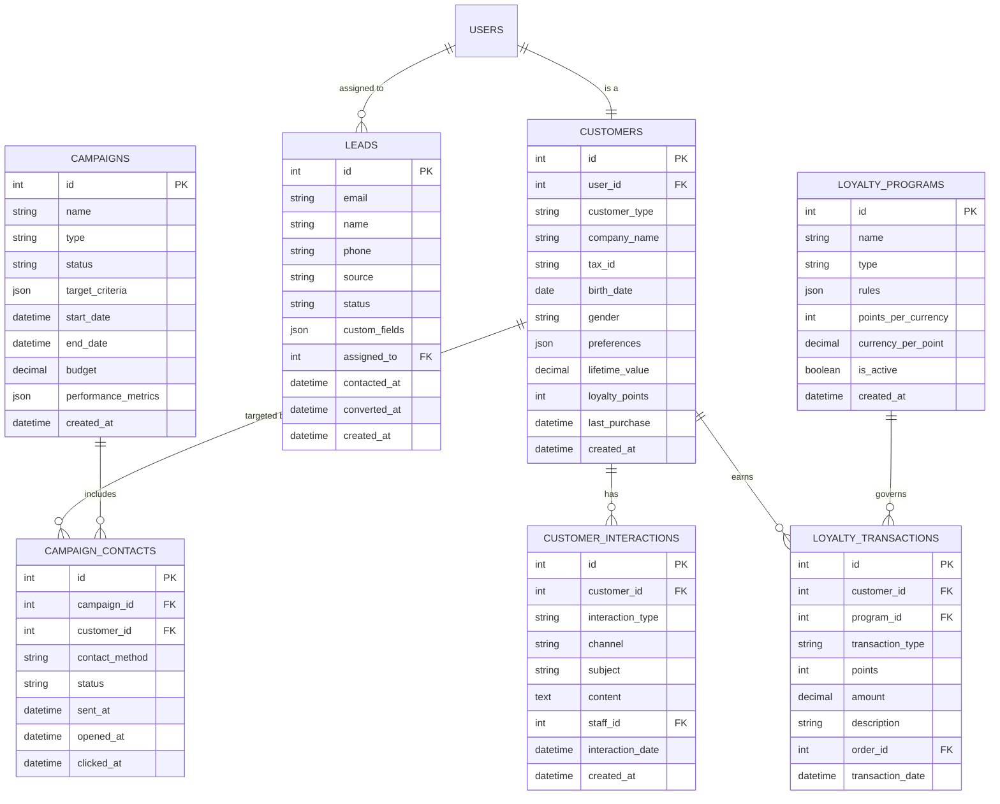
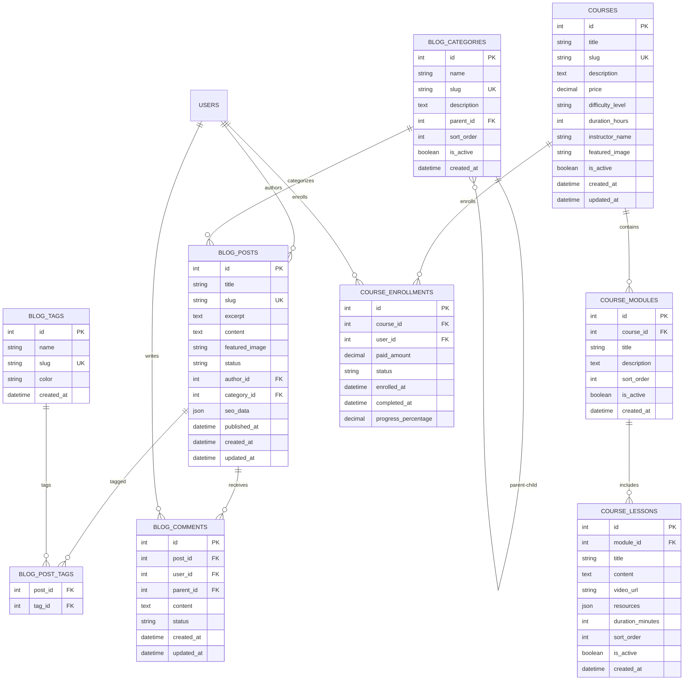
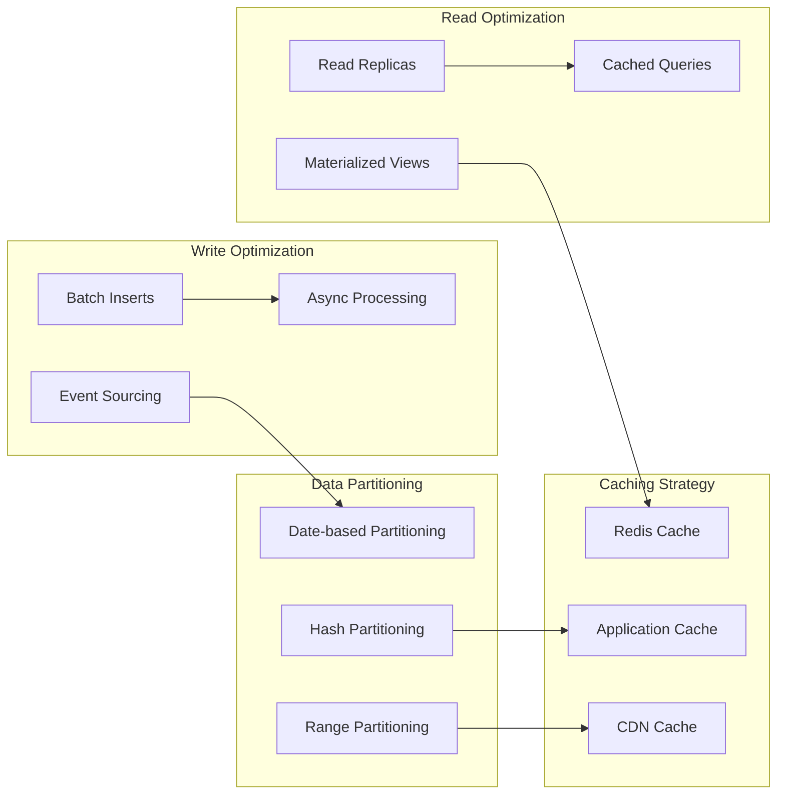
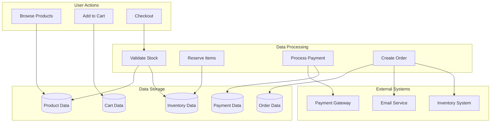
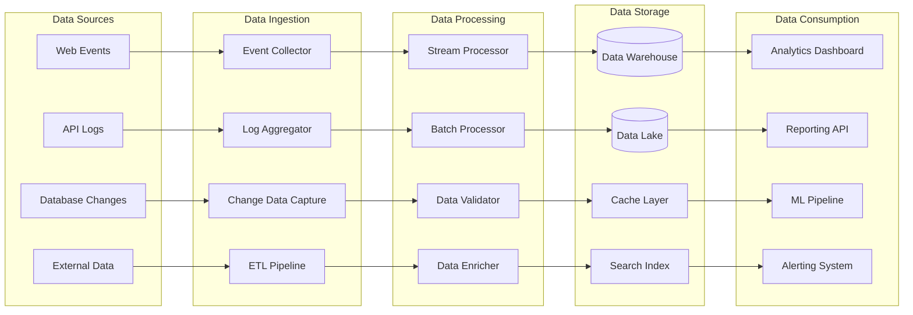
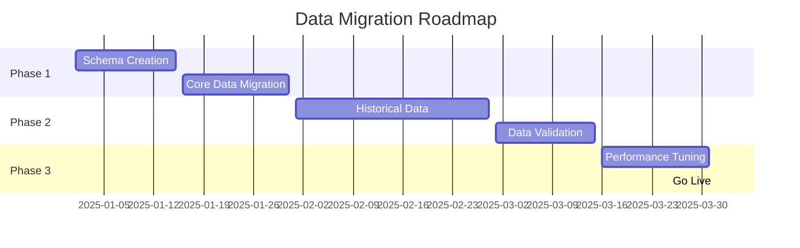
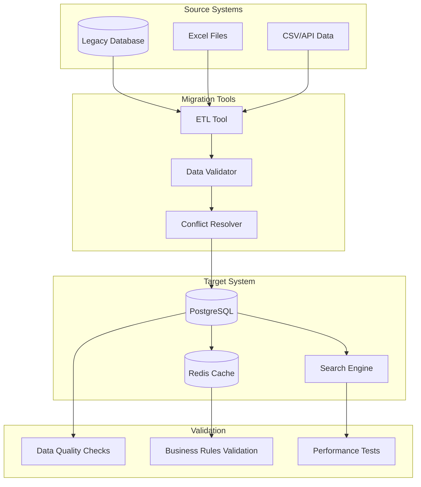

# 🗄️ Diagramas de Dados - Mestres Café Enterprise

## Visão Geral

Esta seção contém todos os diagramas relacionados à arquitetura de dados do sistema Mestres Café Enterprise, incluindo modelo entidade-relacionamento, diagramas de classes e estruturas de índices.

## 1. Modelo Entidade-Relacionamento (ERD)

### Core E-commerce Entities



### Payment and Financial Entities



### Inventory and Stock Management



### Customer Relationship Management (CRM)



### Content Management and Blog



## 2. Diagrama de Classes (Domain Model)

### E-commerce Domain

```mermaid
classDiagram
    class User {
        +int id
        +string email
        +string passwordHash
        +string fullName
        +string phone
        +boolean isActive
        +boolean isVerified
        +DateTime createdAt
        +authenticate(password): boolean
        +updateProfile(data): void
        +generateVerificationToken(): string
    }

    class Product {
        +int id
        +string name
        +string slug
        +string description
        +decimal price
        +decimal costPrice
        +string sku
        +int stockQuantity
        +Category category
        +boolean isActive
        +calculateDiscount(coupon): decimal
        +updateStock(quantity): void
        +isInStock(): boolean
    }

    class Category {
        +int id
        +string name
        +string slug
        +string description
        +Category parent
        +List~Product~ products
        +boolean isActive
        +getFullPath(): string
        +getChildren(): List~Category~
    }

    class Cart {
        +int id
        +User user
        +string sessionId
        +List~CartItem~ items
        +DateTime createdAt
        +addItem(product, quantity): void
        +removeItem(productId): void
        +updateQuantity(productId, quantity): void
        +calculateTotal(): decimal
        +clear(): void
    }

    class CartItem {
        +int id
        +Product product
        +int quantity
        +decimal unitPrice
        +DateTime addedAt
        +calculateSubtotal(): decimal
    }

    class Order {
        +int id
        +string orderNumber
        +User user
        +List~OrderItem~ items
        +decimal subtotal
        +decimal taxAmount
        +decimal shippingAmount
        +decimal discountAmount
        +decimal totalAmount
        +OrderStatus status
        +Address shippingAddress
        +Address billingAddress
        +processPayment(payment): boolean
        +updateStatus(status): void
        +calculateTotals(): void
    }

    class OrderItem {
        +int id
        +Product product
        +int quantity
        +decimal unitPrice
        +decimal totalPrice
        +string productName
        +Map~string, object~ productAttributes
        +calculateTotal(): decimal
    }

    class Payment {
        +int id
        +Order order
        +string paymentMethod
        +string gatewayProvider
        +string gatewayTransactionId
        +decimal amount
        +string currency
        +PaymentStatus status
        +Map~string, object~ gatewayResponse
        +process(): boolean
        +refund(amount): boolean
    }

    User ||--o{ Cart : owns
    User ||--o{ Order : places
    Cart ||--o{ CartItem : contains
    Order ||--o{ OrderItem : contains
    Order ||--o{ Payment : "paid by"
    Category ||--o{ Product : contains
    Category ||--o{ Category : "parent-child"
    Product ||--o{ CartItem : "added to"
    Product ||--o{ OrderItem : "ordered as"
```

### Inventory Domain

```mermaid
classDiagram
    class Inventory {
        +int id
        +Product product
        +Warehouse warehouse
        +int currentStock
        +int reservedStock
        +int reorderPoint
        +int maxStockLevel
        +DateTime lastUpdated
        +updateStock(quantity, movementType): void
        +reserveStock(quantity): boolean
        +releaseReservedStock(quantity): void
        +needsReorder(): boolean
    }

    class Warehouse {
        +int id
        +string name
        +string code
        +Address address
        +string managerName
        +string contactPhone
        +boolean isActive
        +List~Inventory~ inventories
        +getAvailableStock(productId): int
        +transferStock(targetWarehouse, productId, quantity): void
    }

    class StockMovement {
        +int id
        +Product product
        +Warehouse warehouse
        +MovementType movementType
        +int quantity
        +string referenceType
        +int referenceId
        +string notes
        +User user
        +DateTime createdAt
        +record(): void
    }

    class Supplier {
        +int id
        +string name
        +string code
        +string contactName
        +string email
        +string phone
        +Address address
        +string paymentTerms
        +boolean isActive
        +List~PurchaseOrder~ purchaseOrders
        +createPurchaseOrder(items): PurchaseOrder
    }

    class PurchaseOrder {
        +int id
        +string poNumber
        +Supplier supplier
        +List~PurchaseOrderItem~ items
        +decimal totalAmount
        +PurchaseOrderStatus status
        +DateTime orderDate
        +DateTime expectedDate
        +DateTime receivedDate
        +string notes
        +submit(): void
        +receive(items): void
        +calculateTotal(): decimal
    }

    class PurchaseOrderItem {
        +int id
        +Product product
        +int orderedQuantity
        +int receivedQuantity
        +decimal unitCost
        +decimal totalCost
        +calculateTotal(): decimal
        +isFullyReceived(): boolean
    }

    Product ||--o{ Inventory : "stocked as"
    Warehouse ||--o{ Inventory : stores
    Inventory ||--o{ StockMovement : "tracked by"
    Supplier ||--o{ PurchaseOrder : receives
    PurchaseOrder ||--o{ PurchaseOrderItem : contains
    Product ||--o{ PurchaseOrderItem : "purchased as"
```

## 3. Índices e Performance

### Estratégia de Indexação

```mermaid
graph TB
    subgraph "Primary Indexes"
        PK_Users[users.id PRIMARY]
        PK_Products[products.id PRIMARY]
        PK_Orders[orders.id PRIMARY]
        PK_OrderItems[order_items.id PRIMARY]
    end

    subgraph "Unique Indexes"
        UK_UserEmail[users.email UNIQUE]
        UK_ProductSku[products.sku UNIQUE]
        UK_OrderNumber[orders.order_number UNIQUE]
        UK_CategorySlug[categories.slug UNIQUE]
    end

    subgraph "Foreign Key Indexes"
        FK_OrderUser[orders.user_id]
        FK_OrderItemOrder[order_items.order_id]
        FK_OrderItemProduct[order_items.product_id]
        FK_ProductCategory[products.category_id]
    end

    subgraph "Query Optimization Indexes"
        IDX_ProductActive[products.is_active]
        IDX_OrderStatus[orders.status]
        IDX_OrderCreated[orders.created_at]
        IDX_UserActive[users.is_active, users.is_verified]
    end

    subgraph "Composite Indexes"
        COMP_ProductCategoryActive[products(category_id, is_active)]
        COMP_OrderUserStatus[orders(user_id, status)]
        COMP_StockMovementProduct[stock_movements(product_id, created_at)]
    end

    subgraph "Full-Text Search"
        FTS_ProductName[products.name, products.description]
        FTS_BlogContent[blog_posts.title, blog_posts.content]
        FTS_CustomerName[customers.name, customers.company_name]
    end
```

### Performance Patterns



## 4. Data Flow Diagrams

### Order Processing Data Flow



### Analytics Data Pipeline



## 5. Data Migration Strategy

### Migration Phases



### Migration Architecture



## Conclusão

Esta documentação de dados fornece uma visão completa da arquitetura de dados do sistema Mestres Café Enterprise, incluindo:

- **Modelo de dados detalhado** com todas as entidades e relacionamentos
- **Diagrama de classes** mostrando o design orientado a objetos
- **Estratégias de indexação** para otimização de performance
- **Fluxos de dados** críticos do sistema
- **Estratégia de migração** de dados legados

Essa estrutura garante escalabilidade, performance e integridade dos dados em todas as operações do sistema.
