# 🐳 Diagramas de Infraestrutura - Mestres Café Enterprise

## Visão Geral

Esta seção contém todos os diagramas relacionados à infraestrutura do sistema Mestres Café Enterprise, incluindo containers, orquestração, deployment topology e arquitetura de rede.

## 1. Arquitetura de Containers

### Docker Compose Architecture

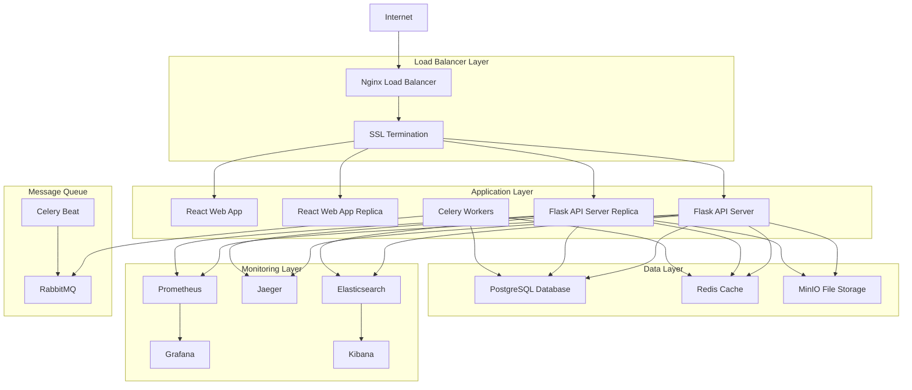

### Container Network Architecture

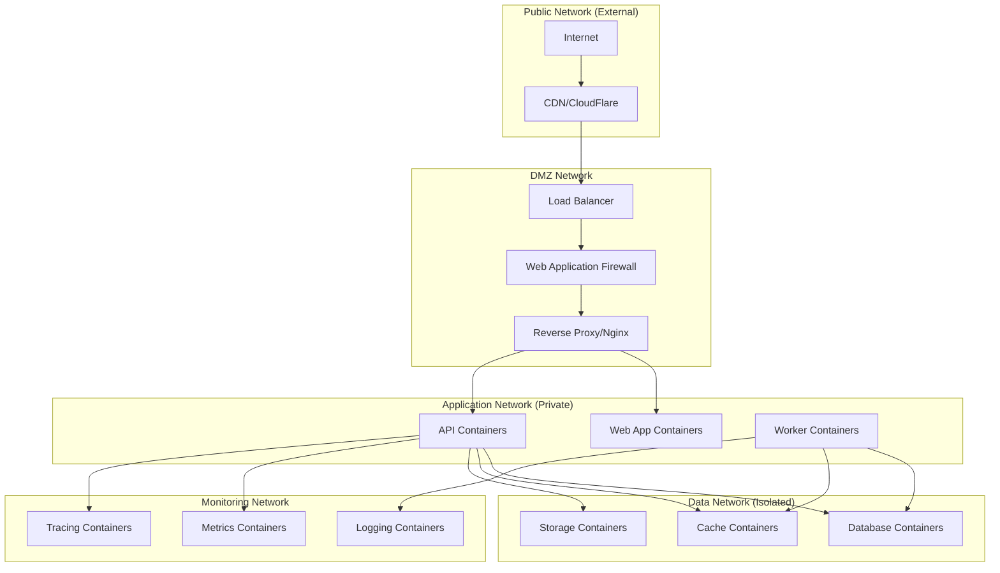

## 2. Kubernetes Architecture (Cloud-Native)

### Kubernetes Cluster Architecture

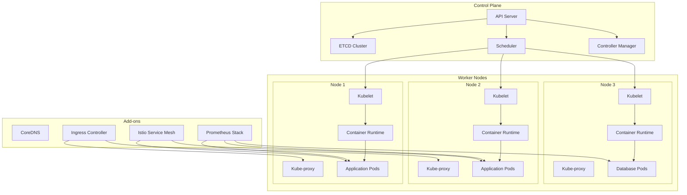

### Kubernetes Namespaces and Resources

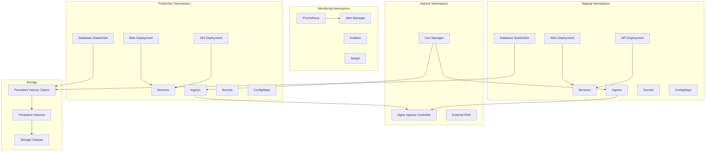

## 3. CI/CD Pipeline Architecture

### GitHub Actions Workflow

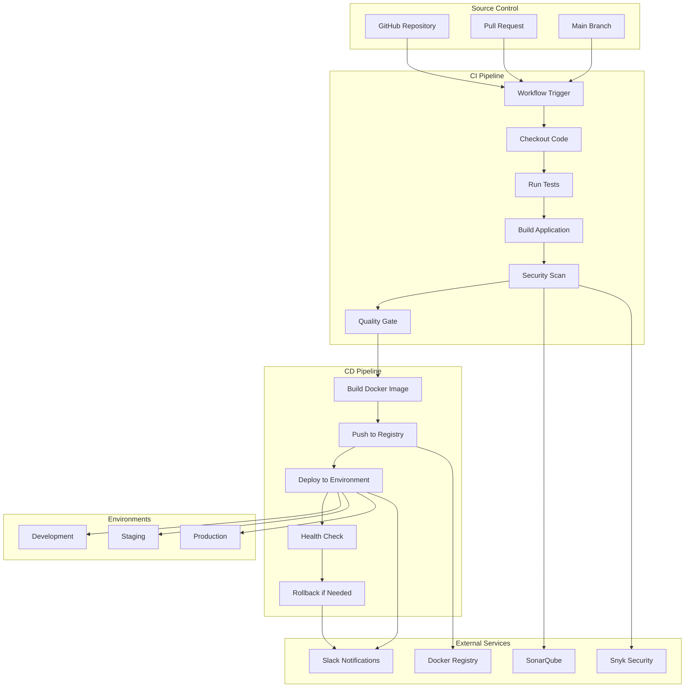

### Deployment Strategies

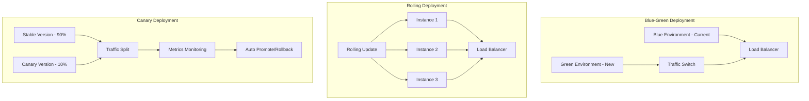

## 4. Cloud Infrastructure (AWS)

### AWS Architecture

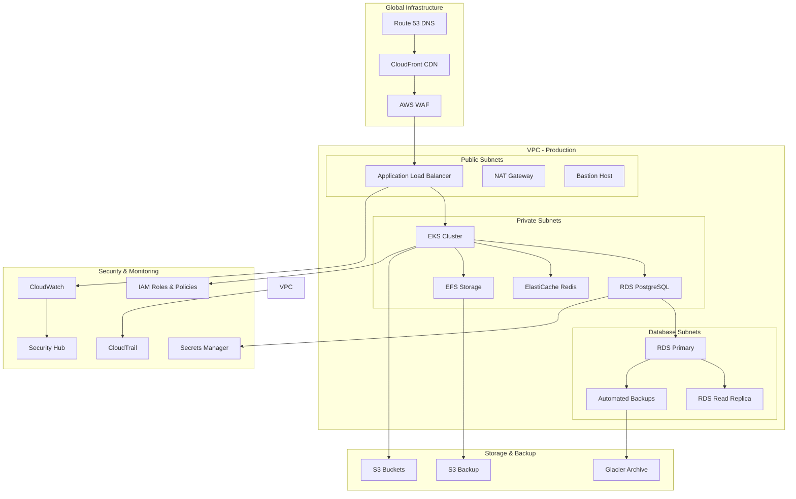

### Auto Scaling Configuration

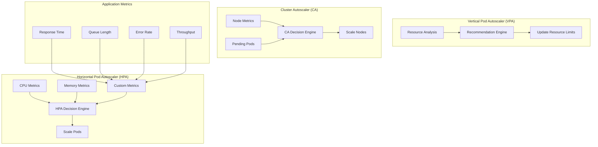

## 5. Service Mesh Architecture (Istio)

### Istio Service Mesh

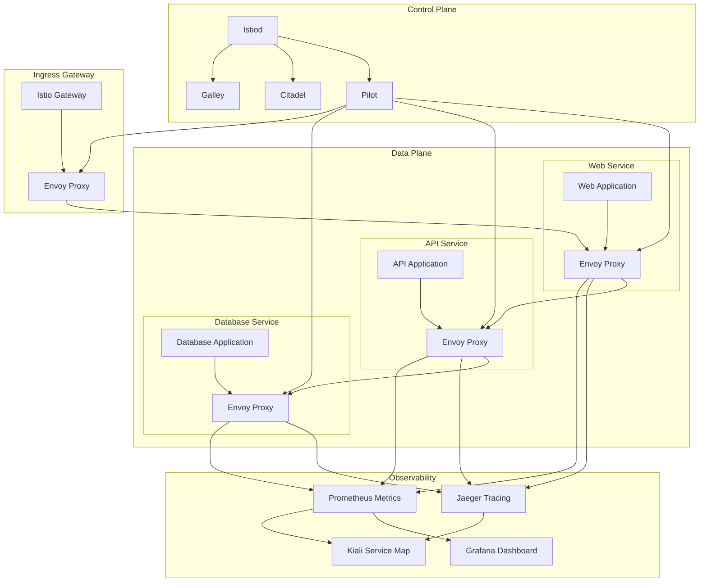

### Traffic Management

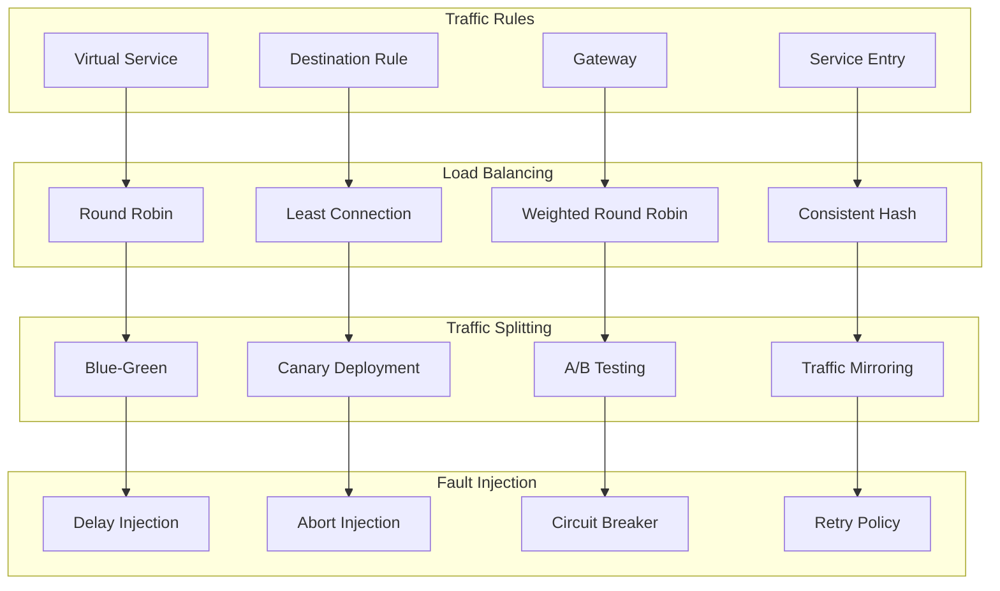

## 6. Backup and Disaster Recovery

### Backup Strategy

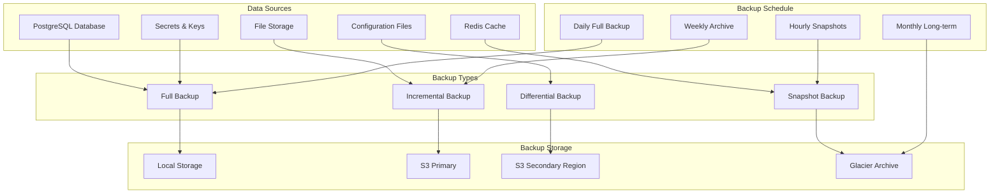

### Disaster Recovery Plan

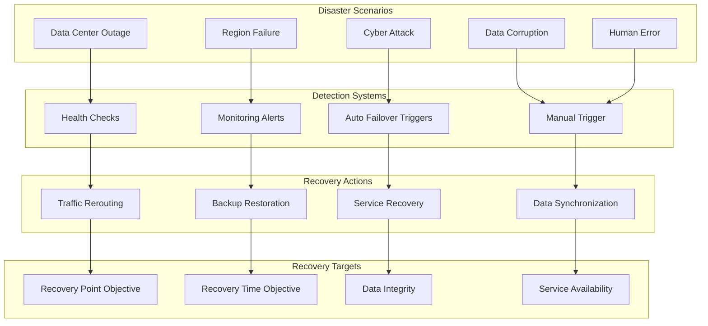

## 7. Performance and Scaling

### Caching Architecture

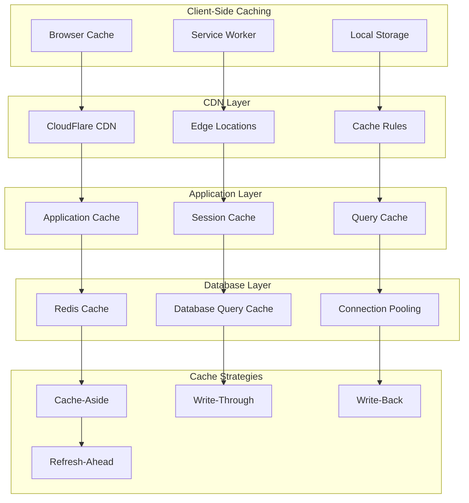

### Load Balancing Strategy

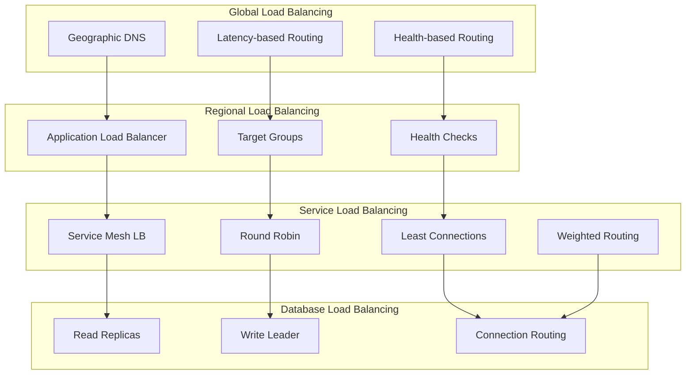

## Conclusão

Esta documentação de infraestrutura fornece uma visão completa da arquitetura de infraestrutura do sistema Mestres Café Enterprise, incluindo:

- **Containerização com Docker** e orquestração com Kubernetes
- **Pipeline CI/CD** automatizado com GitHub Actions
- **Infraestrutura cloud-native** na AWS
- **Service mesh** com Istio para microserviços
- **Estratégias de backup** e disaster recovery
- **Performance e scaling** com múltiplas camadas de cache

Esses diagramas servem como referência para deployment, manutenção e evolução da infraestrutura do sistema, garantindo alta disponibilidade, escalabilidade e performance.
