# 🔒 Diagramas de Segurança - Mestres Café Enterprise

## Visão Geral

Esta seção contém todos os diagramas relacionados à arquitetura de segurança do sistema Mestres Café Enterprise, incluindo fluxos de autenticação, autorização, proteção de dados e compliance.

## 1. Arquitetura de Segurança Geral

### Camadas de Segurança

```mermaid
graph TB
    subgraph "Perimeter Security"
        WAF[Web Application Firewall]
        DDoS[DDoS Protection]
        CDN[CDN with Security]
        LB[Load Balancer]
    end

    subgraph "Network Security"
        VPC[Virtual Private Cloud]
        Subnets[Private/Public Subnets]
        Security_Groups[Security Groups]
        NACLs[Network ACLs]
    end

    subgraph "Application Security"
        HTTPS[HTTPS/TLS 1.3]
        CORS[CORS Configuration]
        CSP[Content Security Policy]
        JWT[JWT Authentication]
        RBAC[Role-Based Access Control]
    end

    subgraph "Data Security"
        Encryption_Transit[Encryption in Transit]
        Encryption_Rest[Encryption at Rest]
        Key_Management[Key Management Service]
        Database_Security[Database Security]
    end

    subgraph "Monitoring & Compliance"
        SIEM[Security Information Event Management]
        Audit_Logs[Audit Logging]
        Compliance[Compliance Monitoring]
        Incident_Response[Incident Response]
    end

    Internet --> WAF
    WAF --> DDoS
    DDoS --> CDN
    CDN --> LB

    LB --> VPC
    VPC --> Subnets
    Subnets --> Security_Groups
    Security_Groups --> NACLs

    NACLs --> HTTPS
    HTTPS --> CORS
    CORS --> CSP
    CSP --> JWT
    JWT --> RBAC

    RBAC --> Encryption_Transit
    Encryption_Transit --> Encryption_Rest
    Encryption_Rest --> Key_Management
    Key_Management --> Database_Security

    Database_Security --> SIEM
    SIEM --> Audit_Logs
    Audit_Logs --> Compliance
    Compliance --> Incident_Response
```

## 2. Fluxo de Autenticação JWT

### Processo de Login

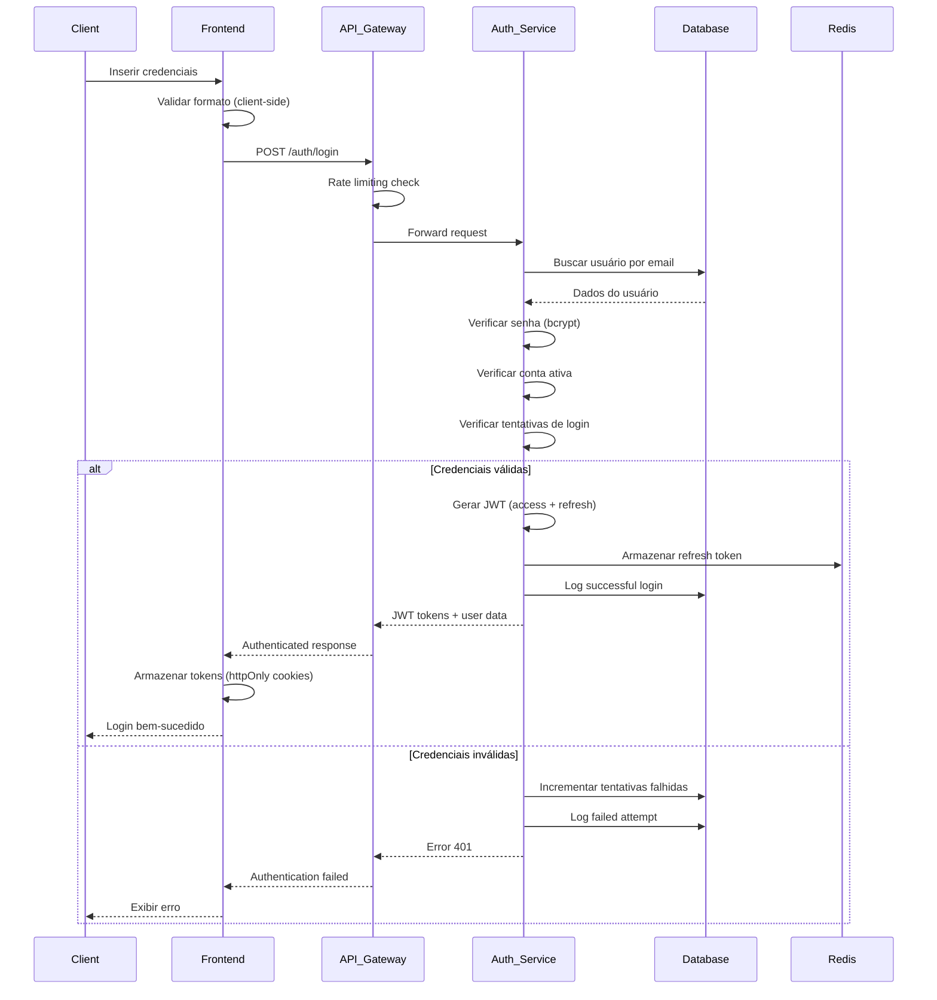

### Processo de Autorização

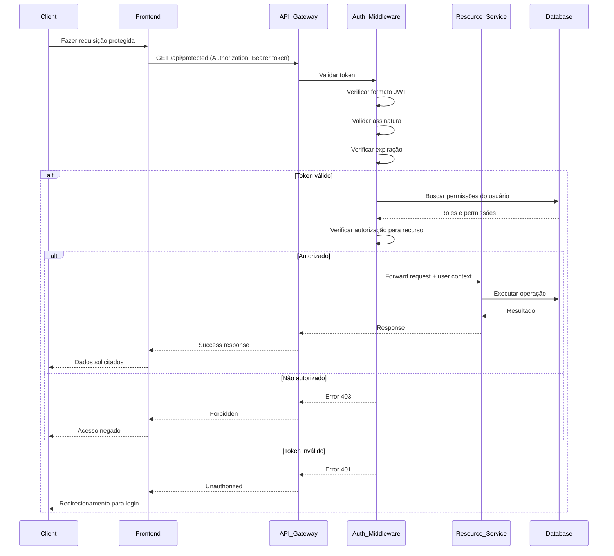

### Refresh Token Flow

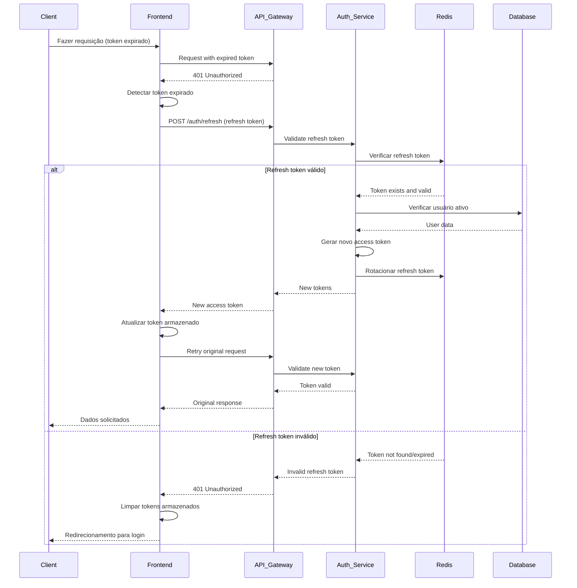

## 3. Matriz de Autorização (RBAC)

### Roles e Permissões

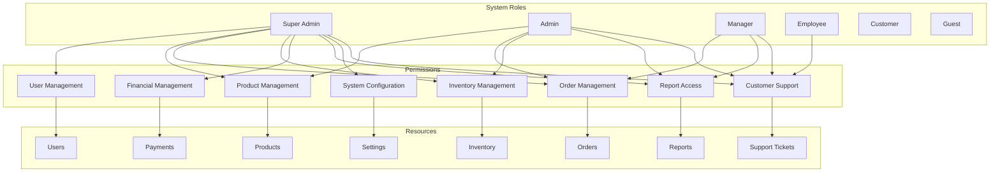

### Controle de Acesso por Recurso

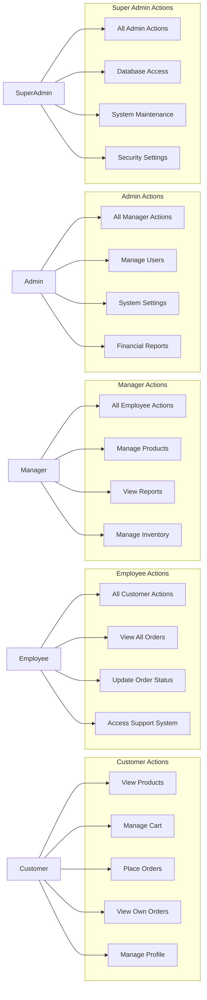

## 4. Proteção de Dados

### Criptografia de Dados

```mermaid
graph TB
    subgraph "Data at Rest"
        Database_Encryption[Database Encryption AES-256]
        File_Encryption[File Storage Encryption]
        Backup_Encryption[Backup Encryption]
        Log_Encryption[Log File Encryption]
    end

    subgraph "Data in Transit"
        TLS_13[TLS 1.3 HTTPS]
        API_Encryption[API Communication Encryption]
        Database_SSL[Database SSL/TLS]
        Internal_TLS[Internal Service TLS]
    end

    subgraph "Key Management"
        HSM[Hardware Security Module]
        Key_Rotation[Automatic Key Rotation]
        Key_Escrow[Key Escrow]
        Access_Control[Key Access Control]
    end

    subgraph "Sensitive Data"
        PII_Encryption[PII Encryption]
        Password_Hashing[Password Hashing (bcrypt)]
        Payment_Tokenization[Payment Data Tokenization]
        Session_Encryption[Session Data Encryption]
    end

    HSM --> Database_Encryption
    HSM --> File_Encryption
    HSM --> Backup_Encryption
    HSM --> Log_Encryption

    TLS_13 --> API_Encryption
    TLS_13 --> Database_SSL
    TLS_13 --> Internal_TLS

    Key_Rotation --> HSM
    Key_Escrow --> HSM
    Access_Control --> HSM

    PII_Encryption --> Database_Encryption
    Password_Hashing --> Database_Encryption
    Payment_Tokenization --> File_Encryption
    Session_Encryption --> TLS_13
```

### Data Loss Prevention (DLP)

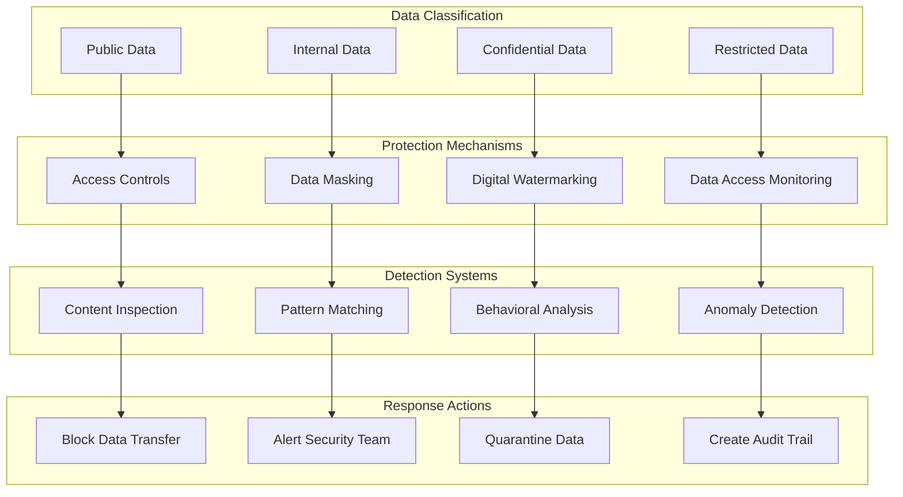

## 5. Compliance e Auditoria

### LGPD Compliance Framework

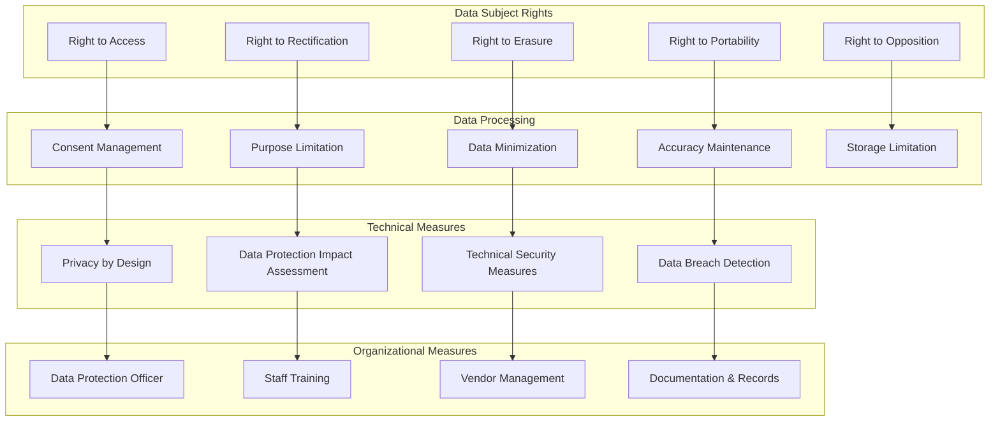

### Audit Trail Architecture

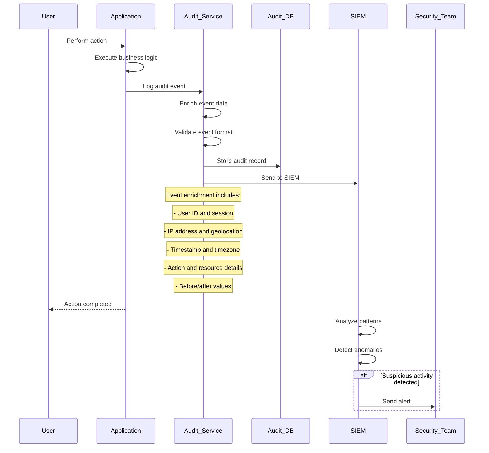

## 6. Incident Response

### Security Incident Workflow

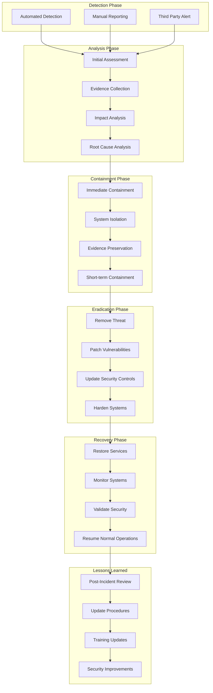

### Breach Notification Process

```mermaid
graph TB
    subgraph "Breach Detection"
        Incident_Detected[Security Incident Detected]
        Initial_Assessment[Initial Assessment]
        Breach_Confirmation[Confirm Data Breach]
    end

    subgraph "Internal Notification"
        Notify_CISO[Notify CISO]
        Notify_DPO[Notify Data Protection Officer]
        Notify_Legal[Notify Legal Team]
        Notify_Management[Notify Senior Management]
    end

    subgraph "Risk Assessment"
        Assess_Risk[Assess Risk to Individuals]
        Determine_Scope[Determine Scope of Breach]
        Evaluate_Impact[Evaluate Potential Impact]
        Timeline_Analysis[Analyze Timeline]
    end

    subgraph "Regulatory Notification"
        ANPD_Notification[Notify ANPD within 72h]
        Authority_Report[Submit Detailed Report]
        Follow_Up[Follow-up Communications]
    end

    subgraph "Individual Notification"
        Identify_Affected[Identify Affected Individuals]
        Prepare_Notice[Prepare Breach Notice]
        Send_Notifications[Send Individual Notifications]
        Support_Center[Set up Support Center]
    end

    subgraph "Documentation"
        Incident_Log[Maintain Incident Log]
        Evidence_Collection[Collect Evidence]
        Response_Documentation[Document Response Actions]
        Compliance_Records[Maintain Compliance Records]
    end

    Incident_Detected --> Initial_Assessment
    Initial_Assessment --> Breach_Confirmation

    Breach_Confirmation --> Notify_CISO
    Notify_CISO --> Notify_DPO
    Notify_DPO --> Notify_Legal
    Notify_Legal --> Notify_Management

    Notify_Management --> Assess_Risk
    Assess_Risk --> Determine_Scope
    Determine_Scope --> Evaluate_Impact
    Evaluate_Impact --> Timeline_Analysis

    Timeline_Analysis --> ANPD_Notification
    ANPD_Notification --> Authority_Report
    Authority_Report --> Follow_Up

    Follow_Up --> Identify_Affected
    Identify_Affected --> Prepare_Notice
    Prepare_Notice --> Send_Notifications
    Send_Notifications --> Support_Center

    Support_Center --> Incident_Log
    Incident_Log --> Evidence_Collection
    Evidence_Collection --> Response_Documentation
    Response_Documentation --> Compliance_Records
```

## 7. Penetration Testing Framework

### Testing Methodology

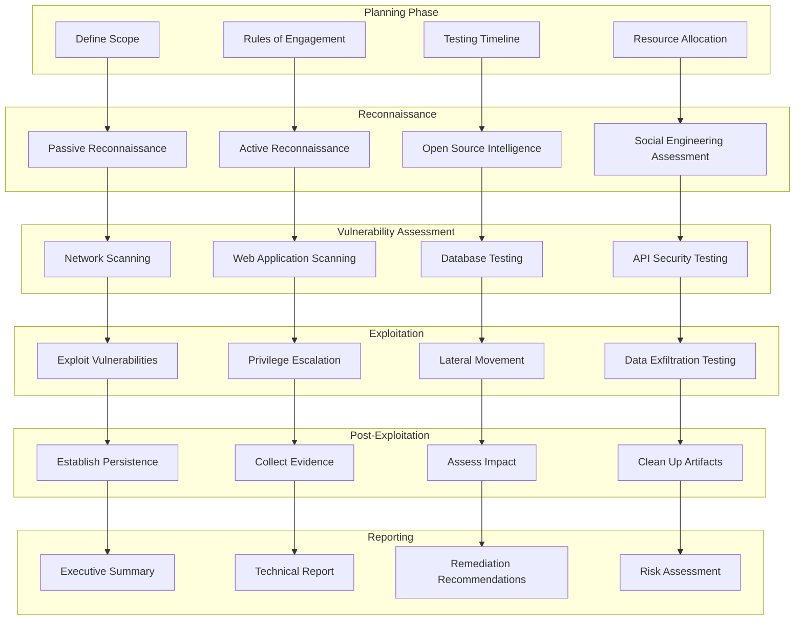

## Conclusão

Esta documentação de segurança fornece uma visão abrangente dos aspectos de segurança do sistema Mestres Café Enterprise, incluindo:

- **Arquitetura de segurança em camadas** com múltiplos controles
- **Fluxos de autenticação e autorização** robustos
- **Proteção de dados** em trânsito e em repouso
- **Compliance com LGPD** e frameworks de auditoria
- **Resposta a incidentes** estruturada e automatizada
- **Testes de segurança** regulares e metodológicos

Esses diagramas servem como referência para implementação, manutenção e evolução dos controles de segurança do sistema.
