# 🏗️ Diagramas de Sistema - Mestres Café Enterprise

## Visão Geral

Esta seção contém todos os diagramas arquiteturais do sistema Mestres Café Enterprise, fornecendo representações visuais da estrutura, componentes e fluxos do sistema.

## 1. Arquitetura de Alto Nível

### Visão Geral do Sistema

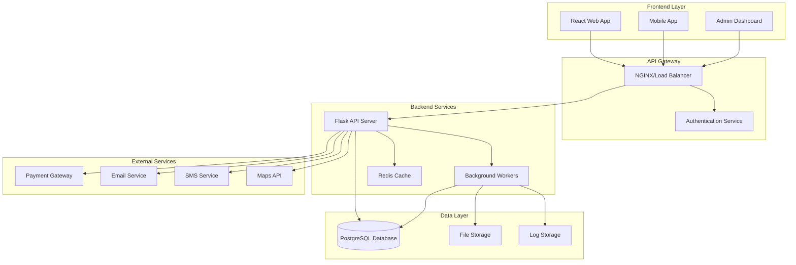

### Arquitetura de Componentes

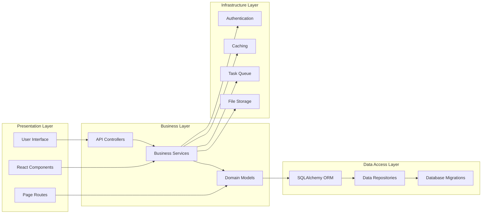

## 2. Fluxos de Dados Principais

### Fluxo de E-commerce (Pedido)

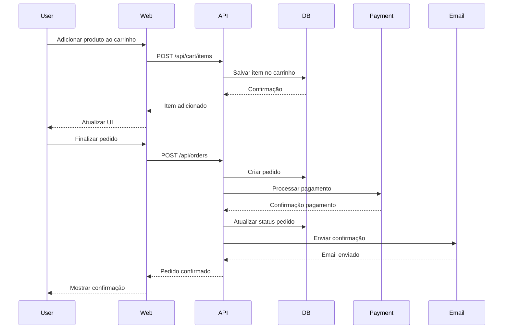

### Fluxo de Autenticação JWT

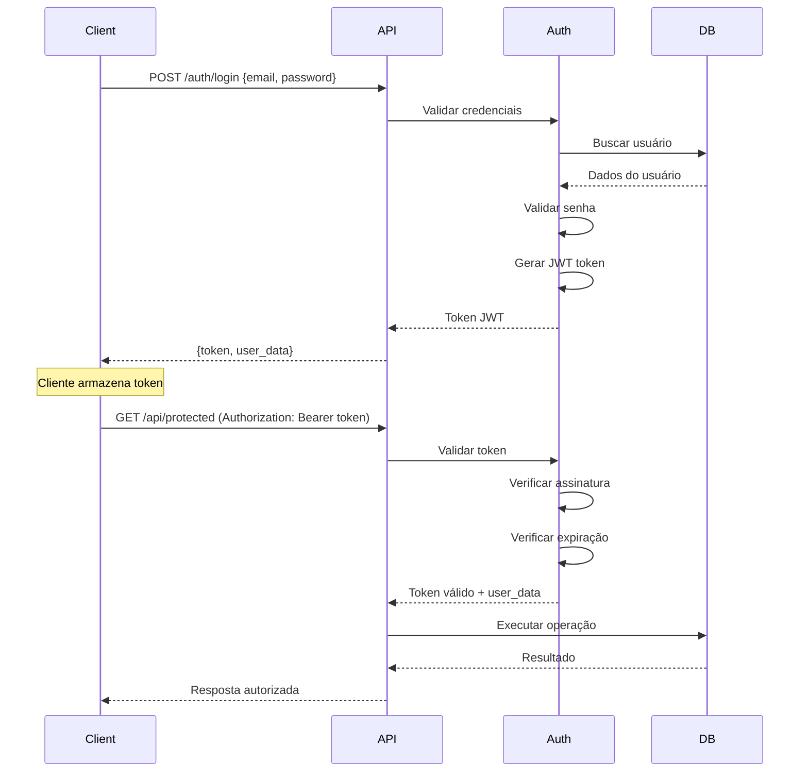

### Fluxo de Gerenciamento de Estoque

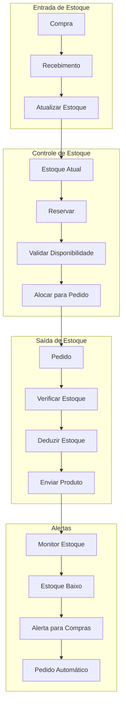

## 3. Módulos e Microserviços

### Arquitetura Modular Atual

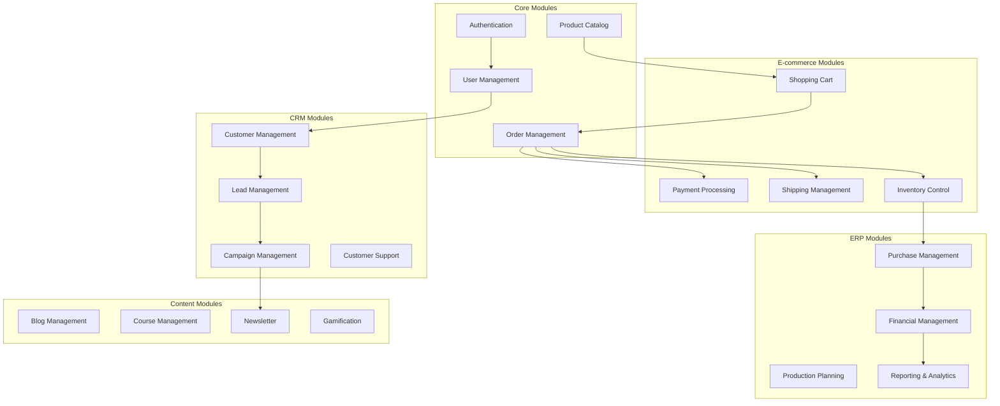

### Preparação para Microserviços (v2.0)

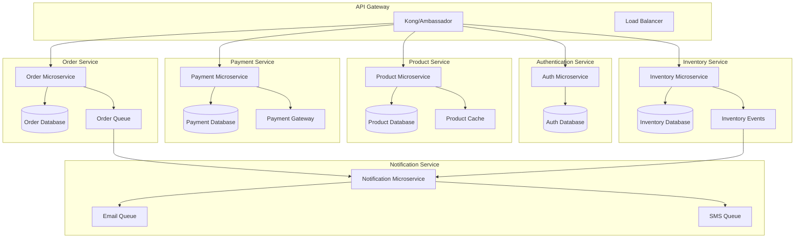

## 4. Integração de Sistemas

### Integração com Sistemas Externos

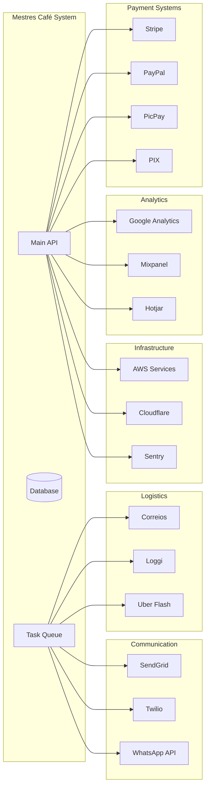

### Arquitetura de Events e Messaging

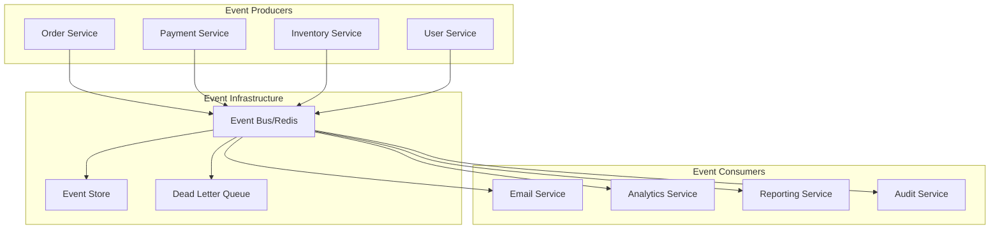

## 5. Padrões Arquiteturais Implementados

### Clean Architecture

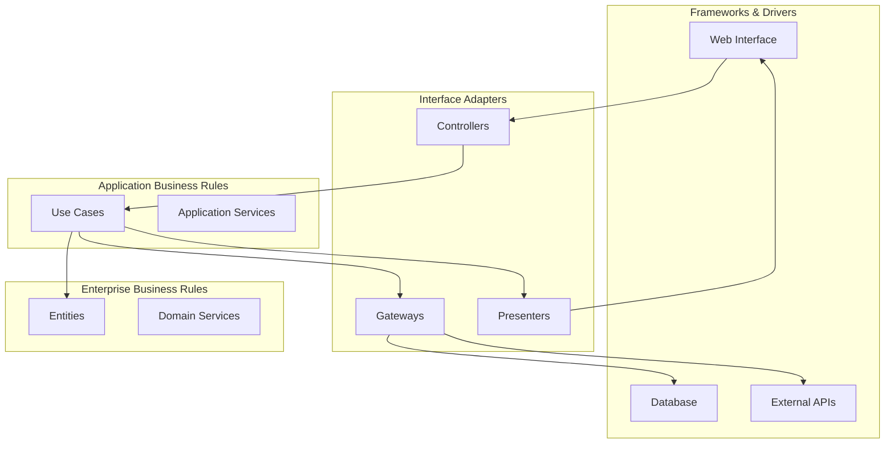

### Domain Driven Design (DDD)

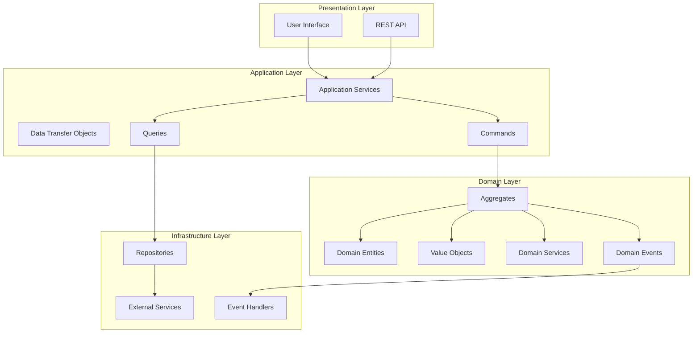

## 6. Evolução da Arquitetura

### Roadmap Arquitetural

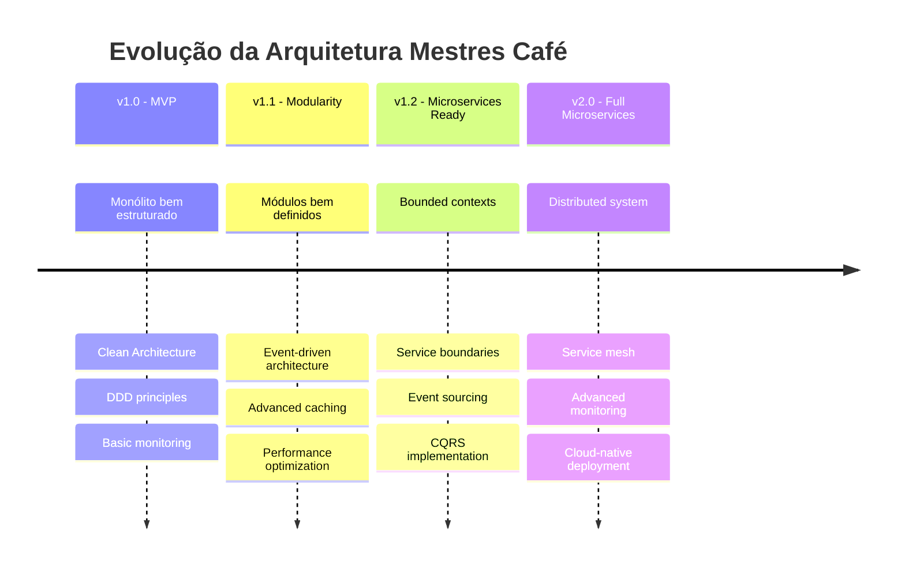

### Migração para Cloud-Native

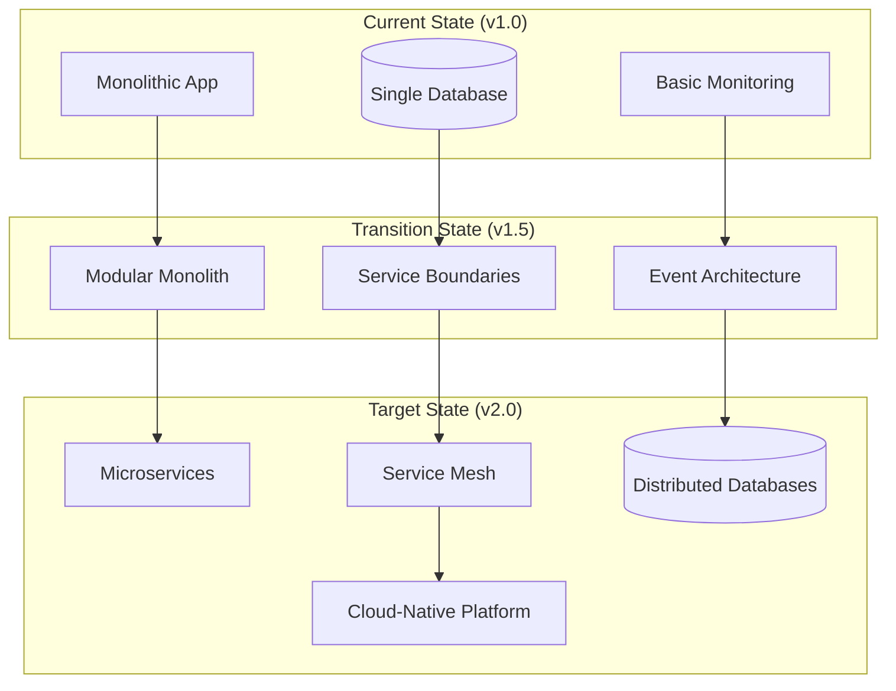

## Conclusão

Esta documentação visual fornece uma compreensão clara da arquitetura do sistema Mestres Café Enterprise, mostrando:

- **Estrutura de alto nível** e componentes principais
- **Fluxos de dados** críticos do sistema
- **Padrões arquiteturais** implementados
- **Roadmap de evolução** para microserviços

Os diagramas servem como referência para desenvolvimento, manutenção e evolução do sistema, garantindo que toda a equipe tenha uma visão unificada da arquitetura.
